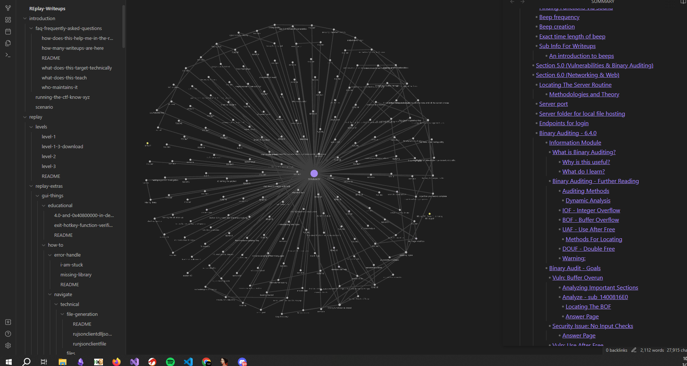

# What Is REplay?

REplay is a high-end and low-profile gutted game cheat written in C++20 that was designed to toss people into real-life environments to practice software cracking. This project was designed and developed due to the lack of playgrounds and projects to practice reverse engineering outside of smaller command line-based environments. For example- small crackmes are amazing for beginners, but when you transition into the real world, oftentimes, you sit through thousands of symbols, functions, and more. So we thought, why not develop something semi-real world?

This is a game cheat, but after development, a copy of the source was made, driver code & exploit code was **mostly** removed and the mass amount of security systems were removed and replaced with basic checks. We then inserted the code with sets of sensitive information, hardcoded passkeys, algorithms, and more that can be used to practice reverse engineering.

# There are a ton of writeups here!

