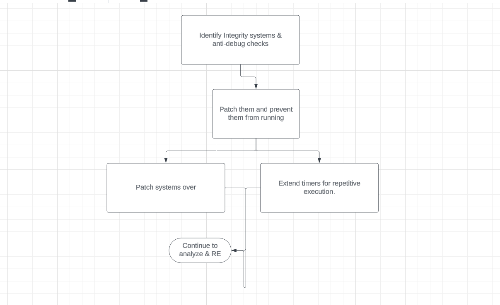

# Level 2

**Level 2** is a bit more of an intermediate level. This level was designed for people who want to understand reverse engineering from a deeper angle and take the knowledge and theory they built from the previous level and advance it during this stage of the playground.

This level is a bit more secure :0 &#x20;

> ### Objectives ( Sections 1.0 - 8.0 )

### Section 1.0 (Binary Integrity System)

* [ ] Figure out the amount of time (in hex) that the program took before comparing the hashes again. This was done on a thread.
* [ ] Figure out the filename that the program writes to and also figure out the hash it uses.
* [ ] Figure how the data fetched remotely and what was called to get it to fetch the resource
* [ ] Find out what hashing algorithm did the program utilize for binary integrity&#x20;
* [ ] Find out what was the RAW URL that the program used to fetch the production hash&#x20;
* [ ] How are you able to bypass the integrity system?&#x20;

> ### Section 2.0 (Protection Systems)

* [ ] Figure out the protection method(s) used within this application
* [ ] Explain how the binary integrity system worked. What algorithms, was it mixing algorithms or just using one? Was the system also server side or client side?

> ### Section 3.0 (Data & information)

* [ ] What was the user of the account that was made on the remote resource (where the hash was fetched)

> ### Section 4.0 (Beeps and Kinks)

* [ ] FUCK! That beep is so annoying and it lags the menu SUPERRR hard when you login...can you find out the few functions that are called every time a button is pressed and shut those timers and durations to 0s?
* [ ] Find out what frequency the beeps are
* [ ] Find out how the Beeps are created
* [ ] Find out what the seconds were for the lasting effect of the beep.

> ### Section 5.0 (Vulnerabilities & Binary Auditing)

* [ ] There were a few good vulnerabilities in here. Try to find them and explain what kind of vulnerabilities there is.&#x20;

> ### Section 6.0 (Networking & Web)

* [ ] Find out what port the server was hosted on
* [ ] Find out what the main homepage was and how you can swap it out
* [ ] Figure out the endpoint URL the page makes a POST request to for login
* [ ] There was a buffer overflow within the server's parsing logic, what area was it in?
* [ ] There was also an integer overflow system here,  where was it?
* [ ] There was a function that compared the pre-generated license. What is the license algorithm? Is it using a specific standard? And what is the seed? Could you generate the same example?&#x20;
* [ ] If you could load the main page, what location was the logo inside of the login form being pulled from?
* [ ] Once done analyzing the paths, maybe create your own HTML file for the server to load! Make it customized (not a question or objective but something fun to do)
* [ ] What made it easy to trace the server calls / binding / startup functions?
* [ ] There was a vulnerability in the website itself, what was it?

> ### Section 7.0 (Exploit Development)

* This is a really long task- but your task is to build your own exploit preferably in C++ using the Windows API to read and write from the cheats process. This code will then write to a specific address in memory, this address, is the address of where a specific variable is being stored. You then need to change the variable to hold the value that represents the user is logged in all the time.

> ### Skills Required

In order to solve this level, you need to not only go through level 1 but also have core fundamental reverse engineering theory and also **decent** CompSCI knowledge, and a tiny bit of web testing experience. Some binary auditing is required, but at this point and stage, you can learn it.

> ### Tip: Check attack map below

<figure><figcaption></figcaption></figure>

> ### Objectives you need to complete L1-L2 before being able to do this level

* Crack the login system 100%
* Bypass the binary integrity system to crack the login system
