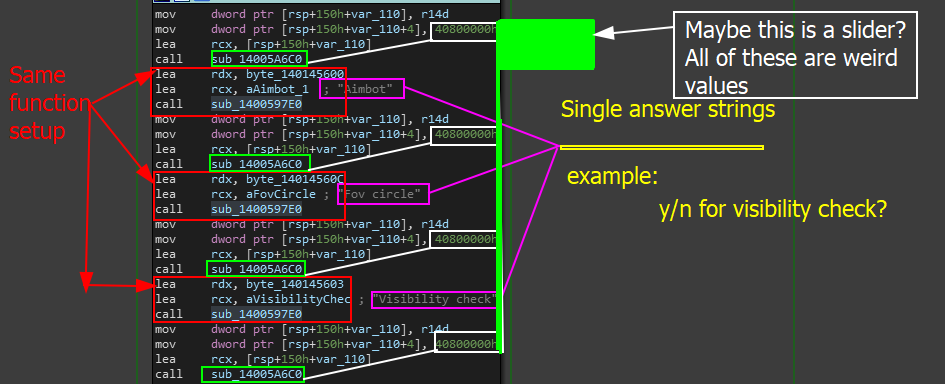

# 4.0 and 0x40800000 (In development)

***

## Note to users

If you want a FULL definition of this and want to fully understand it all- I have an article on [GuidedHacking ](https://guidedhacking.com/)talking about this exact topic.



***

In the page where we went to analyze the login system, specifically [crippling-logins.md](../../../writeups/level-1-all-walkthroughs/bypass-entirely-login-system/crippling-logins.md "mention") we came across a large massive hexadecimal number that looked like this.

```
0x40800000
```

Really, this value translates _(in the source code)_ to `4.f` . So why does IDA showcase it as `0x40800000` when that in decimal is 1082130432? Well that is what this section is all about!

### Source Code Brief&#x20;

Before we explore the inner meaning behind this, it is best that we explore some of the programs source code internally. For context, the code we were looking at in the tab was the snippet shown below.

<figure><figcaption><p> <em><mark style="color:blue;"><strong>model B - Image B</strong></mark></em></p></figcaption></figure>

In this image, we have the same value in every set of instructions. Shown below is this code in text.

```
mov     dword ptr [rsp+150h+var_110], r14d
mov     dword ptr [rsp+150h+var_110+4], 40800000h
lea     rcx, [rsp+150h+var_110]
call    sub_14005A6C0
lea     rdx, byte_140145600
lea     rcx, aAimbot_1  ; "Aimbot"
call    sub_1400597E0
mov     dword ptr [rsp+150h+var_110], r14d
mov     dword ptr [rsp+150h+var_110+4], 40800000h
lea     rcx, [rsp+150h+var_110]
call    sub_14005A6C0
lea     rdx, byte_14014560C
lea     rcx, aFovCircle ; "Fov circle"
call    sub_1400597E0
mov     dword ptr [rsp+150h+var_110], r14d
mov     dword ptr [rsp+150h+var_110+4], 40800000h
lea     rcx, [rsp+150h+var_110]
call    sub_14005A6C0
lea     rdx, byte_140145603
lea     rcx, aVisibilityChec ; "Visibility check"
call    sub_1400597E0
mov     dword ptr [rsp+150h+var_110], r14d
mov     dword ptr [rsp+150h+var_110+4], 40800000h
```

Specifically, again, pay attention to `40800000h` which is `0x40800000` when formatted.

This code representation looks like this in the source code

<pre class="language-cpp"><code class="lang-cpp">ImGui::DUMMYINSERT(ImVec2(0.0f, InvisibleSep));                // -- GUI Insert space
<strong>ImGui::Checkbox("Aimbot", &#x26;CONFIG.Aimstate);                   // Did user want aimbot
</strong>ImGui::DUMMYINSERT(ImVec2(0.0f, InvisibleSep));                // -- GUI insert space
ImGui::Checkbox("Fov circle", &#x26;CONFIG.FoV);                    // Draw circle on overlay?
ImGui::DUMMYINSERT(ImVec2(0.0f, InvisibleSep));                // -- GUI insert space
ImGui::Checkbox("Visibility check", &#x26;CONFIG.IsSpotted);        // Is enemy visible check?
ImGui::DUMMYINSERT(ImVec2(0.0f, InvisibleSep));                // -- GUI insert space
ImGui::SliderFloat("FOV", &#x26;CONFIG.Fov, 1.f, 25.f);             // Create slider for FOV range
ImGui::DUMMYINSERT(ImVec2(0.0f, InvisibleSep));                // -- GUI insert space
ImGui::SliderFloat("Smoothing", &#x26;CONFIG.Smoothing, 1.f, 5.f);  // Smoothing config
ImGui::EndListBox();                                           // End render for list box
</code></pre>

In this code, we see that a dummy insert is constantly being called as a way to separate space on the GUIs rendered section- in this case its the menu. This dummy insert has a configuration not declared in this scope called InvisibleSep which looks like this.

```cpp
	inline float textSeparatorSpace = 4.f;
```

When we look back at our program, where _**`InvisibleSep`**_ should be pushed onto the stack as `0x4` representing `4.f` (what most people would assume ) is actually where `0x40800000` exists.&#x20;

## Warning:&#x20;

This section needs MASS REFINEMENT - SO I WARN ALL READERS TO MAKE SURE TO VERIFY INFORMATION!!!

Most of this was made correctly, but the structure of it **was fucking horrible** so you need to actually look at this yourself and verify it using the links that were provided for you here as additonal resources. Apologies in advanced :( &#x20;

### The IEEE 754 Floating Point Format

Believe it or not, computers have a funny way of representing numbers- especially numbers like floating point numbers. The cool part about this is that depending on the format, representing floating points can become much more efficient, quite wide in its range for numbers and even allows for consistent precision.&#x20;

This is why we have standards or formats such as the[ IEEE 754 floating point format](https://www.geeksforgeeks.org/ieee-standard-754-floating-point-numbers/). This format allows us to provide a standard way to represent massive floating point numbers (or just regular floating point numbers) whilst also being able to maintain some performance and precision to the value itself.

These standards also exist also for quick and easy readability even a sprinkle of error handling! For example, this standard actually introduces some really cool values such as infinity and NaN (Not a Number if you are new to this).

Anyway, this standard is how our number is being represented, and its important that we understand exactly how this becomes `4.f` in IDA.

> **Info Note:** FORTRAN, also known as FORmula TRANslation language is by far one of my **personal** favorite programming languages to learn the applications of mathematics in computer science. Fortrans TRANSFORM function gives you a good image as to how this format works. [https://www.cita.utoronto.ca/\~merz/intel\_f10b/main\_for/mergedProjects/lref\_for/source\_files/rftransf.htm](https://www.cita.utoronto.ca/\~merz/intel\_f10b/main\_for/mergedProjects/lref\_for/source\_files/rftransf.htm)


### So how does this become 4.f?&#x20;

Since we are relying on the IEEE 754 format _(and its a pretty popular format, also the one IDA is using),_ we can solve this using this format.&#x20;

In order to solve using this format, we need to breakdown this hexadecimal value which I did so below. For more context on how this works in other examples, check out this document [here](https://pages.cs.wisc.edu/\~david/courses/cs552/S12/handouts/754.pdf).&#x20;

I know that was probably HORRIBLE and someone might come along and destroy this (pls do cause I need it) but since we now have our value `0 10000001 00000000000000000000000` we can now convert it to a hexadecimal value. For this, we can use [**Binary to Hex Converter**](https://www.rapidtables.com/convert/number/binary-to-hex.html)  which gives us `40 80 00 00` in hexadecimal.&#x20;

> **For Further Context**: The IEEE 754 standard represents single-precision floating-point numbers with 32 bits. For positive numbers like 4.0, the sign bit is 0 (which indicates positive), the next 8 bits represent the biased exponent, and the remaining 23 bits represent the significand.

When we see this value in IDA, it is showing us the hexadecimal representation form based on the IEE 754 representation (which is a pretty common value). So if you want to take these values and convert them to their real values- we can do it like so.

### Reversing The Standard - Original Values

In order to get the original value, or the **real** value rather,  we can take the value, split it up, convert the hex code to binary, then take apart the components and apply the formula for IEEE 754 floating point representations in order to recover our value. So lets take this step by step and lay out the information we have.

> Information we have

* Hex representation - `0x40800000`&#x20;
* Decimal representation - `1082130432`&#x20;
* What we need to do - Get the original floating point value via IEEE 754 FP Formula

> Step 1 - Representation Split

In order to plug the values into the formula, we need to properly split the hex representation or rather, hexadecimal value into the three primary components we need. These components are as follows.

* **Sign Bit** -> The sign bit is a single bit value represented as 0 or 1 that represents or determines whether or not the floating point constant such as `4.0` is negative or positive. If the sign bit is 0, the value is positive, if the sign bit is 1 then the number is negative.
* **Exponent** -> The exponent represents the scale of the number. Think of it as one giant group of bits that determines the magnitude (_the size of the number or quantity in question_). Pretty much, this means that they represent an exponent value relative to a fixed reference point (_verbal labels used in a scale to prevent variations in the response functions_). For single-precision floating-point numbers, the _bias_ is typically 127.
* **Mantissa** -> This is also known as the _**significand**_ which represents the precision or fractional part of the floating point number. This is actually a group of bits that stores the significant digits of the number.

Before we move forward with interpreting these sets of information, we need to [convert it](https://www.rapidtables.com/convert/number/hex-to-binary.html) to binary which we know is `0100 0000 1000 0000 0000 0000 0000 0000` had we used the hex->bin converter.&#x20;

> Step 2 - Log the component's

Now we need to log or find the sign bit, exponent and mantissa. Based on the definitions above, we can point this information out like so.

Recall that we are going based off of: `0100 0000 1000 0000 0000 0000 0000 0000` &#x20;

* **Sign bit** -> The first bit _(leftmost in our value)_ is the sign bit which is 0, indicating a positive number. So our floating point value should be positive.
* **Exponent Bit(s) ->** The next 8 bits will be representing the exponent which is `1000 0000` in binary. It is important that we remember that the exponent in IEEE 754 is biased, so we need to adjust it by subtracting the bias (_127, since we know this is a single-precision floating point value_ <mark style="color:red;">\[how?]</mark>) to get the exponent of 1. For this, we can use the converter and convert `1000 0000` into a decimal value which gives us 128. Then we adjust for the bias, plug it into the formula `EXPONENT = DECIMAL_VALUE - Bias` which for us is `128 - 127` leaving us with 1 (**WARNING: DO THIS WITH PRECISION! If it is not precise, the calculations will not work as intended)**.
* **Mantissa** -> Since our number is considered a[ normalized number](https://en.wikipedia.org/wiki/Normalized\_number), there is an implicit leading bit (_according to the standard IEEE 754_) which means our mantissa is `1.0`.

> [_**Step 3 - Apply the values to the formula**_](https://mathcenter.oxford.emory.edu/site/cs170/ieee754/) _**(IMPORTANT RESOURCE, CLICKME)**_

The formula is actually a lot simpler than some may seem.

<figure><figcaption><p>IEE754 Formula</p></figcaption></figure>

Programmatically speaking, we can set a scenario up like this.

```python
>>> x_sign = 0
>>> x_sigval = 1.5625    # NOTE: This needs to be percise 
>>> x_expval = 4         # In a scenario of a different value like 41C80000 which is 25.f
>>> v = (-1) ** x_sign * x_sigval * (2 ** x_expval)
```

Ideally, all you need to find is the sign, significand value and the exponent value to apply it to the formula.


### Implementing The Algorithm&#x20;

To learn how to do this in a program, I wrote a small Python script that can easily do this automatically!

Check this out at - [ieee-745-formula-implementation.md](../../../writeups/level-exploits-scripts/algorithmic-implementations/ieee-745-formula-implementation.md "mention")

