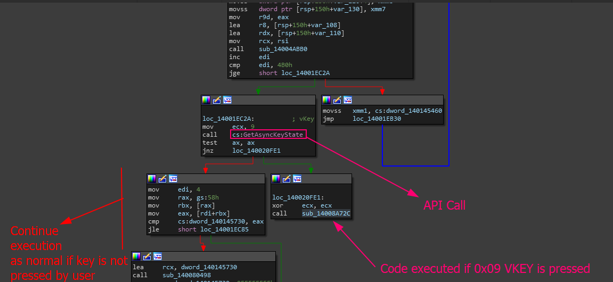
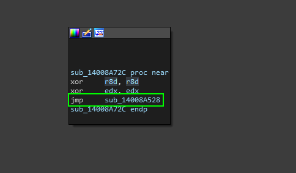
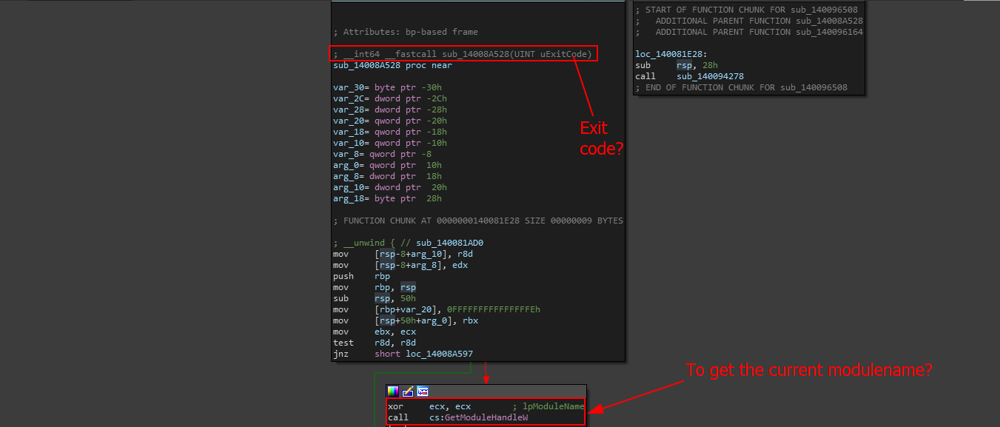
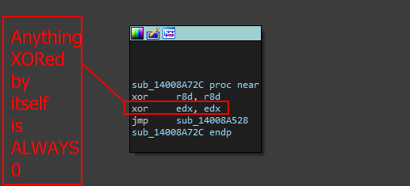
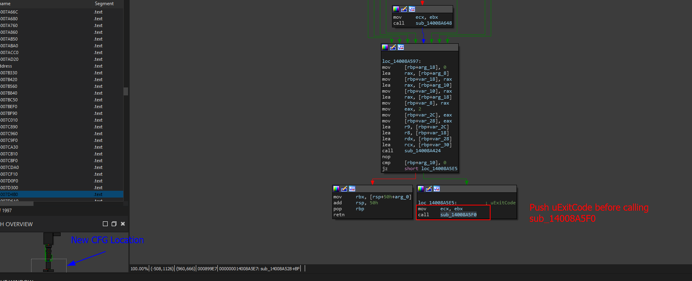
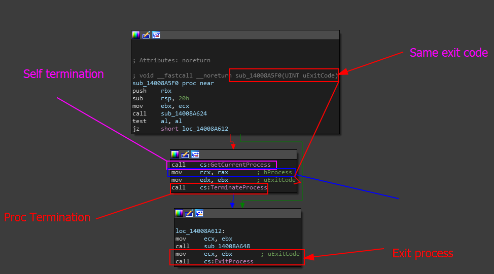

# Exit HotKey Function Verification

In the [find-the-hotkey-that-is-used-to-exit-the-menu-and-kill-the-current-process.md](../../writeups/level-1-all-walkthroughs/find-the-hotkey-that-is-used-to-exit-the-menu-and-kill-the-current-process.md "mention")we explored that the answer was `Tab` but the truth is that you can verify this two ways- one by seeing if the process was actually killed, or by verifying the function.

In this scenario, we will be verifying the function that we found as means of `learning` and extending some of the theory we built.

### Starting Off..

To make sure we are on the right page, we are going to be analyzing the location where 0x09 or `VK_TAB` is used in the `GetAsyncKeyState` Windows API call.&#x20;

<figure><figcaption></figcaption></figure>

In this function, we need to pay attention and zone in on three things-&#x20;

* 1: The initial call for GetAsyncKeyState
* 2: The condition if the key is pressed
* 3: The condition if the key is NOT pressed.

To get a better picture of this, you can use IDAs pseudocode generator and see that this logic programmatically looks like the program code shown below.

```cpp
  if ( GetAsyncKeyState(9) )
  {
    sub_14008A72C(0);
    JUMPOUT(*(_QWORD *)&byte_140020FE8);
  } else {
     // continue execution
  }
```

Going back to the view point, lets analyze `sub_14008A72C` since this is where the action takes place if the virtual key state of the VKEY 9 (`VK_TAB`) is true.

<figure><figcaption></figcaption></figure>

When we double click on`sub_14008A72C` we get placed in the CFG with a single block of code with 3 instructions. Multiple XORs and a single jump to a location called `sub_14008A528` . This is interesting to us- lets chase the rabbit hole until we find something.&#x20;

Double clicking on `sub_14008A528` will bring us to this output.

<figure><figcaption></figcaption></figure>

In this CFG, multiple things are easy to find- the first thing that sticks out to us is that the exit code is the ONLY argument allowed for this function to be called during runtime. This means that rolling back to our previous code block.

<figure><figcaption></figcaption></figure>

Before we make a jump call to `sub_14008A528` we push `0` to the stack as an argument to `sub_14008A528` . This means that the status code that we will exit with is 0 (_usually set by the developer or modified during compile-time by the compiler_)

<figure><figcaption></figcaption></figure>

Further down in our program and now we have this push of the same exit code before we go into the new function `sub_14008A5F0` . What happens if we go down this rabbit hole again?

Double-clicking on `sub_14008A5F0` will give us the following.

&#x20;

<figure><figcaption></figcaption></figure>

Now we can verify that pressing `Tab` does in fact kill the process. As when our function calls `ExitProcess` then the program will exit and terminate entirely.

