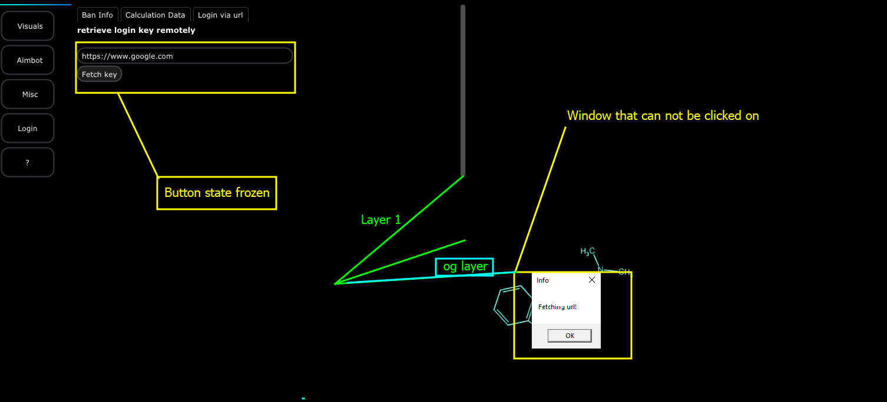

# I Am Stuck

If the page freezes or the GUI just does not let you click anywhere (_e.g: you are on a one monitor system and do not have any over rides for the overlay)_ than you might have to reboot the machine. This is because, when an error box occurs, Windows will not put it on the overlay- instead, it will be stuck in the background. So you may have to again, reboot the machine to get back to a specific state.&#x20;

Before you power off the machine- there is another method you can also use.

### Click the button and do not click anything else&#x20;

When the message boxes appear, especially in levels like [vuln-double-free](../../../../writeups/level-2-all-walkthroughs/section-6.0-networking-and-web/binary-auditing-6.4.0/binary-audit-goals/vuln-double-free/ "mention")we find out QUICK on one screen that we actually get stuck and can not click on anything such as the button or the tiny window that pops up.

TO AVOID THIS -> WHEN YOU CLICK A BUTTON, CLICK IT ONCE AND ONLY ONCE. WHEN A WINDOW POPS UP SUCH AS THE ONE IN THE SCREENSHOT BELOW, PRESS ENTER AND THAT WILL SEND THE INPUT TO THE WINDOW CONTROLLER.

<figure><figcaption></figcaption></figure>

* o.g layer -> Represents the first layer, the actual Desktop
* Layer 1    -> The layer that the GUI is drawn onto

