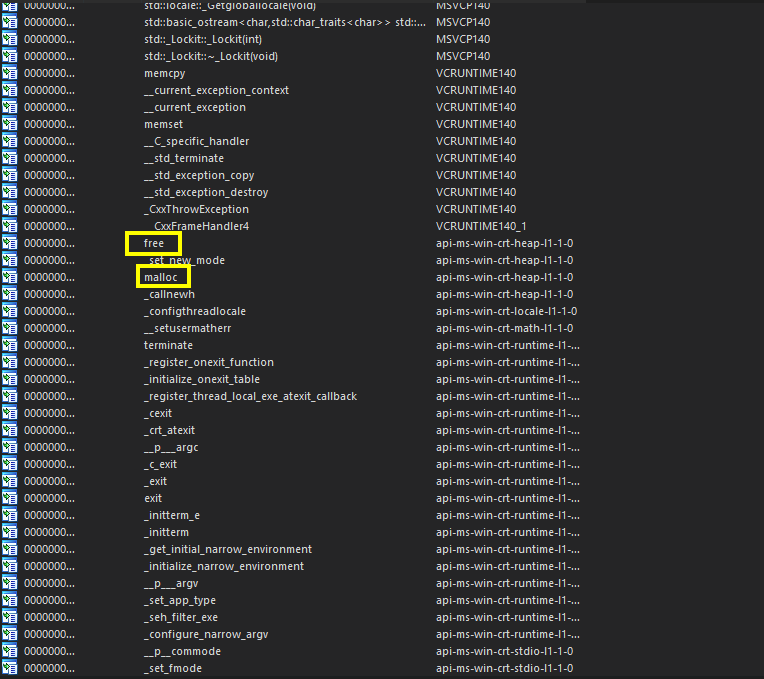

# Buffer Over-run #1

Similar to the previous example, I will not be going over buffer overflows in depth nor give away too much- but we will go over a very basic demonstration of one and learning how to analyze it in the wild!

We will also do similar steps as we did in the previous example with use after free (UAF) flaws.

### Source Code / Isolated Vulnerability

For this vulnerability, we are going to be exploring a very basic user influenced buffer overflow. One of the most simple options which in fact requires an entire pragma (pre-processor definition or statement) before you are allowed to compile it.

```cpp
#include <iostream>
#include <cstring>

int main() {
    char input[10]; 
    std::cout << "Enter your name> ";
    std::cin >> input;
    char* copy = (char*)malloc(strlen(input) * sizeof(char));
    strcpy(copy, input); 
    std::cout << "Echo -> " << copy << std::endl;
    free(copy);
    return 0;
}
```

This code asks for user input, copies it into a buffer without checking. One of the most basic BOFs someone could make.&#x20;

This code utilizes multiple functions, these functions that influence the safety of this program which are defined as `malloc`, `strcpy`, and `free`. Mainly, we should not use malloc when we do not need to, should not use <mark style="color:red;">strcpy</mark> as alternatives such as <mark style="color:red;">strcpy\_s</mark> (_string copy, safe_), and we did however use free properly here.  &#x20;

These calls are important for us to keep in mind. Lets compile and analyze it in IDA.


Note that when compiling, configure your project to use `_CRT_SECURE_NO_WARNINGS` which will prevent the compiler from complaining about safety issues as our intention is to compile unsafe code for demonstrative purposes.


### Analyzing the code in IDA

When we first drop the program into IDA, we can go into the import table and see the functions there. Below is what we see that sticks out to us!

<figure><figcaption></figcaption></figure>

These calls are important to us as mentioned previously due to how easy it is to make mistakes, especially if projects are configured to ignore even the more dangerous errors.


Many code projects especially depending on the team, timeline, leadership and more will possibly completely ignore all warnings during compile, turn security features off, and turn all of these security options that hinder their development time when forced to fix the error.\
\
So most times, it may be one person who just does not want to do the work and pushes a change to disable or lower the verbosity of the error system. This in turn, especially in the future, can make projects MUCH more susceptible to easy-bugs like the ones above. Even if they are not directly using <mark style="color:red;">strcpy, malloc,</mark> etc, you can still make mistakes with just standard system API calls!


However, there is something to note about this- lets go back to scenario 1, the user after free example.

### Tracking Back Our Steps

In the previous example, we explored one core problem- even if we analyze the function and trace using this method, it may become invalid to use and a problem later on in bigger environments. Since REplay tries to stay as real as it can, I felt that this was a good stopping point to tell you that this methodology is really only helpful for CTFs. Recall that the compiler will most likely just implement the function itself instead of importing it if that is what the compiler sees as best fit- especially for functions as small as <mark style="color:red;">malloc</mark> and <mark style="color:red;">free</mark>.

> **So what do we do?**

Well, to explore this further- I added another individual section that is actually used all throughout REplay as you advance through different levels and objectives. This page is linked below.


[tracing-externs](../../reverse-engineering-other-theory-s/tracing-externs/)


## Applying Trace Methods

