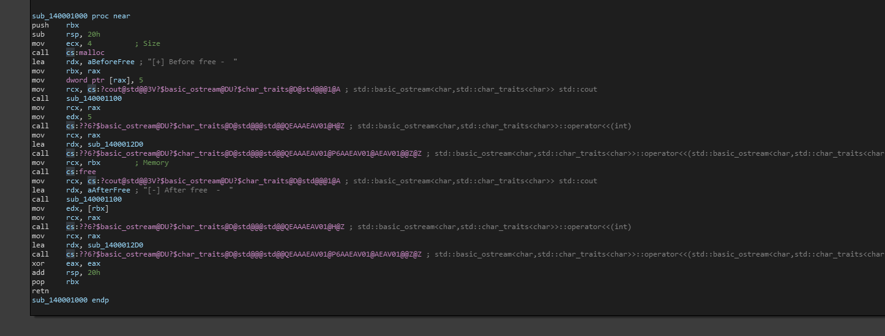

# Use After Free #1

I will not go into depth about what use after free is, instead, we will just be throwing an example of how to analyze it, where it comes in handy, and more.

### Isolated Training - Knowing the know

Before we start our isolated training- we need to have a end goal of why we are doing this, we need to also weigh in the factor of whether or not this is truly worth isolating.

The reason we ask ourselves **is this worth isolating?** is because in many scenarios, compiler optimization is going to catch you by surprise and you may not also be able to recognize traditional symbols, conventions and more. If it is worth isolating, and we realize that it may be worth finding in the future, then it is almost always going to be worth isolating.

### Scenario & Source Code

For our current scenario, we want to train ourselves to not only recognize how to identify use after free vulnerabilities, but also how we can analyze symbols that are not registered yet by frameworks like IDA.

For this scenario, we will be using the basic program code below.

```cpp
#include <iostream>

int main() {
	int* someage = (int*)malloc(sizeof(int));
	*someage = 5;
	std::cout << "[+] Before free -  " << *someage << std::endl;
	free(someage);
	std::cout << "[-] After free  -  " << *someage << std::endl;
	return 0;
}

```

As you can see, we use the pointer after freeing it using the `free` call. So lets compile and toss this into IDA.

### Analyzing in IDA

When we toss the program into IDA and check the import symbol table for any known symbols that can indicate UAF, BOF, etc, we see the following two calls.

<figure><figcaption><p>Image of IDA-pro import tab showing <mark style="color:red;">malloc</mark> and <mark style="color:red;">free</mark> import calls</p></figcaption></figure>

As we expected, we see both function calls in our code. When we list the cross references and go to the first occurrence used, we can see the following.

<figure><figcaption></figcaption></figure>

In this example- IDA seems to have clearly recognized that free is being used here and in the same manner. This was expected due to how small the actual code was making it easier for IDAs mnemonics to kick in. When we analyze the code around free, we are specifically looking at the following.

<pre><code><strong>mov     rcx, rbx        ; Memory
</strong>call    cs:free
mov     rcx, cs:?cout@std@@3V?$basic_ostream@DU?$char_traits@D@std@@@1@A ; std::basic_ostream&#x3C;char,std::char_traits&#x3C;char>> std::cout
lea     rdx, aAfterFree ; "[-] After free  -  "
call    sub_140001100
</code></pre>

In this code, we have the first call which will free the memory moved into the `rcx` register. We then see the move of `std::cout` 's symbol into `rcx`, see the string get loaded before the call finally happens. When the call happens we realize that we are printing a statement and actually just skipped over our flaw.

Because we see that `cs:?cout@std@@3V?$basic_ostream@DU?$char_traits@D@std@@@1@A` is being pushed to `rcx`, memory which has actually just been deallocated, we can see the use after free being made here. This is because we see that immediately after free, no setup, no proper initialization, checking, etc. happens- it simply, immediately gets data pushed onto it.  &#x20;

### Answer Of Analysis

The vulnerability lies in the fact that after the call to free, the memory that `rbx` previously pointed to has been deallocated. However, the code still proceeds to use the `std::cout` object, thus accessing or modifying memory that is no longer valid from the instance of calling `free`.

## Real world summary

While this did help us understand how to audit program binaries or functions to look for use after free in the most simplistic example- we not only need to train to find UAF in more complex scenarios, but we also need to understand how we can recognize free on our own simply by just analyzing the symbols.&#x20;
