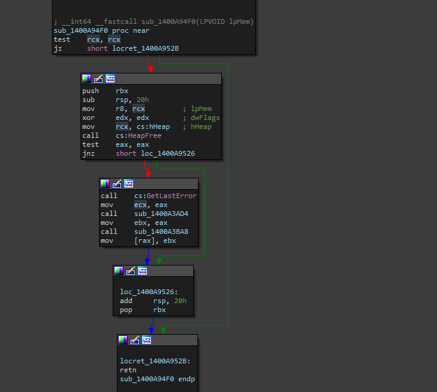
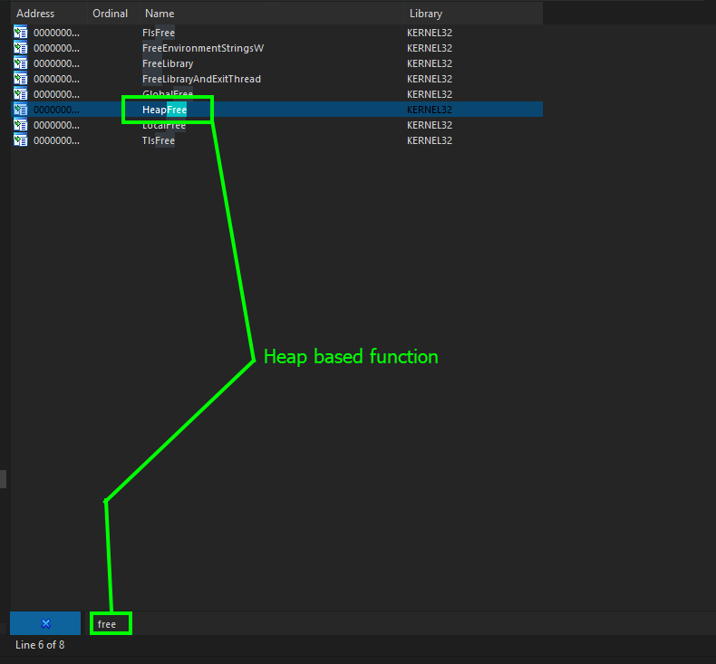
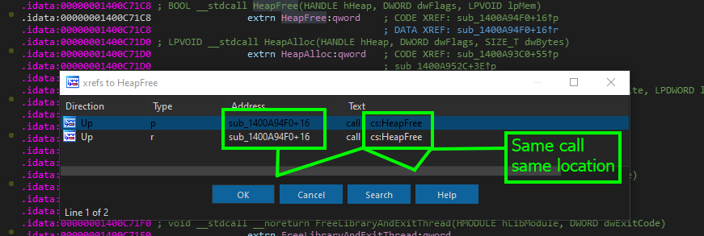
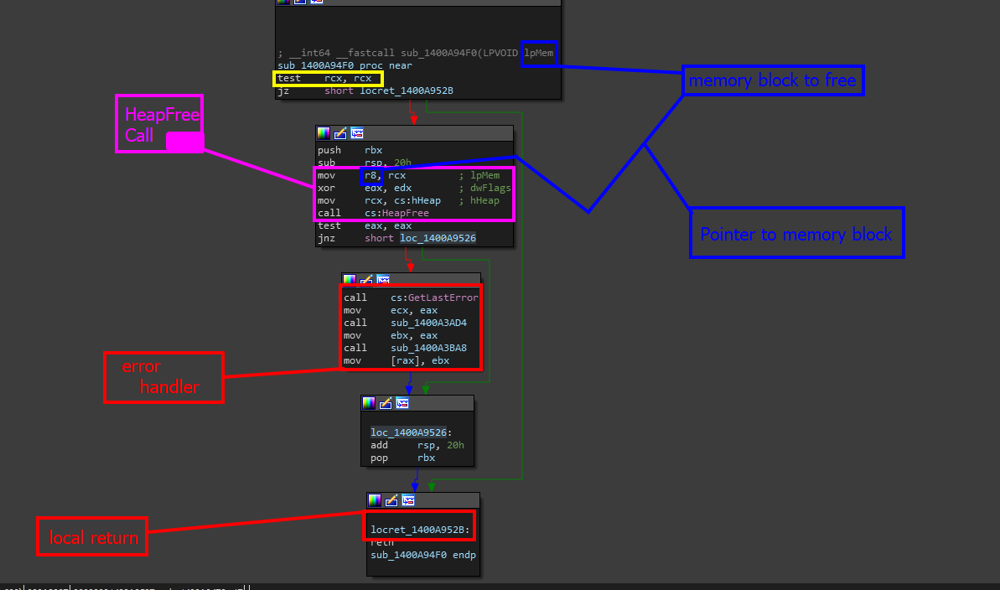
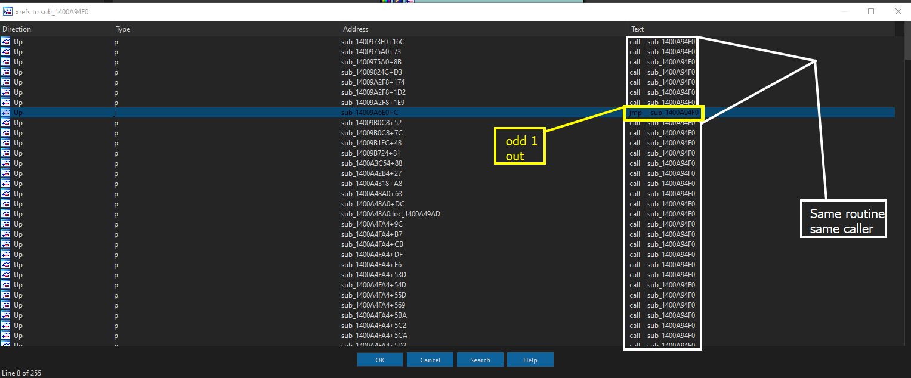
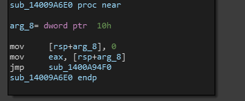
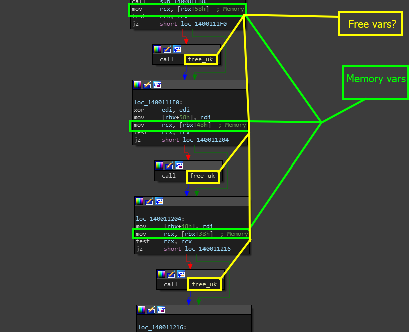

# Analyzing Free

In the previous example, IDA easily was able to find all the symbols loaded into the program, but what if IDA never actually gets to load these symbols? Now what? Well, haha, my friend- now we have to manually reverse engineer it!


This is in fact the case with REplay. During writing of this documentation, even despite reloading and various other methods, it seems as if IDA could not recognize what `free` was and where it was. You will have to manually reverse free and rename it to that same symbol name as well to make sure you can do further analysis properly.\
\
This may also be happening not just being an IDA issue but a matter of a fact of how programs are compiled and what libraries they use. Because this is Windows, Microsoft seems to have embedd their own version of free which relies and traces back to their own system APIs as we will explore later. The reason this is done is primarily due to the way memory management is done on the operating system level on Windows. Alas: we are going to see Windows API calls for memory-management-specific calls.


### Thank Microsoft&#x20;

Thankfully, identifying functions like `free` is actually quite easy by tracing the internal structure of `free` without being inside of `free`. If you spent time prior to this reverse engineering the free memory caller, then you would recognize that despite it being standard C, when compiled with Microsoft Visual Studio- we see that free looks like the following behind the screen.

<figure><figcaption></figcaption></figure>

Thanks to Microsoft, symbols like `HeapFree` imported are going to be so easy to trace back. When we find the same exact structure, list all of its cross references and start seeing the pattern, we are more than likely to see that it ends up being used when free is called on a lower level, most likely with a random subroutine name.&#x20;

Tracing the origin location of `HeapFree` will allow you to gain a more efficient approximation of where the internal function for calling `free` actually exists.&#x20;

## Steps for locating \``free`\`

There is a little bit of footwork to understand where free is being used and how it is being used. But first, we should understand the prevalence of `HeapFree` and why it is important to us.&#x20;

While the entire function has not been dissected yet, you notice that when you cross reference <mark style="color:red;">HeapFree</mark> that it only has those two references both to the same subroutine. The reason this symbol or import is important to us is because it pinpoints a heap related handling function as <mark style="color:red;">HeapFree</mark> is used to free memory on the heap.  As defined by the MS documentation seen [here](https://learn.microsoft.com/en-us/windows/win32/api/heapapi/nf-heapapi-heapfree).

`Frees a memory block allocated from a heap by the` [`HeapAlloc`](https://learn.microsoft.com/en-us/windows/desktop/api/heapapi/nf-heapapi-heapalloc) `or` [`HeapReAlloc`](https://learn.microsoft.com/en-us/windows/desktop/api/heapapi/nf-heapapi-heaprealloc) `function`

Because of this understanding, we can assume that the only time <mark style="color:red;">HeapFree</mark> would be used is in a modification to the original C call - `free` or by a user. We also understand that this is going to be freeing a memory block. In this case, we are assuming the block we are freeing is going to be a pointer. So we can expect the calling convention for `free` to have registers such as <mark style="color:red;">rdi</mark> being pushed to the stack before the subroutine that represents `free` is called.


The reason we look for specific registers is mainly due to the calling convention we are in. Since we are utilizing the standard Microsoft x64 calling convention used in Windows, the first four integer or pointer arguments to a function are passed in registers `rcx`, `rdx`, `r8`, and `r9`, respectively. This means that we should be looking for these being pushed prior to what we think is `free` as this will help us verify a little bit more if the function we are analyzing is some implementation of the `free`call or not.&#x20;


So now that we have information in some state laid out- we can move forward!


I figured that I should warn you now- I injected the previous code sample into REplay's dev build as this build was so big that `free` was changed around and not scanned directly upon load- leaving it up to us to reverse it. Ideally, these are similar steps you would follow for the other challenges.


### Step 1 - Analyze References (if possible)

When I tossed the program into IDA, the first thing I did is go to the import table and filtered (CTRL+F) for all references of `Free` which could indicate some heap or stack management based functions. Thankfully, there is a call to <mark style="color:red;">HeapFree</mark>.

<figure><figcaption></figcaption></figure>

When listing cross references, I was only given two, both of which are in the same subroutine.

<figure><figcaption></figcaption></figure>

When I analyze subroutine <mark style="color:red;">1400A94F</mark> we get the following code brick.

<figure><figcaption></figcaption></figure>

This code shows us a few things, but we still do not understand- as the standard c calling convention is&#x20;

```cpp
void __cdecl free(void *_Block)
```

So how does this make sense? Well, this might be the handler that we were just discussing above, the change to use Windows APIs to handle heap based memory.&#x20;

This call also defines one of the registers we expect to be used - <mark style="color:red;">r8</mark> as a pointer to the memory block that needs to be freed.&#x20;

Now we need to trace this current reference - where exactly is this going? When we list cross references to this current routine, we get a MASSIVE list of functions. But we do manage to see one odd function reference.

<figure><figcaption></figcaption></figure>

As you can see, every single reference to this function is all a call to the function, however, one sticks out to us and it is the one most. The reason it does is because it is a jump instead of a function  call. If we analyze this one first, there is a chance it might be the reference we are looking for. Alas: we are given this brick of code.

<figure><figcaption></figcaption></figure>

This routine is very small, and all we are doing is taking a argument, moving it into <mark style="color:red;">eax</mark> before finally making a jump to the previous routine. For now, lets name this `free_uk` which means `free_unknown` which is a statement to tell us that while we are kind of sure this **might** be the origin call, we are still not 100% sure until we verify this either dynamically or through more static analysis.

### Step 2 - Verifying The Use

The use of this function seems interesting to us because it allows us to verify the function we named.&#x20;


It is worth noting that even if we 100% verify the subroutine as the actual call to free() backed by Windows APIs, we still have a ton of searches to go through. This is because free is used everywhere.\


However, most of it is filtering through junk and most of the times you can train your eyes to recognize what is and what is not junk at the moment in time.


When we list cross references again, we see the first subroutine pop up to be sub\_1400111D0. When looking at this subroutine, we notice that our new call is used as an individual call with one argument to it which seems to be `Memory`.&#x20;

<figure><figcaption></figcaption></figure>

Finally, we can say that we verified the use, especially after looking at many different functions and looking at the data being passed via registers such as <mark style="color:red;">`rdi`</mark>.&#x20;
