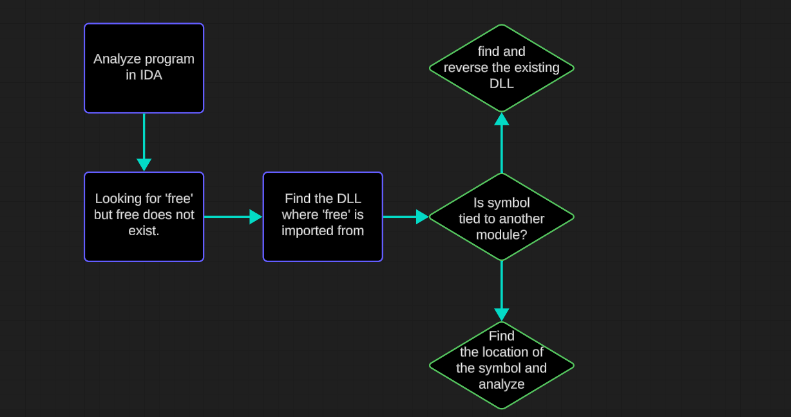

# Tracing externs

During the binary auditing stage of REplay's Level 2 which can be seen here [binary-auditing-6.4.0](../../../writeups/level-2-all-walkthroughs/section-6.0-networking-and-web/binary-auditing-6.4.0/ "mention"), there were many stages where we were actually confused and could not always verify the validity of a function we were analyzing. Even if they were default functions that should have been picked up by IDA!

As you can imagine, this can become a problem in the world of reverse engineering as it is a very time consuming process without knowing **how** to verify functions and how to verify their use cases.

## Identifying the issue

The primary issue within this portion of REplay was that when we were looking for flaws mostly related to heap overflows, or heap related matters- or even trying to analyze heap related functions, we were often stuck trying to figure out what function was what.&#x20;

For example, not being able to 100% verify the structure of `free` or `malloc` which were masked as individual subroutines rather than their imported names.

### Why does this happen?

This happens due to compiler optimization and a few other factors, especially depending on the system or the settings you have for your project.

However, compilers will mainly boil down to these reasons - optimization/performance and product size (_cutting down binary size by eliminating large dynamic linking operations for small and simple functions that can be statically linked_). This makes the program, in the end, much more performant instead of just letting people link whatever no matter the size.

The reason the compiler did not bother doing this for smaller code samples like the one above is because it did not need to. <mark style="color:red;">Free</mark> was not used nearly as enough to warrant static linking.&#x20;

### Fixing This With Theory

Fixing this issue is simple- in order to properly verify that what we found or investigated was in fact a function that was originally dynamically linked- we can reverse engineer the dynamic libraries that hold these functions, analyze their code structures and verify that these code structures are the same.

The thought process is easy to follow along with. Check the chart below for a demonstration of this.

<figure><figcaption></figcaption></figure>

## Walking through this

I have provided some extyra pages for you that will help you along the lines of understanding exactly what this is and how we can leverage it in real world scenarios.


[tracing-free.md](tracing-free.md)



[tracing-malloc.md](tracing-malloc.md)

