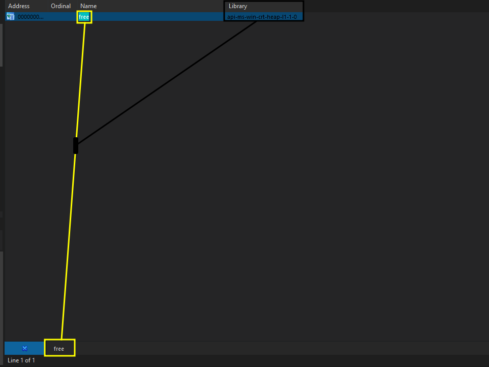
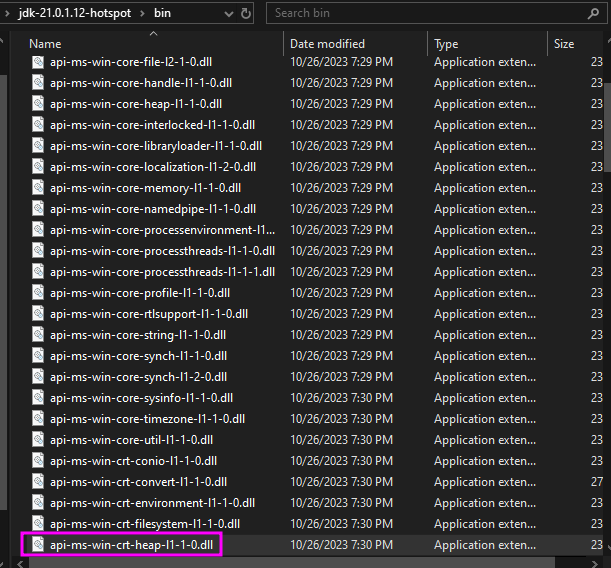
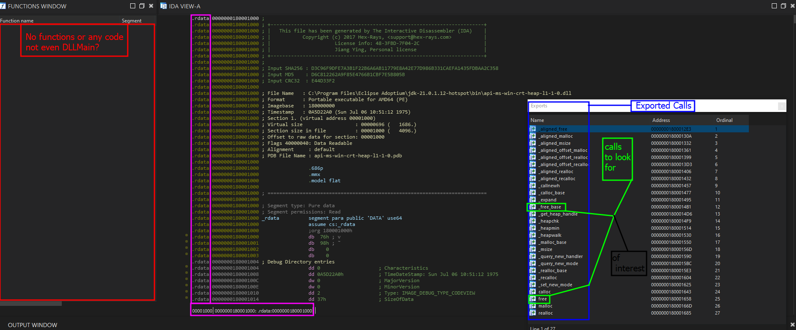
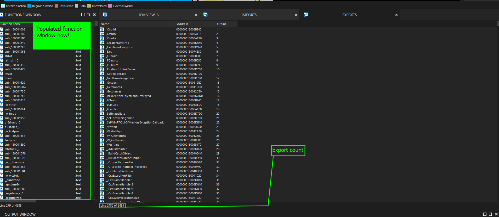
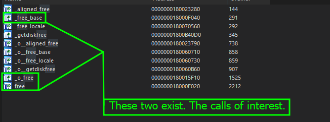
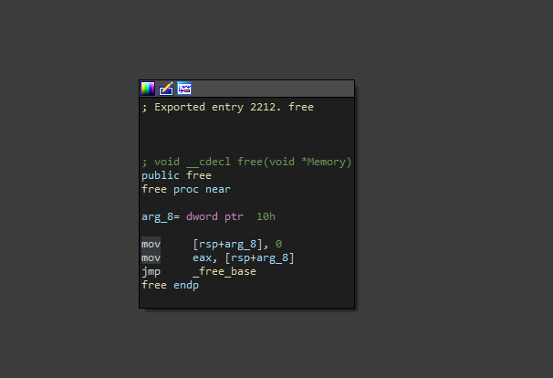
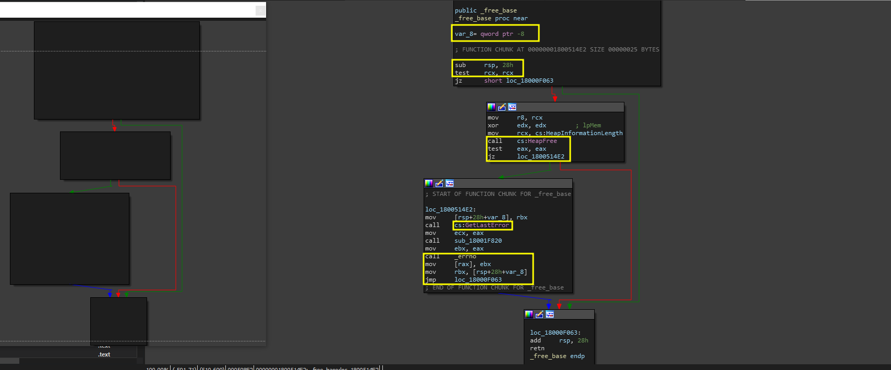

# Tracing Free

For this example, we are going to go back to the original code we had- an example where the <mark style="color:red;">free</mark> function was imported and used.&#x20;

### Source Code

```cpp
#include <iostream>

int main() {
    char input[10]; 
    std::cout << "Enter your name> ";
    std::cin >> input;
    char* copy = (char*)malloc(strlen(input) * sizeof(char));
    strcpy(copy, input); 
    std::cout << "Echo -> " << copy << std::endl;
    free(copy);
    return 0;
}

```

Again, very basic buffer overflow.

### Loading it into IDA

When we load the program in IDA, we are going to be looking at the import table for this one. This is because, if my assumptions are correct, the compiler had 0 reason to statically link this since the program was not in need of mass change or optimization. So we should see this symbol in the import table.

As shown below - this was accurate.

<figure><figcaption></figcaption></figure>

Since we are using this as practice, ignore the fact that this function exists. As sad as it may sound, we can not currently analyze the functions code as it is dynamically linked. Without intermediate dynamic analysis techniques, we will not be able to analyze this code- alas: this is why I chose to go static, its a more fun hunt!

## Tracing Free Back To Its Origins

In order to trace this back to the origins, we must first pay attention to the way that this is imported. In this case, IDA tells us that the symbol table is reading that `free` comes from the `api-ms-win-crt-heap-l1-1-0.dll` library.&#x20;

Cool, so lets check that out in windows. When typing that into the Windows search bar at the bottom of the screen, the DLL should show up as the following.

<figure><figcaption></figcaption></figure>

&#x20; Awesome! We have located the DLL file! Now lets analyze it in IDA.

### Analyzing '<mark style="color:red;">api-ms-win-crt-heap</mark>'&#x20;

We are going to be using the same methods here, but instead of checking the import table, we want to check the export table. This is because whatever the DLL is exporting is going to be what our program imports from the DLL during runtime.

<figure><figcaption></figcaption></figure>

When we analyze this DLL in IDA, there are many things that to the trained eye would not be confusing- but to an untrained eye, it might be confusing why this is happening? Lets first analyze WTF is happening here.

* **Function Table**: Function table seems to be nonexistent. Nothing in there even the usual main entry point for a DLL is specified (_<mark style="color:red;">DLLMain</mark>_).&#x20;
* **Import Table:** Import table is empty which even for a DLL is even confusing to some.
* **No code**: There is no actual <mark style="color:purple;">.text</mark> code here, instead, just data definitions.
* **Calls like free:** We did analyze that free was in fact in here, but then we see `_free_base` which tells us that there might be an extension to the existing <mark style="color:red;">free</mark> function.

Most of this- however, is completely normal! The thing is, sometimes, developers will seperate definitions in one DLL to store the location of those functions and map them to other DLLs to avoid many different issues that can occure during the dynamic linking. So the empty import table, no code, etc is actually not a rare thing to come across.&#x20;

> So what now?

Well, lets go to one of the calls that represents <mark style="color:red;">free</mark>. For me, I will just be going directly to the exact definition. Below is the assembly brick that resembles the result of clicking on the export entry for <mark style="color:red;">free</mark>.

<pre><code><strong>.rdata:0000000180001653 aFree           db 'free',0             ; DATA XREF: .rdata:off_180001214↑o
</strong>.rdata:0000000180001658 ; Exported entry  25. free
.rdata:0000000180001658                 public free
.rdata:0000000180001658 ; void __cdecl free(void *Memory)
.rdata:0000000180001658 free            db 'ucrtbase.free',0    ; DATA XREF: .rdata:off_1800011A8↑o
</code></pre>

In here, we do see one interesting set of functions. We see the exported entry, see the public definition and see the functions prototype (_pretty much a blueprint to the function_) then see the actual database token which lies to be - `ucrtbase.free`. To someone who does not know Windows internals (_which I highly suggest you learning if you will be a reverse engineer or exploit dev for Windows applications_), this is pointing to the [<mark style="color:blue;">Dynamic Link Library</mark>](https://en.wikipedia.org/wiki/Dynamic-link\_library) for the [<mark style="color:purple;">Universal C Runtime Base Library</mark>](https://support.microsoft.com/en-us/topic/update-for-universal-c-runtime-in-windows-c0514201-7fe6-95a3-b0a5-287930f3560c).&#x20;

Okay cool- so lets see if we can find that DLL.


Using Google as specified in [google-is-also-helpful.md](../../replay-isolated-training/tips-and-tricks-for-isolated-training/google-is-also-helpful.md "mention") will be extremely helpful here. This is because, in scenarios where we are limited on information or are still new to a specific area, often looking up symbols or names or functions or dll files will result in some form of knowledge about the system unless its undocumented.\
\
For this, when I started out- I would google symbols like "[ucrtbase](https://www.google.com/search?q=what+is+ucrtbase.dll\&oq=what+is+ucrtbase\&gs\_lcrp=EgZjaHJvbWUqBwgBEAAYgAQyCQgAEEUYORiABDIHCAEQABiABDIHCAIQABiABDIHCAMQABiABDIICAQQABgWGB4yCggFEAAYDxgWGB4yDQgGEAAYhgMYgAQYigXSAQgzMTAzajBqN6gCALACAA\&sourceid=chrome\&ie=UTF-8)" that I saw often.&#x20;


When we pull up the search for the DLL file, we find it in `C:\WINDOWS\system32\ucrtbase.dll`. So now, lets analyze this file for the symbol we are looking for!

### Analyzing  'ucrtbase.dll'


Before throwing this DLL into IDA, IDA may give you a <mark style="color:red;">'permission denied'</mark> if you do not have IDA configured to store the dragged and dropped file into a specific location as you can by default not write to the <mark style="color:red;">system32</mark> path in Windows without elevated privilege's.&#x20;


Dragging and dropping this into IDA, then going to the export table is going to give us this output shown below.

<figure><figcaption></figcaption></figure>

Awesome! We now have a populated DLL! Now lets see if we can find that <mark style="color:red;">free</mark> function (_CTRL+F in the exports area_).

<figure><figcaption></figcaption></figure>

Even better! Our calls exist! Remember that both of these are calls that we want to analyze, for now, lets check out the definition to free and analyze the function routine.

When clicking on this function, we get the following.

<figure><figcaption></figcaption></figure>

Hm, even more interesting. It seems that the original function might have been modified a bit! Lets go back and analyze `_free_base`  which was another _COI (Call of Interest)_.

When we analyze this function- we actually see something quite interesting.

<figure><figcaption></figcaption></figure>

If you have been following along for some time now, and have been walking through the CTF, you would know that in the example during the [use-after-free-1](../../replay-isolated-training/examples/use-after-free-1/ "mention") exercise for [replay-isolated-training](../../replay-isolated-training/ "mention") you would notice this was the same exact function structure to the anonymous one I analyzed which you more specifically had come across in [analyzing-free](../../replay-isolated-training/examples/use-after-free-1/analyzing-free/ "mention").

### Finalizing

With this finalized, we have learned how to verify specific functions when they are statically linked (_due to compiler optimization_) despite being dynamically linked programmatically. This should have been a bit easier to follow on- I know it was a bit tough and some extra leg work, but we can definitely say that at least we have a few methods of verifying specific functions or studying them to say the least (_for further identification_).&#x20;
