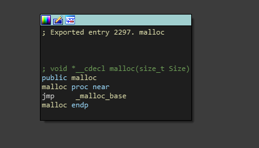
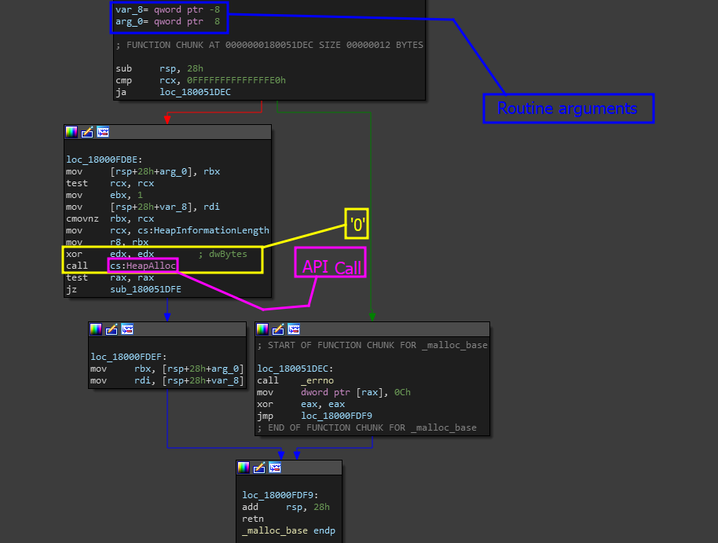

# Tracing malloc

Tracing back the malloc call will also revolve around the same principals, ideally, this is just supposed to be used as extra practice to make sure you get the fundamental concept of tracing functions and analyzing functions.


Remember that this can be super helpful for us- granted, when we step into a reverse engineering scenario, we are not going to immediately know what to do. However, taking notes from understanding the structures of very widely used calls can lead you to more success down the road when reversing. \
\
While it may seem hard to grasp at first- if you give it enough time, it will eventually snap! :D&#x20;


### Code / Scenario

For this scenario, I will be using the same code we did in [tracing-free.md](tracing-free.md "mention") but instead of searching for the <mark style="color:red;">free</mark> function, we will be analyzing the <mark style="color:red;">malloc</mark> call.&#x20;

### Methodologies

Using the same method before- try to analyze the control flow of malloc but instead, we are going to go build off of the previous example. In the previous example, we explored how we can spot specific imports and know when to go somewhere- but in REplay, you will never really know that.

This is why we are taking a slightly different approach.

Instead of opening our target, analyzing our target, choosing a suspicious function, following the function imports and etc., we will be using the previous DLL used to find the free call as a form of study guide if you will?

When we are done analyzing the structure of the malloc call, we will then take important notes on the structure and APIs the backend of malloc uses, then use that as a method to track down malloc in our original target code.

## Analyzing  '[ucrtbase.dll](https://www.google.com/search?q=what+is+ucrtbase.dll\&sca\_esv=92cdb23dca59aae9\&sca\_upv=1\&sxsrf=ACQVn0-QpnScUnPK8D0Q3WIsjgKqg7h8JQ%3A1710215960081\&ei=GNPvZZzGBMGYwt0PsdydoAg\&ved=0ahUKEwicsqj26u2EAxVBjLAFHTFuB4QQ4dUDCBE\&uact=5\&oq=what+is+ucrtbase.dll\&gs\_lp=Egxnd3Mtd2l6LXNlcnAiFHdoYXQgaXMgdWNydGJhc2UuZGxsMgYQABgHGB4yBhAAGAcYHjIGEAAYBxgeMggQABgHGB4YD0idI1CPEVieInAFeACQAQCYAX2gAfsHqgEDOS4yuAEDyAEA-AEBmAIFoALMAcICBxAjGLADGCfCAggQABiABBiwA8ICCRAAGAcYHhiwA5gDAIgGAZAGCpIHAzQuMaAH\_y8\&sclient=gws-wiz-serp)' For [<mark style="color:purple;">malloc</mark>](https://learn.microsoft.com/en-us/cpp/c-runtime-library/reference/malloc?view=msvc-170)

Since we are analyzing the pre-known DLL for the malloc call, all we have to do is go back to IDA, drag and drop the DLL back in there, and analyze the export table for the malloc symbol and analyze its function code.

### Step 1 - Analyzing <mark style="color:purple;">malloc</mark>

I expect you to already know, by this point, how to look for cross references and how to get from calls to the function body itself- so I will spare you the nightmare and skip right to the point of finding the function and analyzing it and what we see at first glance.


'malloc' is a relatively small import, so most likely, we can expect (if used in many applications) that the compiler will statically embed the function instead of importing it dynamically. Especially depending not just on how much it is used, but also how it is being used.


<figure><figcaption></figcaption></figure>

Okay, well for one, we see the first thing we did when we were [tracing-free.md](tracing-free.md "mention") which was just a conditional jump to a base function. These base functions are most likely going to be using some form of <mark style="color:green;">API</mark> on the routine related to memory management.


Got any guesses? Windows has its own [API ](https://learn.microsoft.com/en-us/windows/win32/api/heapapi/nf-heapapi-heapalloc)for allocating memory :D \
\
If you guessed <mark style="color:purple;">HeapAlloc</mark>, you were in fact correct!&#x20;


When jumping to `_malloc_base` we get the following code snippet.

<figure><figcaption></figcaption></figure>

As we can probably infer already, the structure of this call is using `HeapAlloc` after its primary jump. So now what? well, lets take some notes.

### Step 2 - Important Note Taking

The next step is to train ourselves to look for the malloc call when it is not exactly called upon or named directly. Doing this is actually a lot easier than you may think! Below is the important notes followed by the reason it is important.

* <mark style="color:red;">**When analyzing, look for HeapAlloc calls ->**</mark> The common theme we keep seeing amongst Microsoft Windows API tuned standard C calls is that all of them especially around memory management use some form of Windows API as a "_base_" to the original caller. This is VERY important as it helps us quickly pinpoint and identify the function we are trying to look for.
* <mark style="color:red;">**When located in the base, check for jumps to the base ->**</mark> As we analyzed in both examples, and as you will see in many other examples: Microsoft made this easier for us- because for each base exists a main caller, that main caller seems to always be jumping to the base instead of landing conventional calls. Paying attention to this can help prevent us from being overwhelmed by the amount of cross references.
* <mark style="color:red;">**When looking for the base or main caller, template the code to match it ->**</mark> We can think of this as some form of natural pattern matching that is happening within our heads. When we see this code, it is most likely (_as a base_) going to remain the same (_unless someone decides to modify it_) so we can imagine that if we see the code above, we are most likely at the base and vice versa for the origin caller. So keep this code structure in your head!&#x20;
* <mark style="color:red;">**Do not forget to rename!**</mark> Renaming is pretty important, we want to make sure we rename the variables properly- base for base and caller for the original caller. In this case `malloc_Base` for the base and `malloc` for the original caller are all great representations or exactly what we need for further analysis.

Now that we have these notes, its time to ask ourselves...

> Now what?

Well now, we can use this as a method for tracing the original function but I will leave that to you to follow along in the REplay writeups! Since our code already names 'malloc' the code example is not valid to follow this along with. But do keep this information in mind!

&#x20;
