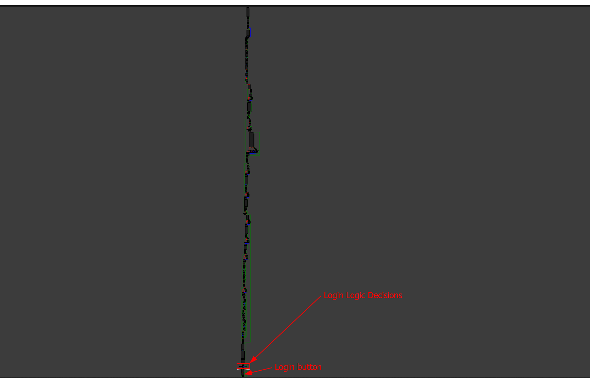
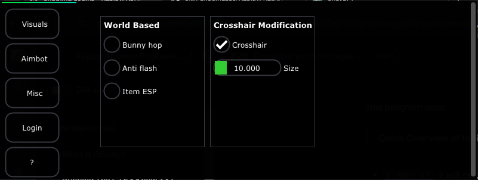

# Crippling Logins

There are two main ways to go about cracking software and those are between keygening and manual patching both of which over time have become obsolete. So...

## Informational Note

### Why learn?

Software cracking is not just useful for understanding the logic in programs, but practicing cracking third-party programs, especially closed-sourced, "**underground**" software like [_DDoS_ ](https://en.wikipedia.org/wiki/Denial-of-service\_attack)panels and so on can help you grasp a little bit more about real-world reverse engineering.

**Granted:** it is no Microsoft Defender reverse engineering or some Crowdstrike Falcon cracking but it's still a relatively **helpful** thing to know how to do from a beginner to an advanced level. And it can be super fun when you want to make a few bits of cash.&#x20;

## Cracking The System

Cracking this system may be trivial to beginners, but should be super easy for intermediates. Either way, take a peak at some of the internal designs.

> Internal Design / Help

This login system is comprised of one main functionality- the fact that it uses a third-party program called [`KeyAuth` ](https://keyauth.cc/)which many game cheats rely on (_**mostly copy/pasted**_). &#x20;

This login system will set a globally accessible variable called `Login` either a true or false value depending on the current status of the login.&#x20;

However, this system never actually queries KeyAuth or uses any remote resources **we would know this if we did proper testing and analysis on the program in an active environment and state**. Instead, the login system will actually use a hardcoded key that you should have found in [find-the-integer-based-key-used-to-compare-the-input-license-in-the-gui..md](../find-the-integer-based-key-used-to-compare-the-input-license-in-the-gui..md "mention")&#x20;

Now, all you need to do is either figure out where that key is used or manually trace the logic for the login system.&#x20;

### Step 1: Tracing Back

Okay so here, we need to trace back some of our steps. Let's go back to the location where we were able to patch the program to say we were logged in _(even if the status internally said otherwise)_.

The image below showcases the last position we were at.

<figure><figcaption></figcaption></figure>

Here is where our original login modification was made. While this is technically apart of the login system, it is not really what you think it is.&#x20;

### Step 2: Analyzing Further

If you spent some time actually looking at the program, you would notice some things right off the bat.

* 1: There is a plaintext value in the application called `Login` that you can actually see on the GUI when you press `Login` whilst also in the `Login` tab of the GUI.
* 2: There is another plaintext value that outputs the last password you tired

Specifically, this is what I am talking about in the CFG (Control Flow Graph) overview.

<figure><figcaption></figcaption></figure>

And this is what that area looks like in the CFG itself.

<figure><figcaption></figcaption></figure>

Looking at this a bit more, it seems that every plaintext string rendered on the GUI has the following series of instructions.

```
push $TEXT || lea register, db_reference (e.g: aLastPassword)
call sub_140057840
call sub_14005A850

```

The way I think of this, especially when I see this same pattern in bricks like the one below

```cpp
mov     rcx, cs:qword_140145470
call    sub_140032970
lea     rcx, aLastPassword ; "Last password...:"
call    sub_140057840
call    sub_14005A850
```

I immediately think that this data is being pushed to a function to output text onto the GUI then it is being popped dynamically or some value such as a font is being popped. If you look at the source code of many C++ applications, especially ones that use common GUI libraries like [ImGui](https://github.com/ocornut/imgui), you notice that the font is pushed, then the text function is called, then after the text function is called you then see a font POP function. Similar to this below.

```cpp
ImGui::PushFont(imGuiMenu::titleText);
ImGui::Text("Last password...:");
ImGui::NewLine();
```

This line is an example where instead of popping the font, we are actually calling for a new line before the text function is called. Either way, if the developer is doing this over and over for each new set of text being rendered on the GUI, then we can picture the same format when its disassembled unless the compiler chooses to optimize this (_**which it should not unless it is a duplicate or can be optimized in a way**_). Another example of this is shown below.

```cpp
ImGui::PushFont(Configuration::Names.TitleFormatFont);
ImGui::Text("Snap line option");
ImGui::PopFont();
ImGui::PushFont(Configuration::Names.TitleFormatFont);
ImGui::Text("Snap line X/Y Points");
ImGui::PopFont(); // Bad representation, we should not push and pop constantly. Should only be pushing font once and pop once we are done using text based functions that rely on this
```

Anyway, we see this pattern on almost all of the text-based calls and rendering. This pattern is common- since this is a common pattern, we can rename the functions such as `sub_140057840` to something like `GuiRenderText` that would help us during analysis to make sure we are not getting lost in the weeds.

### Step 3: Renaming Repeating Labels&#x20;

In order to rename these labels, or function calls, simply right-click on the label and then click "**Rename**" and type in what you want to rename it to. I will be renaming the following functions.

* `sub_14005A850` -> `PopFont` : I chose pop font mainly because this was used every now and then and also was referenced in many bricks of data that required specific fonts. If you also want, you can analyze further and eventually come across the resemblance of it requiring the font inside of the function references.\

* &#x20;`sub_140057840` -> `RenderText` : I changed this to RenderText because it seemed to be used on sections that only used or rendered text onto the GUI outside of widgets. Digging into the module that uses the ESP (_**if you do enough analysis**_) you will see that the ESP for drawing details on the overlay also uses the same function. \

* &#x20;`sub_1400581E0` -> `Widget_Button` : I chose this because if you look closely, and analyze the menu and the way things are constructed, you can see as if the references  `sub_1400581E0`  were all used around local menu buttons. Check the snippet below for this.

<figure><figcaption><p><code>sub_1400581E0</code> -> <code>Widget_Button</code> reference image (Model A - Image A)</p></figcaption></figure>

* `sub_1400597E0` -> `Widget_CheckBox` : The reason I chose this function to be a checkbox is not really verified but rather assumed on the current state. The reason we assume this is because while we can statically see the code in the program for what seems to be other configurations (_**e.g: ESP, Aimbot, Fov circle, etc**_) and do not have access to it, the structure of the setup before this function or subroutine, rather, is called gives us this vibe that it is a checkup. _**You will see this in model B - Image B.**_
* `sub_14005A6C0` -> `DummyInsert_Unknown` : Sometimes, it's best to make variables dummy inserts for the time being- that is until you can move forward. The reason I called this a dummy insert is because we are not sure exactly what this function does. It just seems to be pushing a bunch of floating-point data. _**You will see this in model B - Image B.**_

> **IMPORTANT NOTE:** The one thing you need to know about these "Floating point values" is how exactly they are floating point values. Because when we convert `0x40800000` to decimal, we get `1082130432` ? How does that make sense? Well, just go down the rabbit hole. Check out this page [4.0-and-0x40800000-in-development.md](../../../replay-extras/gui-things/educational/4.0-and-0x40800000-in-development.md "mention")

<figure><figcaption><p> <em><mark style="color:blue;"><strong>model B - Image B</strong></mark></em></p></figcaption></figure>

### Step 4: Tracking & Diving Deep

Let's dive deeper into this a bit and analyze how the login function is going to be traced down.

Right now, we have two exact pinpoints of where it can be and one of them can be eluded instantly.

* **First pinpoint -> (The first occurrence of the term '`login`'):** Remember when we named those variables? Well, now we can identify that the first occurrence of the string `login` is a button. This is because when we go to the first occurrence and view it in the graph mode, we can easily see our renamed function call right after the text '`login`' is loaded by the program.

<figure><figcaption></figcaption></figure>

* **Second pinpoint -> (The second occurrence of the term '`login`')**: This term was the actual button we pressed to login using the data we input. In this case, we can analyze the area in which the button is pressed and check if there is a function that the login could be pressing. So lets go ahead and dissect the login function condition, the button, and surrounding information.

### Step 5: Analyzing The Login Button

The image below showcases what the login button looks like in IDA.

<figure><figcaption></figcaption></figure>

Here we pretty much have the following structure

```cpp
{
    if (Button_pressed()) { // Button was pressed (returned 1, or true)
        push("last password");
        RenderText();
        DummerInsert();// Not sure what here- explore (sub_14005A850)
                       //-new note for (rcx=rdi)
        push(rdi);     //Considering the output on the menu, we can assume RDI is the last password, 
                       //also considering that this was printed after "Last password....:" which we see 
                       //on the GUI when we press the login button.
        RenderText(); // Render the value of 'rdi' onto the GUI 
        PopText(); // Pop font
        // do some extra stuff 
        
        
    } else { // button was not pressed (returned 0, or false)
        // continue execution
    }
}
```

In our findings, we understand some of the general structure. We know that if we press a button, the GUI will tell us (the user) that our last password was ... after "Last password....:" was printed. It will then continue execution.

If the button is NOT pressed, the GUI maintains a state and never has anything done until the user makes an action on the menu or application such as triggering a hotkey or pressing another button.**?**&#x20;

> **Now....what?**

Well now we need to dive into the program, from here, we can leverage IDA-Pros `Pesudocode generator` which allows us to view a more high-level representation of the program. This can be super helpful when we need to verify our logic map and also understand deeper parts of the function flow.&#x20;

### Step 6: Analyzing With Pseudocode

To get to where we want to be with this login system, we need to be able to dump the program in the sense that we understand the flow properly. Without all the mess on the control flow graph especially.&#x20;

Here, we can use pseudocode. To do this in IDA, go to the to the following - `View>Open subviews>Generate Pseudocode` or you can use the hotkey shortcut `F5` to auto-generate it.&#x20;

> **Note**: IDA will disassemble the ENTIRE brick of code we are in or viewing inside of the CFG. So make sure that you are ready for a large output. Also note that IDA will probably spit out some information about specific content, for now- its worth ignoring until it warrants an error.

When we click on `Generate pseudocode` we get this large output that looks something like the image below.

<figure><figcaption></figcaption></figure>

This is the pseudo-code or high-level representation of what our program looks like aside from assembly. Lets go and trace back to our login function that we initially broke.&#x20;

> **IMPORTANT NOTE: The reason we chose to go back to the initial function, where we changed the status, is mainly due to the logic and information we can gather. There is a reason this menu does not allow you into other tabs- if you track the occurence of the variable that was checked in the login status checker, then you would notice that on each tab, there is a conditional using this status. This means that the program is actively checking for authentication for \*nearly\* every action you make on the GUI that allows access to specific features. Alas: there needs to be some global configuration that is here. Whatever it was- this variable or this area most likely had it and is the easiest to pick apart.**

**When we go back we see the following.**

<figure><figcaption></figcaption></figure>

The thing you notice almost immediately is the green possible login status message on the image. In the image, I explicitly state that this is most likely the login status - `byte_140144893` .&#x20;

> How do we know this?

Well, a few things. Analyze the way the variable is used. Follow the list below that may give us some key indicators.

* **Byte value**: The first thing you know about computers is that 0 is false and 1 is true. This means that in compiled programs, a boolean value represents a singular constant byte- `1` as true and `0` as false. So this means that `bool x = 1` really is `bool x = true` . This means that this, especially with the way it is used- most likely is a variable storing a boolean value.
* **Usage**: If you look at the way it is being used in conditionals, then we can infer that it is most definitely used as a boolean value internally- because `if(x)` where `x` is the byte input of `byte_140144893` then the conditional statement `if` must have `x` be either true or false for it to even become compiled.
* **Context**: When it comes to reverse engineering, you are going to see data that looks the same or is the same used frequently in different ways. This is where the context comes into play. Here, since we know this is a login tab, we can almost guarantee that this is a part of the login function, especially when we see it being used almost immediately after the `Login` button is pushed in the login tab.

> **Note (Sub-note):** While this is not required, its important that we rename this variable as it will help us understand what we are looking for in other parts of the program. So, I renamed `byte_140144893` to `Login_Status_GLOBAL`

Looking further into the program pseudocode generation, we see some code below where we suspect the initial login to be.

<figure><figcaption></figcaption></figure>

Dissecting this further we have the following based on color.

* **White**: White is information we already confirmed. We knew that the user had to press the login button in the tab for anything else to execute. We also confirmed that the user input for the password is passed onto two separate functions. One being the "Last password" output series and now the authentication function.&#x20;
* <mark style="color:red;">**Red**</mark>: Red represents anything to do with the variable `v185` . The reason this variable is important to us is that it seems to be passed to the same function (_and the only function in this local scope_) that sets the renamed `Login_Status_GLOBAL` variable.&#x20;
* <mark style="color:green;">**Green/**</mark><mark style="color:blue;">**Blue**</mark><mark style="color:green;">**:**</mark> Green and blue together represent information that is highly likely to be our target. Remember that our target is the authentication function- we basically always need to make the authentication system return a true value (_in some shape or form_). Here, green resembles the fact that the function `sub_14001E260` is most likely the location of the login function. This is because it takes only one parameter (most likely the input we gave it before clicking login) and also returns a byte value. We see that when we click on the function and see that the functions return type is `char` which a char or character is a single byte value. We also see that it setting a byte only value-&#x20;

This gives us more than enough to investigate it. To further investigate and view the disassembly of the function, lets double click this and read the function out.

We get this code

```cpp
char __fastcall sub_14001E260(__int64 a1)
{
  __int64 *v1; // rsi
  __int64 v2; // rdi
  __int64 v3; // rbx
  __int64 *v4; // rdx
  __int64 v5; // rbx
  unsigned __int64 v6; // rdi
  __int64 v7; // rcx
  __int64 v8; // rdx
  unsigned __int64 v9; // rdx
  unsigned __int64 v10; // rdx
  __int64 v11; // rcx
  signed __int64 v12; // rdx
  __int64 v13; // r8
  __int64 v14; // rcx
  char result; // al
  __int64 v16; // rax
  unsigned __int64 v17; // rdx
  unsigned __int64 v18; // rdx
  __int64 v19; // rcx
  __int64 v20; // r8
  __int128 v21; // [rsp+20h] [rbp-58h]
  __int64 v22; // [rsp+30h] [rbp-48h]
  __int64 v23; // [rsp+40h] [rbp-38h]
  __int64 *v24; // [rsp+48h] [rbp-30h]
  __int64 v25; // [rsp+58h] [rbp-20h]
  unsigned __int64 v26; // [rsp+60h] [rbp-18h]

  v1 = (__int64 *)a1;
  v23 = a1;
  _mm_storeu_si128((__m128i *)&v21, (__m128i)0i64);
  v22 = 0i64;
  if ( ((signed __int64)xmmword_140144928 - qword_140144920) >> 2 )
  {
    sub_140008230(&v21);
    v2 = v21;
    v3 = xmmword_140144928 - qword_140144920;
    sub_1400B0200(v21, qword_140144920, xmmword_140144928 - qword_140144920);
    *((_QWORD *)&v21 + 1) = v2 + 4 * (v3 >> 2);
  }
  sub_14001DED0(&v24, &v21);
  v4 = (__int64 *)&v24;
  v5 = (__int64)v24;
  v6 = v26;
  if ( v26 > 0xF )
    v4 = v24;
  v7 = (__int64)v1;
  if ( (unsigned __int64)v1[3] > 0xF )
    v7 = *v1;
  if ( v1[2] != v25 || (unsigned int)sub_1400B0CE0(v7, v4) )
  {
    if ( v6 > 0xF )
    {
      v16 = v5;
      if ( v6 + 1 >= 0x1000 )
      {
        v8 = v6 + 40;
        v5 = *(_QWORD *)(v5 - 8);
        if ( (unsigned __int64)(v16 - v5 - 8) > 0x1F )
          goto LABEL_30;
      }
      sub_14008017C(v5);
    }
    v25 = 0i64;
    v26 = 15i64;
    LOBYTE(v24) = 0;
    v17 = v1[3];
    if ( v17 > 0xF )
    {
      v18 = v17 + 1;
      v19 = *v1;
      if ( v18 >= 0x1000 )
      {
        v12 = v18 + 39;
        v20 = *(_QWORD *)(v19 - 8);
        v14 = v19 - v20;
        if ( (unsigned __int64)(v14 - 8) > 0x1F )
          goto LABEL_31;
        v19 = v20;
      }
      sub_14008017C(v19);
    }
    result = 0;
    goto LABEL_29;
  }
  sub_140022300(&qword_140142D90, "Hello there user!");
  if ( v26 <= 0xF )
    goto LABEL_13;
  v7 = (__int64)v24;
  if ( v26 + 1 >= 0x1000 )
  {
    v8 = v26 + 40;
    v7 = *(v24 - 1);
    if ( (unsigned __int64)((char *)v24 - v7 - 8) > 0x1F )
LABEL_30:
      sub_14008702C(v7, v8);
  }
  sub_14008017C(v7);
LABEL_13:
  v25 = 0i64;
  v26 = 15i64;
  LOBYTE(v24) = 0;
  v9 = v1[3];
  if ( v9 > 0xF )
  {
    v10 = v9 + 1;
    v11 = *v1;
    if ( v10 < 0x1000 )
    {
LABEL_17:
      sub_14008017C(v11);
      goto LABEL_18;
    }
    v12 = v10 + 39;
    v13 = *(_QWORD *)(v11 - 8);
    v14 = v11 - v13;
    if ( (unsigned __int64)(v14 - 8) <= 0x1F )
    {
      v11 = v13;
      goto LABEL_17;
    }
LABEL_31:
    sub_14008702C(v14, v12);
  }
LABEL_18:
  result = 1;
LABEL_29:
  *(_BYTE *)v1 = 0;
  v1[3] = 15i64;
  v1[2] = 0i64;
  return result;
}
```

In this block of code, we come across something interesting like `sub_140022300(&qword_140142D90, "Hello there user!");` which seems to be outputting "Hello there user!".&#x20;

For now, this is something to pay attention to, but the output is still a bit messy. Lets fine tune it.

> To fine tune, go to the very top, right-click on the subroutine or `sub` name then click "copy to assembly" which will then give you a pop up warning saying 'Copying pseudocode to disassembly listing will destroy existing anterior and posterior comments. Do you want to continue?' but you can ignore that since we have not made any comments ourselves and have not required any previously generated or made by plugins etc.

Check the image below with the fine tunned output and what it should look like.

<figure><figcaption></figcaption></figure>

Now that we have this nice output, we can go and explore to the end.

> **IMPORTANT NOTE: INFORMATIONAL** -> Note that we need to change the way this function is returning data since this effects the status of what we think is the logged in status. We do not care to change control flow when we can change the values.

### Step 7: Logical Manipulation

In most programs that you crack, you learn to crack the actual control flow statement. Well sometimes, that will not always work and that methadology of just assuming logic patterns (unless you can proof it) can become harmful in the future.

So we want to look for other things we can change, other ways to influence a function in the case that this function does not depend on logic for setting the variable.

> **IMPORTANT NOTE: Other situations, such as ones that use KeyAuth, will set the last digit of the status code to the application, or- depending on the status message from the server will set a variable to 0. Sometimes, this can be chanined with other functions- just patching over if statements or trying to track down that if statement of origin is going to be a pain. This is where learning other methadologies and ways of manipulation come in handy.**

When we scroll down a bit further we can actually analyze the way data is being set before it is returned. Check the screenshot below for this.

<figure><figcaption></figcaption></figure>

In this function, we have two bricks of code. One that takes the register `al` and stores a `1` or `true` as the status and another operation that conducts a logical XOR operation on the register.&#x20;

> Why does XOR matter?&#x20;

In the original value that returns true, or one, we see that `mov al, 1` is executing. This means that the value was true and the condition worked! But then, if the condition fails we see `xor al, al` . This was actually auto-inserted by the compiler.

The rule goes to state that - `XORing anything by itself will result in a 0 value` . Cool, so we can play the logic game.

> So what to we do?

Well, the simple fix is to find a way to make sure that the executed line to return false, or simply `xor al, al` returns true all the time. To do this, we can **insert our own logic** and change the Boolean logic this program uses.&#x20;

> **Quick Overview of logic**

* `x AND x1` -> will result in true only if both `x` and `x1` are true
* `x OR x1` -> will result in true if either `x` or `x1` (or both) are true

So if we wanted to, since we are xoring `al` by itself, we can actually insert a `AND` here which will allow us to always return true since `al` are the same value.&#x20;

### Step 8: Finally Making The Patch

To make the patch, use the same patching method we used in [crack-the-first-login-system.md](../crack-the-first-login-system.md "mention") and change `xor` to `and` .&#x20;

Save the file and apply the patches to the file we loaded and rerun-&#x20;

### Step 9: Re-running and verifying the findings

When we go back to the login menu, and we click login, we notice that the quick flash of rendering is now `1` instead of `0` which means that we properly patched the login system!

You should not be able to go to any tab such as the `Aimbot` tab or the `Misc` tab as we visit below.

<figure><figcaption><p>Unlocked tabs</p></figcaption></figure>

> **IMPORTANT NOTE:** YOU WILL NEED TO DOWNLOAD LEVEL TWO AND REDO THE FIRST STEP TO CRACK THE LOGIN IN ORDER TO MOVE FORWARD WITH THIS CHALLENGE.

