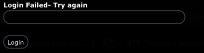
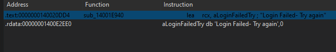
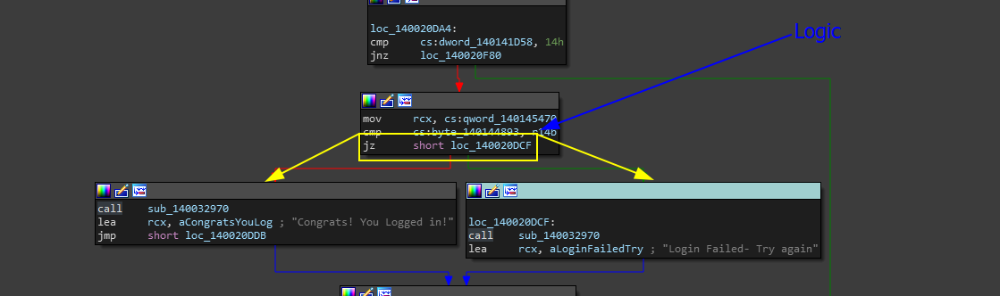
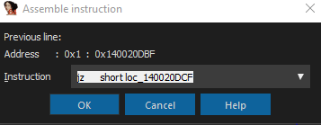
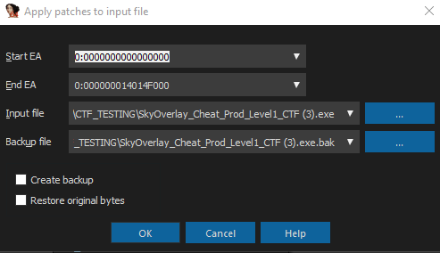
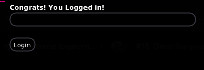
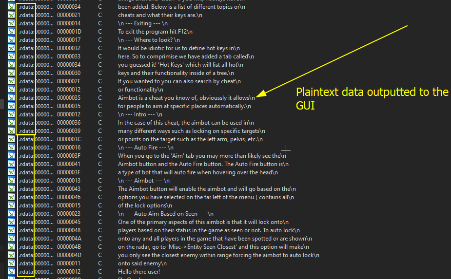
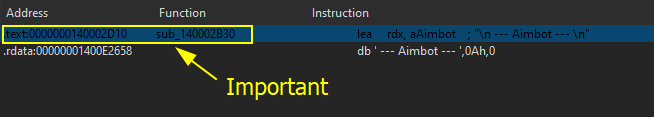
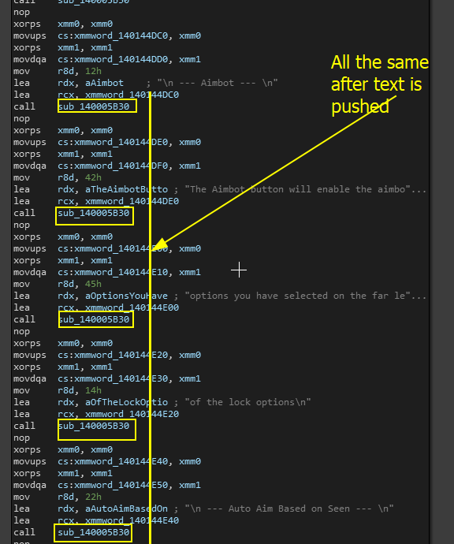
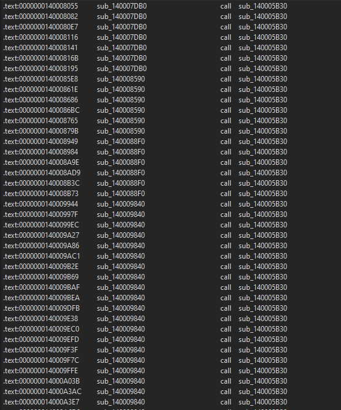

# Crack the first login system

### What is this task?

This task is pretty much to successfully crack the login system and get it to say that you have logged into the application. This would be pretty basic to most, but it is a bit different in this environment since you need to understand the structure of the GUI rendering and take into account some theories on the internal structure of the application before fully understanding it.

Ideally, you are supposed to change the image below

<figure><figcaption>
Login Failed Status
</figcaption></figure>

To an image that says the login was successful.

### How to finish this task?

To finish this task, you need to get the application to spit out the phrase `Congrats! You Logged in!` without even having to press the login button. This is pretty much basic software cracking applications without the toughness.

### Software Cracking

Software cracking is a very niche field and is not really applicable in many huge scenarios but it is still helpful in the blackhat market! For example, maybe you want to crack some malware or cheat or exploit to use it for free.

In this case, we will not be going over software cracking entirely so if you want to learn check these articles out.

* Reverse Engineering - Cracking Code: [https://medium.com/martian-defense/reverse-engineering-cracking-code-218304fcc1ad](https://medium.com/martian-defense/reverse-engineering-cracking-code-218304fcc1ad)\

* Guided Hacking - Cracking paycheats: [https://guidedhacking.com/threads/how-to-crack-pay-cheats-with-ida-pro.20487/](https://guidedhacking.com/threads/how-to-crack-pay-cheats-with-ida-pro.20487/)

While software cracking is something that seems short, it can be quite extensive depending on the scenario- this CTF tries to mimic what most login systems look like in the copy/paster world (where people say pasted game cheats). So bear with us on this one!

### Step by Step

In order to first solve this, the idea of cracking a login system is to make the system do the opposite of what it was meant to do. If it was meant to deny you if your username did not match, then make it give you access if your username does not match. This is done through binary patching, a method of taking specific data in a binary and changing it through static analysis tools like IDA-Pro.&#x20;

But ofc, there are a few things we need to iron out first.

> 1: What are we looking for?

When we go to crack login systems, we are usually looking for the original logic that makes the choice to authenticate us or not. In this case, we are looking for a conditional statement in the binary that will spit out the message `Congrats! You Logged in!` if our credentials are correct and a failure message if they are not correct.

> 2: How are we going to get there?

The next thing we need to figure out is how we are going to get there. In this case, since our Login is in the GUI, we can do the following.

* **Search For The Login Status Message:** If the developer was an idiot, then they would have left this in plaintext for us to trace. We can find all occurences of the login status message that gets tossed to us in the GUI, and trace it back to the logic that determines the output. Then we can reverse and patch the original logic with the reverse logic to crack the login and bypass the need for a license.\

* **Reverse Engineering Function Calls** if the developer was not a moron, and encrypted the login status messages, then it may be a bit tougher to find- but not by much. Since this data is being printed to the GUI, we can imagine that the GUI library this person is using requires a function to print data to the GUI rendering. This will be a special function that is most likely used on many different occurences throughout the program. If we can find and reverse engineer this text output function for the GUI and then name the function throughout IDA, we can find all cross-references of the function and references to the function and then try to find the one that is used in comparison to our text-based input. Of course, this is a deeper and more complex method, but it is more realistic and good to practice.

In this section, we will be using both of these methods.

## Answer 1 - Method 1

The first method is going to be tracing the text status messages of the login system and then find the logic that determines this status.

Simply do what we did for everything else by searching for the string and finding the references. You should find a reference like the following.

<figure><figcaption></figcaption></figure>

So now at this point, we need to analyze the function that is outputting this information. Looking from a graph view, the logic is pretty obvious.

<figure><figcaption>
Logic of the function
</figcaption></figure>

We can see that if the ZF (ZeroFlag) is set to zero, this program will jump to the function that will output the login failed message. But if it is NOT zero, then we will go to the fall which says the user has logged in.&#x20;

To do this, we need to change the logical statement to always go to the fallback function that prints the message which is `Congrats! You Logged in!` .&#x20;

Switch `jz short loc_140020DCF` to `jnz short loc_140020DCF`

> How to change it?

Now go to the very top of IDA, and go to `Edit>Patch program>Assemble` and this box should show up.

<figure><figcaption></figcaption></figure>

Now change it to the final condition which was just changing `jz` to `jnz` and then hit the `x` at the top of the box.

Go back to `Edit>Patch>Apply patches to input file` where the following box should be shown.

<figure><figcaption></figcaption></figure>

For now, we will not be using the StartEA and EndEA to the max potential, and instead, just leave everything the way it is and hit `OK` to make the patches.

When we do that and rerun the application we get the following.

<figure><figcaption></figcaption></figure>

Hell yeah! We got it :sunglasses:

## Answer 1 - Method 2

A lot of times, developers will only spend their time encrypting strings they think are important to hide such as ones around login systems or specific functions and even sensitive information like credentials, and will leave out other strings.&#x20;

The good thing for us is this acts as a breadcrumb and this GUI has a LOT of them. For example, when our program seems to output information about the cheats which we see in massive blocks in the strings section.

<figure><figcaption></figcaption></figure>

Since all of this data is referenced in the application, we can easily change it and analyze the functions it uses. Lets trace it by finding all occurrences and analyzing the function call.

Searching for the `-- Aimbot --`  string we get the following result.

<figure><figcaption></figcaption></figure>

Lets look at this function. It seems as if we see the same occurrence of the function...

<figure><figcaption></figcaption></figure>

Since this function is being called a lot, we can assume that this most definitely might be the function that is used for all the text. To verify this, let's find all the references or findings of this in the program.

<figure><figcaption></figcaption></figure>

Wow that is a lot of references. If you analyze them further, you can see that almost all of them are pushing text that is placed on the GUI before it's printed- this makes us certain that this is the right function.

So we can right-click on the label in its location, and rename it to something like `GUI_TextOut`which can help us in our search for the login function. Eventually, when searching through the functions, you will come across the same compare statement that we did in the first method and you can crack it from there!&#x20;

