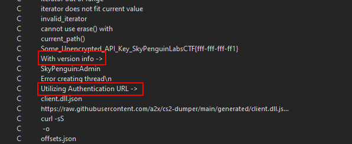
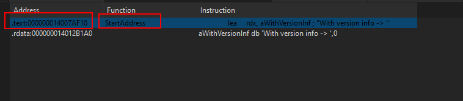
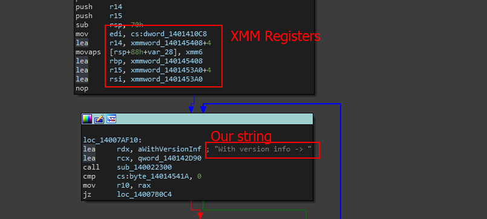
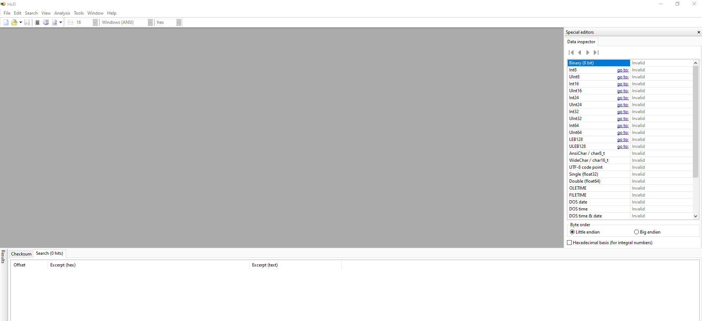
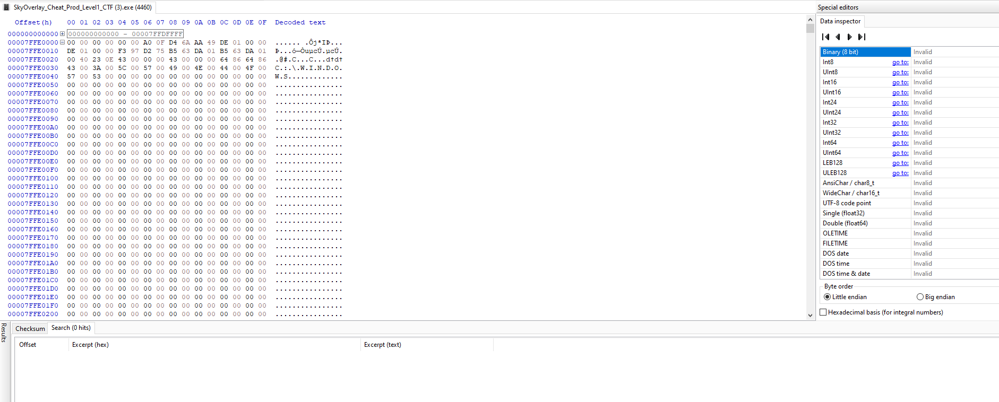
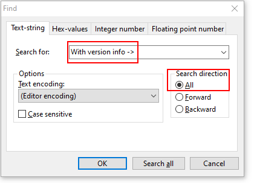
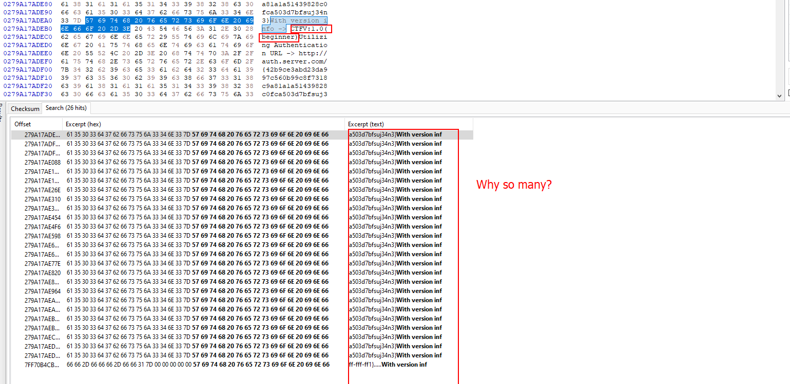
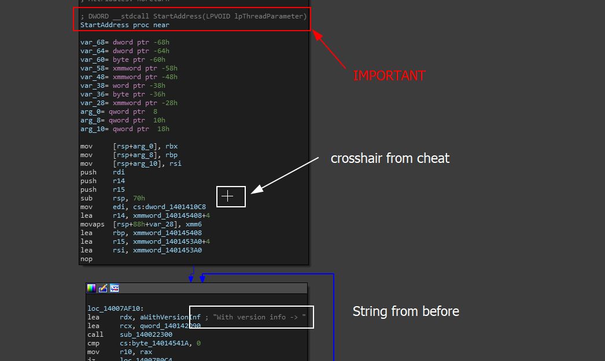

# Find the CTF information block

### What is this task?

This task may confuse people, but to clear up the context, this task is asking that you find a block of text that defines the CTF information such as the version number.&#x20;

This is in the format `CTFV:x.x(xxxxxxxx)`

### How To Finish This Task

To find this, it takes some basic testing methodology that will help us find this information. For additional information, this data is encrypted which means that it uses a specific algorithm during the compile time to statically hide plaintext strings such as the CTF info block.

* **Note**: If you do not know how string encryption works, check out[ this](https://guidedhacking.com/threads/anti-debug-techniques-string-encryption.20486/) article on GuidedHacking&#x20;

We can get around this using a method that allows us to track down where the CTF may be placing information output or may be parsing/formatting application information. Recall to the previous objective writeup and you are able to see some weird sets of strings that seem to print out specific information.


<figure><figcaption></figcaption></figure>

While we are not 100% sure what these are, we know they are informational and must be used to format version information of either the app or API and an authentication URL which could possibly represent a remote authentication server. But it seems as if the data being formatted is encrypted.

This means that we need to dynamically search through the program's memory to find this string when it is decrypted. Before we go to decrypt this, we need to verify some information.

### Going Back To String Encryptions Inner Workings

The one thing you need to know about string encryption is that data that is encrypted statically, needs to eventually be used by the program. This means that it must be decrypted dynamically when the program runs- this is one of the very many downfalls of static string encryption.

If a program does not implement anti-debug measures properly, someone may easily be able to dynamically trace statically encrypted data in the program's memory and pull it out of its dynamic set.

### How can we do this?

To properly view statically encrypted strings when the program is decrypting them, we must catch the program at the right moment decrypting that string.&#x20;

### What do we need to verify?

Well we can not just go hunting, because we are still unsure of the information we need to find other than the fact that we are looking for version information now since we have the string output `With version info ->` . This is our golden ticket because it can help us when searching for this dynamically.

We also need to verify that this is using decrypted information, which we can view with the way data is being pushed to the stack before the function output call.

For example, let's take a look at the bricks that call these strings. We can do this by going to the text view of the program, and then going to `Search>Text` input the text `With version info ->` and then select search for all occurences and hit enter.

<figure><figcaption></figcaption></figure>

We want to view the function in the `.text` section as this section resembles code in a binary application.&#x20;

> **Note**: A good resource for binary analysis and how binaries work, if you are new, is going to be practical binary analysis: build your own linux tools for binary instrumentation, analysis, and disassembly by Dennis Andriesse

When we view the functions we see this in the graph view.

<figure><figcaption></figcaption></figure>

We have our string and right before our string is loaded we instantly see a massive use of XMM registers. The reason these are interesting to us is that XMM registers are used to perform calculations on data. For example, this can be a rotation, or in the case that we are decrypting data or encrypting data.&#x20;

While we still are not 100% sure, it is apparent that it might be worth investigating during dynamic analysis.

> **Important Note: In order for us to find the CTF information, we can assume that this string`With version info ->` will be decrypting the string CTF information block. When this is decrypted dynamically, the decrypted string will be placed in a location that is adjacent to the string that prints the data. This means when opening programs like HxD, viewing the program in memory and searching for the string `With version info ->` will draw us to the version of the program being printed if its ever decrypted.**

### Executing And Finishing The Task

downloadTo do this, download and install HxD or download it from [here](https://github.com/TotallyNotAHaxxer/HxD-VersionUsedinGHFM). When you downlosd HxD and run it, you should have this screen show up.

<figure><figcaption></figcaption></figure>

This means that HxD has no file currently open and no process is actively being dumped. The cool thing about HxD is it will allow us to read a processes memory (**if the process does not block it via DACLs**) and dump all the active data that was decrypted or left unencrypted during compile time.

To do this, go to the top of HxDs tab bar and go to - `Tools>Open main memory` and you should see this window pop up. If you can not get it to pop up, try `Shift+Ctrl+M`&#x20;


<figure><figcaption><p>Process list from HxD</p></figcaption></figure>

Now select the process and the window should now be populated with a massive hex dump also showing the strings.


<figure><figcaption></figcaption></figure>

Now since we want to grab the possible area of the encrypted string we are looking for, we can use the string before which we assumee to include this mysterious encrypted data by hitting `Ctrl+F` in the HxD window and then searching for the string we found before which might be the culprit.


<figure><figcaption><p>Configure the string search </p></figcaption></figure>

Then hit `Search all` to find all occurences. When we do that, the bottom window instantly becomes populated with a bunch of occurences.


<figure><figcaption></figcaption></figure>

In the findings, we find the CTF information block which is `CTFV:1.0(beginner)` and we also found a bunch of other occurrences of the information.

Sure, we found the task- and finished it, but let's go the extra mile for a second.

### Going The Extra Mile

When exploring the GUI, there is something you never see- these strings we seem to be finding statically. You can press every button, and try to make every action but we never see this data.&#x20;

> Why?

Well there is two reasons this is happening

* **1: The data is not being called ->** this does not make much sense because if the data is not being used in the program, usually the compiler will trash it and we would have never found the encrypted data being decrypted in memory. This is because the data needs to be used for it to be decrypted by the program.&#x20;
* **2: The program is printing the data out just not on the GUI ->** Some programs, especially applications that use drivers, may debug print or call output symbols  `std::cout` to output information onto a console which can be plugged into the application during development. Sometimes developers are morons and leave this information in the binary still sitting there being used, so we can usually find out how this is being called by tracing the cross-references to the functions we analyze that hold these static strings. Or we could inspect the functions area and location as well-&#x20;

When we go back to where we found the string that helped us locate the decrypted data in memory, we actually see something SUPER important.

<figure><figcaption></figcaption></figure>

This image hwee shows us that there is a function calling this information called.

```cpp
 DWORD __stdcall StartAddress(LPVOID lpThreadParameter)
```

This function being called is for threaded routines and is used in function calls like `CreateRemoteThread` We can easily find this out by googling it and looking at some forum threads and even Microsoft documentation.

So we have our solution-

> **Conclusion (Part 1)**: Most likely, our program is being told to print this information in a loop while the program is running. This was most likely used in a function called `CreateRemoteThread` to create the thread and store the handle.

With this conclusion, we can also investigate the length of time it takes for this same information to be used in the program (_or printed to STDOUT_).

We can do this by looking at the end of the routine or looking for any suspicous sleep commands or timing commands.

> Eventually after scrolling for a while...

We come across a brick of code at the very end that executes a set of instructions shown below.

```armasm
jmp     loc_14007AF10
```

This essentially means that our program will jump and restart the information loop- we can read this because `loc_14007AF10` looks like the code below.

```asmatmel
lea     rdx, aWithVersionInf ; "With version info -> "
lea     rcx, qword_140142D90
call    sub_140022300
cmp     cs:byte_14014541A, 0
mov     r10, rax
jz      loc_14007B0C
```

When we lok above the jump call to `loc_14007AF10` we see the following code.

```
mov     ecx, 1388h      ; dwMilliseconds
call    cs:Sleep
```

This call is to a windows function called `Sleep` which takes a single argument (_based on the Microsoft Windows API documentation_ [_here_](https://learn.microsoft.com/ja-jp/windows/win32/api/synchapi/nf-synchapi-sleep))

```cpp
void Sleep(
  [in] DWORD dwMilliseconds
);
```

This means the information pushed to the function first (as IDA also indicates as`dwMilliseconds`) is the amount of time the program waits before jumping back to the top of the loop to slide back down to the timer.

&#x20;In order to find how much time it actually takes, we can convert the hex value `1388` to decimal which is 5000.&#x20;

```
Python3 REPL (Read Eval Print Loop)
>>> 0x1388
5000 # <- Decimal value
>>>
```

5000 in milliseconds is equal to 5 seconds.

> **Conclusion 2 (Final)**: Our program waits 5 seconds before re executing a function on a thread to print debug information about the program.

### Answer

The answer to this is simple- `CTFV:1.0(beginner)`
