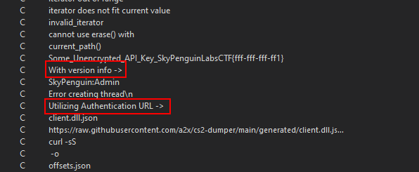

# Find the encrypted API key

### What is this task?

This task is basically asking you to find an encrypted API key. I know the way I phrased this wording was weird, but basically, our strings are always going to be decrypted during runtime with this CTF, but I use `encrypted` to give you a hint that the data is encrypted and you need to use specific methods to find it.

### How to finish this task?

We could take the same information from&#x20;


[find-the-ctf-information-block.md](find-the-ctf-information-block.md)


and use the same methadology as before to find the API key.

Check the sections below to walk through this.

### API Key Overview

Many API keys, especially ones used for server based authentication, have a character set of `A-Z, a-z, 0-9` and very rarely have a mix of special characters like `|{}[]()_+` and will frequently use `:` or `-` as a seperator. We can use this information as **theory** for trying to find an API key in the program.

> Question: Where exactly is an API key going to be used on a client side application?

Well, we would use the API key for some remote service the application relies on. So we can imagine this being formatted with some remote URL or formatted with parameters before a request is made.

### Going Back A Step

Remember this image in the previous task?

<figure><figcaption></figcaption></figure>

There is a reason `Utilizing Authentication URL ->` is highlighted there. Similar to `with version info ->` this string was also used in the same thread as the previous string- most likely to print out the URL for remote authentication. This can be used as another important piece to our theories and tests.

### Using HxD To Solve This

Similar to the previous step, open HxD, dump the programs memory, then search for the string `Utilizing Authentication URL ->` and you should come across the output like below.


<figure><figcaption></figcaption></figure>

The output selected is a URL&#x20;

```
http://auth.server.com/{42b9ce3abd23da997c560b99c8f7318c9a81a1a51439828c0fca503d7bfsuj34n3}
```

This URL now has the what once was a encrypted API key and now decrypted API key included in the URL as a value of path on the server.

### Answer

The answer to this is that the API key was `42b9ce3abd23da997c560b99c8f7318c9a81a1a51439828c0fca503d7bfsuj34n3`&#x20;

* 1: This fits our A-Z, a-z, 0-9 pattern&#x20;
* 2: This was used for a remote resource with `auth` in the endpoint
* 3: It is most likely debug info due to it being in the same thread used for debug purposes.

#### How did we verify point 3?

&#x20; This was easy because we can see the brackets and the use of XMM registers at the very end of the thread routine that we found in the previous section.

* The XMM registers indicate some form of decryption (or mathematical operations) happening ondata
* The bracket at the end before another function is called (to presumably print this info because this function is being called after every function is formatted) indicates the end of string formatting being pushed onto the stack as an argument to another function.

Lets look at the end of the function to verify this

<figure><figcaption></figcaption></figure>

With all this in front of us, we can pretty much say that considering the start and end between the two brackets, this is definitely the encrypted API key.

