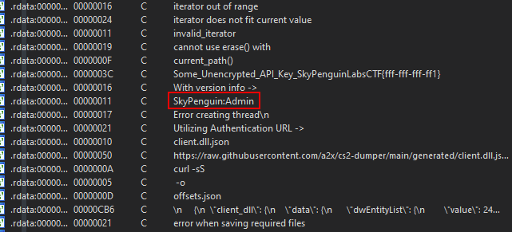

# Find the HTTP-BasicAuth formatted username and password

### What is this task?

In order to finish this task, we need to obtain HTTP-BasicAuth Formatted credentials that were left in the applications binary.&#x20;

* **For context**: HTTP-BasicAuth formatted credentials usually look like this before they are base64 encoded if encoding is applied - `username:password`   &#x20;

### How to do this task

With standard methodology, we can first look through strings as we did with the previous section and objective, then use different sets of IDA made regex patterns to match specific patterns for that format. Or we could just look through the strings and eventually come across a key that is `SkyPenguin:Admin`

<figure><figcaption></figcaption></figure>

