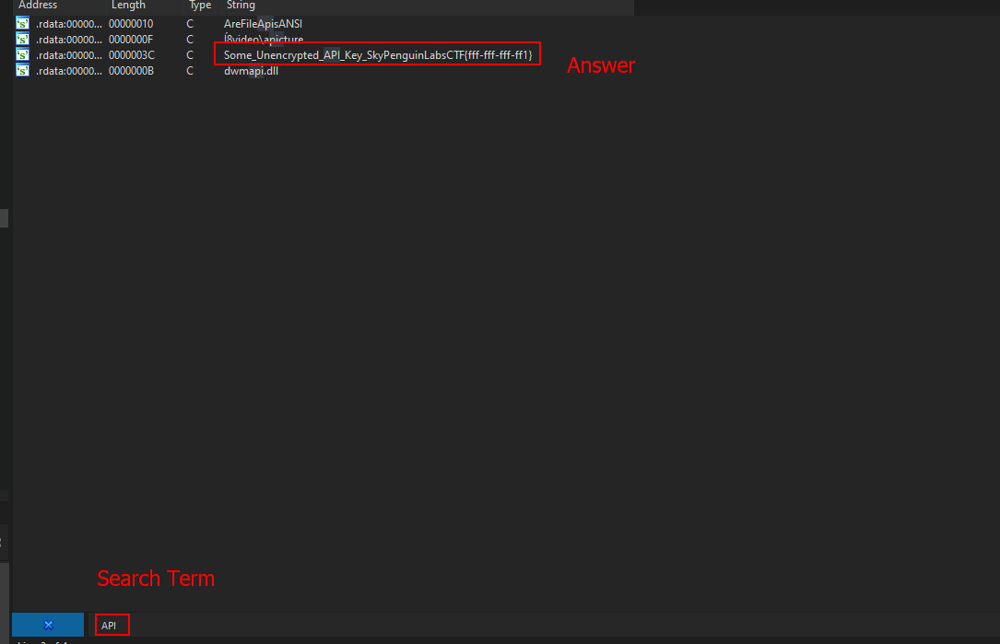

# Find the unencrypted API key

### What is this task?

This task involves going through the program's active memory and searching for the unencrypted API key.

### How to do this task

In order to finish this task or objective, we can drop our program in IDA-Pro, go to `View->Open subviews->Strings` and get a list of the strings in the program.

From there, we need to search for specific keywords such as API, CTF, and so on from there until we come across the key.&#x20;

Eventually, when searching for the term `API` or `CTF` IDA pulls up a string that looks like the following.

`Some_Unencrypted_API_Key_SkyPenguinLabsCTF{fff-fff-fff-ff1}`

<figure><figcaption></figcaption></figure>

