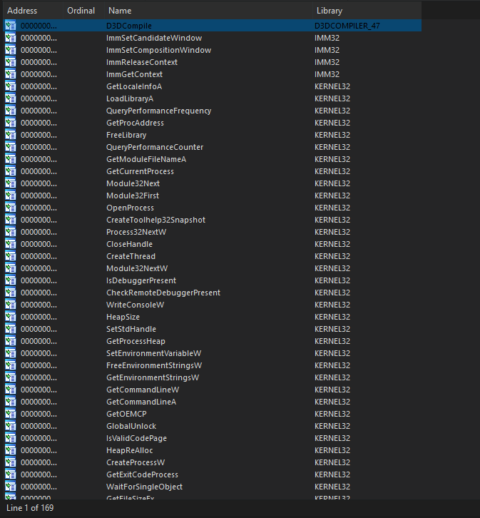
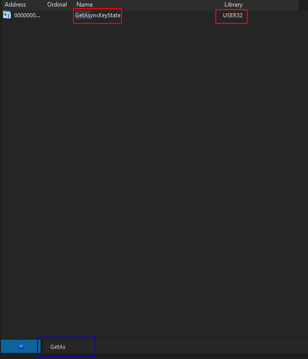
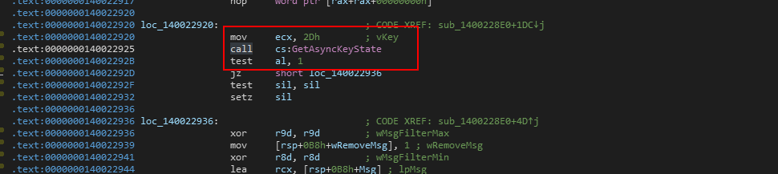

# Modify the variable of the hide menu functionality

### What is this task?

This task is also formatted a bit weirdly so to briefly explain it- to click around on your main screen while the menu is running, you need to hide the menu. Sadly, the person who gave us this menu slapped us with documentation that did NOT go over the hide menu functionality and feature.

Your task is to find and modify the undocumented keystroke to hide the menu. Note that this will be the key that hides the menu not exit the program.

### How to finish this task?

Since we are looking for a hotkey, we need some base theory to get us started.

The idea is simple: Since this is a game cheat, developed purely for gamers to trash other people in games- there will be many hotkeys to activate specific features in the cheat. Anything from Aimbot to wallhacks most likely has some form of a hotkey. Because hotkeys are monitored usually through system API calls, we can find all references to a system API call such as `GetAsyncKeyState` to find the type of keys being pushed into the function before the function, and find the key that is causing us to do this.

However, this idea is a bit wonky, so let's refine it a bit.

### What to solve?

We need to solve a few things before finding the undocumented feature. Check the list below.

* **Are they using a module of their own or can we verify that GetAsyncKeyState is used?** This is simple to figure out as we can look through the `imports` tab of IDA which will show us all the symbols that this program imports from a module.
* **How are we going to find the key?** Well, this is split into two forms. The first form will help us navigate to the area in the program we are looking for aka, the actual key we pressed that hid the menu. Since this is a game cheat, pressing a single key on your keyboard and going down the list of keys to press while the menu is active may eventually reveal the keystroke.
* **How are we going to find the key? (The second form)**  -> The second part of the key is the virtual key code pushed to the function that listens for keystrokes and executes actions based on the input state of the key `1 for true, or active` and `0 for false, or inactive`&#x20;

### Looking at symbol imports

Going through imports is easy. The second we drop the program into IDA, IDA gives us a few tabs by default, one of those is called `IMPORTS`. Go to this tab and you should see something like the following.

<figure><figcaption></figcaption></figure>

Ideally, because **this application is built for Windows** we can imagine that it is going to be using some sort of internal function to get the virtual keys active state in some loop as a listener. The most commonly used function for this, if someone chooses to not use their own module is going to be `GetAsyncKeyState`&#x20;

So in the  `IMPORTS` tab, press `CTRL+F` to pop up the find search bar, and type `GetAsync` and by then you should see it pop up.

<figure><figcaption></figcaption></figure>

Since we know this application relies on this, we now know what we need to look for. We need to look for all cross-references or references to `GetAsyncKeyState` and need to analyze the first argument being pushed before the function is called which will define the virtual key code in hex that is being used.

([https://learn.microsoft.com/en-us/windows/win32/api/winuser/nf-winuser-getasynckeystate](https://learn.microsoft.com/en-us/windows/win32/api/winuser/nf-winuser-getasynckeystate))

```cpp
SHORT GetAsyncKeyState(
  [in] int vKey // Virtual Key code 
                // | View them here (
                //   https://learn.microsoft.com/en-us/windows/win32/inputdev/virtual-key-codes)
);
```

### Finding the key

To do this, we can work with two possible ways.

* **1: Brute force virtual key events ->** Basically, here we will build a program to brute force every single virtual key possible until the brute forcer sets a specific key state to active in which that key causes the menu to become hidden.
* **2: Manually Brute Force ->** Manual brute force would be easier too if you do not know how to script fast. Basically, just type common key patterns and common keys or every key until the menu does what you need it to do.

For brute forcing with a tool, you can go to the page below to build and use this tool on the level.


[key-state-brute-forcing-utility.md](../level-exploits-scripts/brute-forcing/key-state-brute-forcing-utility.md)


### Option result - Theory Buildup

It does not matter what option you choose- but eventually, you will find that the key `INS` or `INSERT` will hide the menu momentarily. So now that we have it mapped out, we can look for the value or argument pushed before  `GetAsyncKeyState` which again is the virtual key code. Since we know it is INS, we are looking for `0x2D # (`[`https://learn.microsoft.com/en-us/windows/win32/inputdev/virtual-key-codes`](https://learn.microsoft.com/en-us/windows/win32/inputdev/virtual-key-codes)`)`

### Going Through The Function List

In order to find this function, we need to find a listener within the program that pushes this value to the stack and uses it as a conditional.

We can imagine this function internally to be like this...

```cpp
bool state;
push(0x2D)
state = GetAsyncKeyState()
if (state) {
  HideMenu() // Hide it as the key is active
} else {
 nop
}
```

So we want to look for something like this in the program because we know that some data has to be checked such as the key state before the menu is hidden on the overlay.

Similar to text, when we find all occurences we can go through the function references and eventually find one that has a similar structure to the pseudo-code example.

<figure><figcaption></figcaption></figure>

To modify this, do the same thing we did in the previous walkthrough which is shown below.


[crack-the-first-login-system.md](crack-the-first-login-system.md)


Instead of changing an instruction, we can change the value to whatever we want- like `h` for hide or `x` and so on from there. Just make sure the code is in hexadecimal format and is supported here ([https://learn.microsoft.com/en-us/windows/win32/inputdev/virtual-key-codes](https://learn.microsoft.com/en-us/windows/win32/inputdev/virtual-key-codes))


