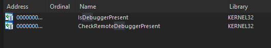

# Security Systems In This CTF

### What is this task?

This task asks you to find all of the security systems at the very first level. There are many different ways to solve this and it purely depends on the route you want to go.

### Using Common Thought Logic

One of the many ways to get this done is kind of go through a list of things you would expect a developer to think most of. For example, this is a game cheat- we do not expect our end users to go through the pain of sandboxing this cheat to run it, so this is not going to be a priority.&#x20;

However, maybe some of our users are going to have some basic debugger knowledge especially if they want to look cool in front of their friends- so anti-debug and anti-analysis techniques are going to be better.&#x20;

It also depends on the way you look at it, the way you explore and what exactly you need to know exists as a security mechanism before proceeding further.

**For further example:** we know that if we want to properly debug and dig apart a program dynamically, we need to get rid of anti-debug systems if they exist not just some random binary integrity system- simply because the binary integrity system, while being a security system, is not going to be triggered simply because we are not modifying the binary directly.

### Finding Security Systems

Finding security systems in most applications like this is not that hard. In fact, all you have to do is look through a few tabs and views on IDA to see if any are blatantly ontop. Take the list below as some areas to check.

* **Import table ->** here, symbols like `IsDebuggerPresent()` are most likely going to be seen. Also, knowing other symbols that are used in unison with other security systems, such as cryptographic imports like Sha256 header imports, specific algorithm function imports, and so on from there which are used for binary integrity systems that are purely client-sided (or server-sided with client-side configuration)&#x20;
* **Strings ->** If the developer did not take debug messages out, or error and status messages, a lot of error system relics can be uniquely identifiable error messages. For example, the KeyAuth library will create a new console window before displaying the message `Pattern checksum failed, don't tamper with the program.` . Because this is a common pattern with the vendor itself, it's going to be easy to recognize in the program indicating potential security systems.&#x20;
* Names/Functions -> Names are also pretty important, as they can tell you other functions used within the applications and their locations. While not explicitly telling you that there is a security system here, you might be able to see some other functions or symbols that indicate other security systems.

There are many other methods to finding these systems as well, some of them you might not be able to find in software like IDA right away without the proper expertise due to how hidden some systems are. At this level, there are a few of them we can find.&#x20;

### Answer(s)

Since this part of the CTF is just getting you to feel good about your knowledge, this one is a bit easier. Just go to the import tab in IDA, and search for topical words like `Debug` or `Anti` or `crypt` and you might be able to catch some good symbols. Check the following two below which are our answers.

<figure><figcaption></figcaption></figure>

**Our answer is**&#x20;

* `IsDebuggerPresent`
* `CheckRemoteDebuggerPresent`

> **Important Note: Sometimes, anti debug symbols like \`IsDebuggerPresent\` is not always something that is imported and used. Some of them may just be imported but never called in a sense that the developer themselves did not do it, instead a library is. So whether or not that system is constantly being run is purely dependant on the application. You can verify that the function is used if you trace down the area its used in and find functions like threads (which may constantly check if a debugger is present) and so on from there.**

