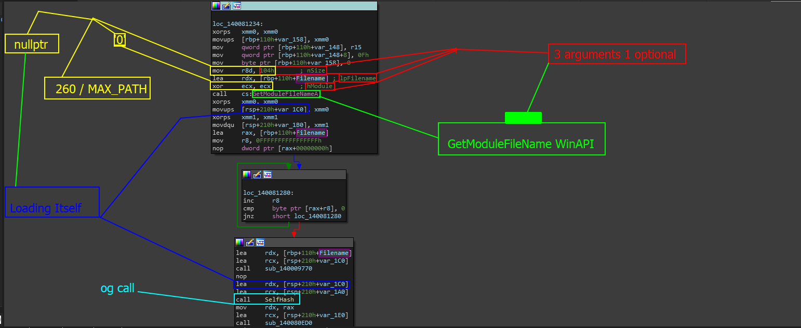
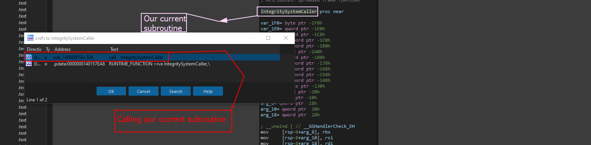
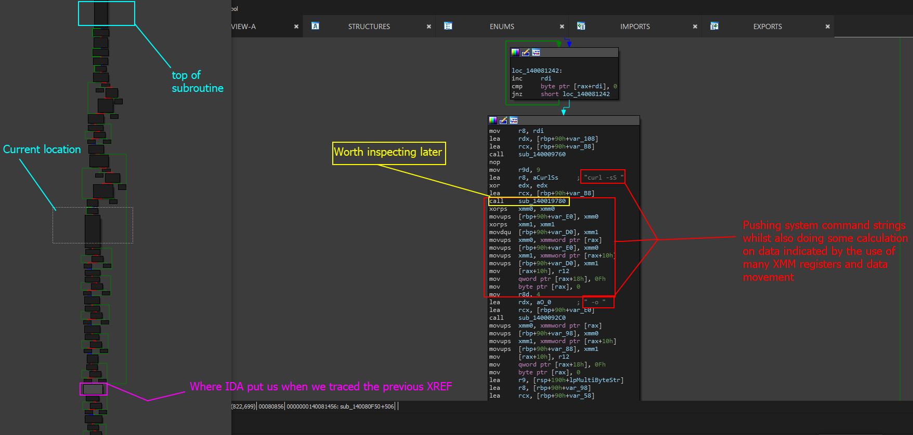
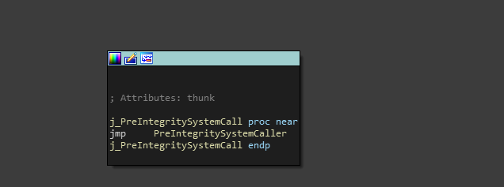
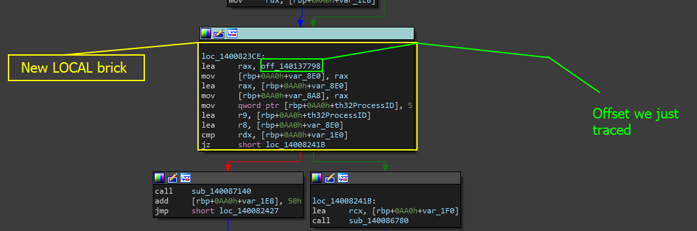
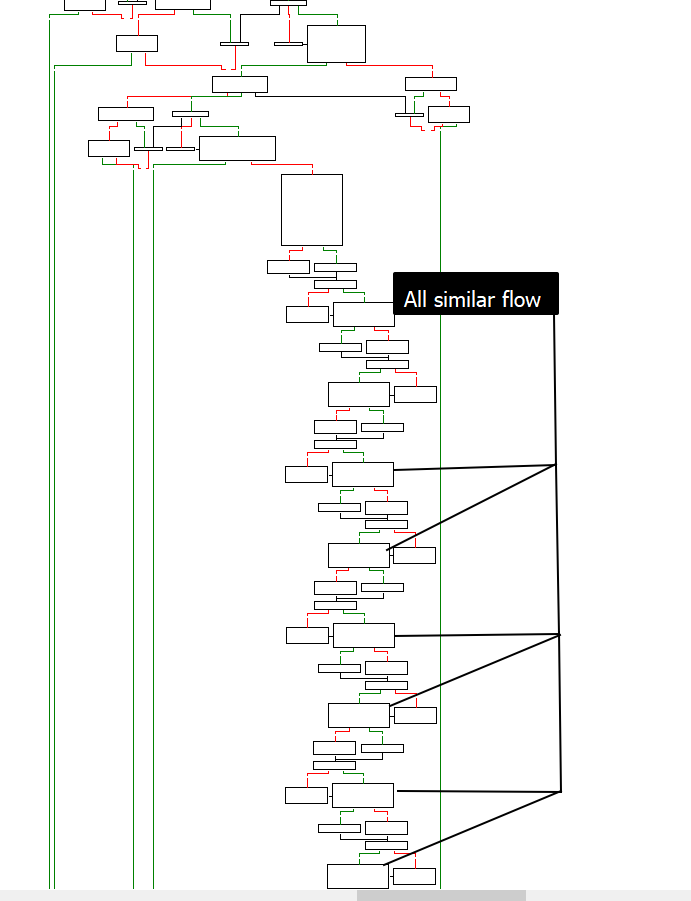
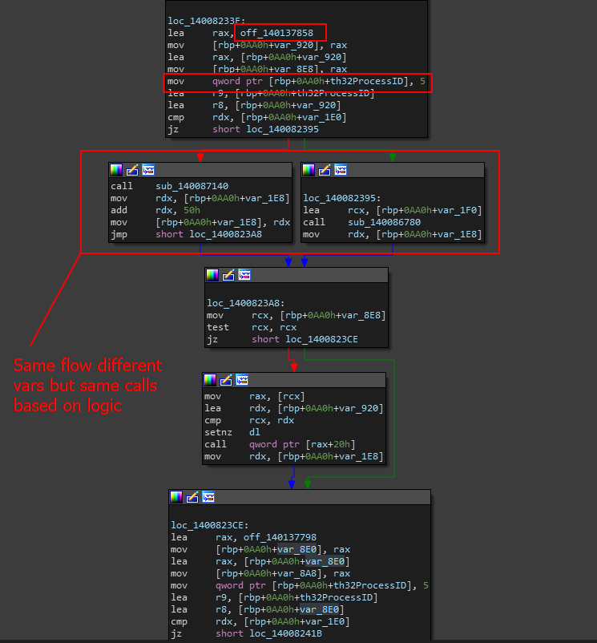

# Locating The Thread Management Calls

In order to pass **most** of this level, you need to be able to identify and properly coordinate with more than 10 different protection systems which need to be bypassed in order to make modifications **statically** or **dynamically (e.g.: Debugger)** to the program.&#x20;

### Internal Design

From a internal design perspective, this system is one giant complex beast of a threading system that will allow developers to setup a list of routines and execute them all on their own clock until the program ends or the routines are all terminated. For more information of the overview and internal structure, check out the following page here [thread-and-routine-manager.md](section-0x0-tips-and-information/thread-and-routine-manager.md "mention").&#x20;

## Tracing Functions

So for this current call, we are going to be locating where the binary integrity system is **actually** called and thrown onto the thread- then be using other steps to verify this. For one, lets first make a starting point.

### Where we left off

When we found the binary integrity system, we need to also **know** for certain this system is also being repeatedly called which we can test when we find the location of the loaded function. For this section, we are going to be leaving off at the subroutine `sub_140081100` which was shown **partially** in this photo.

<figure><figcaption></figcaption></figure>

To make sure we are all on the same page, this code is contained in subroutine `sub_140080AF0` which we renamed `IntegritySystemCaller` since we analyzed previously that this function is running a system command.

### Getting XREFs again

Most of this is tracing as much functions as we can and analyzing until we can find the root element. The root element is important to us because we need to see **how** this function is being called.

<figure><figcaption></figcaption></figure>

When we go to trace this routine, we are brought to another subroutine which calls the `IntegritySystemCaller` in a local block after what seems to be some command execution. When we scroll further up we notice this. Check the image below for this reference.

<figure><figcaption></figcaption></figure>

For now, I am going to rename this function - _**PreIntegritySystemCaller**_ which is not fully supported, but because of the use of commands and the fact that it called the integrity system caller, then we can name it this for now until we verify further **what** this function is doing with those commands.

&#x20;XREFING again and clicking on the first result brings us to this really weird call.

<figure><figcaption></figcaption></figure>

This is weird for us- because we just got done finding the original call- so...

> What is happening here?

Well, ideally, this means that the code is calling itself within itself? Like a lambda you can imagine.

> **IMPORTANT NOTE:**  Also take not of the attributes this has- IDA calls this a 'thunk' which is a specific attribute in which the code scanned or loaded is a small brick of code which is called as a function doing only a few smaller option before jumping into another function (such as the PreIntegritySystemCaller) instead of returning to the original caller.

If you spent some time reverse engineering Lambdas in C++ or C, then you might be familiar with this. Lets list XREFs one last time to see what happens.

<figure><figcaption></figcaption></figure>

This to most reverse engineers that are new to RE would be trivial- like how does this work? Why are we getting pointed to RDATA? Well, if this is a lambda (which it is on the backend) then most likely, the call is going to be reserved and its going to be loaded via offset using instructions such as Load Effective Address or simply `lea` instructions. When we click on this XREF we get this block of code.

```cpp
.rdata:0000000140137798 off_140137798   dq offset sub_140086EF0 ; DATA XREF: sub_140081D10:loc_1400823CE↑o
.rdata:0000000140137798                                         ; sub_140086EF0↑o
.rdata:00000001401377A0                 dq offset sub_140086EF0
.rdata:00000001401377A8                 dq offset j_PreIntegritySystemCall
.rdata:00000001401377B0                 dq offset sub_140086ED0
.rdata:00000001401377B8                 dq offset sub_140086EB0
.rdata:00000001401377C0                 dq offset sub_140086EC0
.rdata:00000001401377C8                 dq offset unk_14013ECB8
```

Note that it is worth paying attention to `off_140137798` because IDA is telling us that there is a DATA XREF (which means this offset is loaded) in subroutine `sub_140081D10` underneath local function `loc_1400823C` indicating that this is under another local brick defined like this `{}` .

When we **double click** on the XREF note to the subroutine, we get placed at this brick.

&#x20;

<figure><figcaption></figcaption></figure>

Oh cool, so we see some really interesting stuff here. First we see our offset being loaded under a local function, and then we see that th32ProcessID is going to be statically pushed with 5. This is actually quite weird, considering normally, we are not seeing this value being used as a process ID- 5 is just a weird place to have this.

> **Note**: In many game cheats, the compiler will auto optimize to use API vars like th32ProcessID to store values. This makes it a bit easier to use the API var if it is used elsewhere in the code.

When we analyze the CFG, we get something really even more worth diving into. Check it out!

<figure><figcaption></figcaption></figure>

This graph is interesting to us because of the fact that more than one areas have the exact almost identical structure and flow. Scrolling up, we verify this as another offset is loaded and `th32ProcessID` now has the new value 5.

<figure><figcaption></figcaption></figure>

This might mean we have actually found the location of the threads. As we can see, well more than 5 bricks all have this same exact setup- I will leave it up to you to verify this :D
