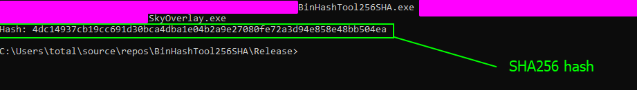
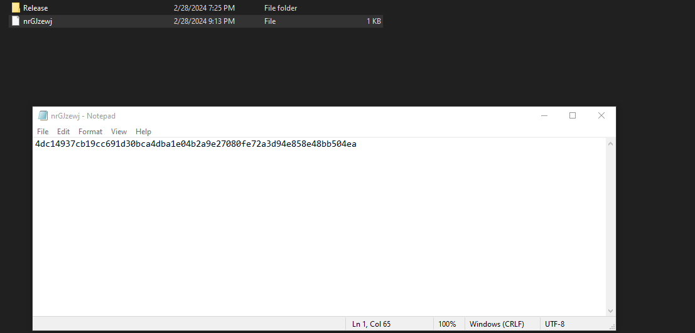
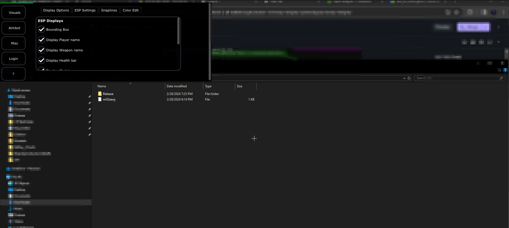

# Bypass Binary Integrity

### What is this task?

This task requires us to basically bypass the binary integrity system permanantly. There is many ways we can do this-&#x20;

* Patching Logic: We could modify the application to never run the binary integrity system&#x20;
* Noping: We could just use NOPS and patch over efficiently.

These are just two ways- but we are going to be doing it a bit differently.

## How to solve this task

In order to solve this task- we are going to do something a bit special. Since we know the binary integrity system is reading the file hash from the file downloaded onto our PC, we can imagine that the program is probably going to try and save network and noise by checking if the file exists on the client before reading it.&#x20;

If you want to go the extra mile to verify, you can verify this in two main ways off the top of my head.

* 1: **Statically** - We can use our current setup in IDA and trace back to the function where the curl command existed and look at the conditions closely to see what sticks out as far as `run if this does not work or run if it does not exist` .
* 2: **Dynamically** - We can use ProcMon and a plethora of tools here (once you bypass appropriate systems) to analyze whether or not the commands are executed when the file exists or only when the file does not exist on the client.

For this, we are just going to roll with the basics and basically take the existing binary we modified and toss it into a file hashing utility (_which we will get to and build later in this section_) then toss the resulting SHA256 hash of the modified binary into the file downloaded on our machine. This will effectively trick the application into thinking that this is the production hash because this is the same file that is downloaded and checked for and read internally.

### Step 1 - Understand Environment

Before we change the file, we need to verify that the file contents are not overwritten even if the file is downloaded. Lets check this by first stopping the program, modifying the file contents and then running the program again.\

If you tested this, the results should have been that the file contents were NOT modified! This is really good.

### Step 2 - Write The Hasher

We could upload this file to a remote service that does this- but I felt it was better to design a tool.

For our modifications to work, we need to literally generate our own hash of the modifications to write to the stored hash file on our client. To do this- I developed a tool that can auto hash binary files and generate a hash in C++20 for Windows. Check out the page below for this!


[binary-hashing-tool.md](../../level-exploits-scripts/algorithmic-implementations/binary-hashing-tool.md)


### Step 3 - Using The Hasher

To solve this problem, simply take the hash from the hasher you run (shown below) and write it to the file used by the program.

<figure><figcaption></figcaption></figure>

This hash is `4dc14937cb19cc691d30bca4dba1e04b2a9e27080fe72a3d94e858e48bb504ea` and I changed it and put it into the file the program reads.

<figure><figcaption></figcaption></figure>

Now after running you should have no issues with the integrity system bothering you!

<figure><figcaption></figcaption></figure>

