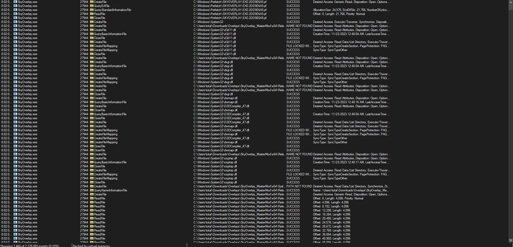

# File location of the hash

What is this task

Basically, the task is asking us to find the file that is being written to in the program for the hash. The one way we can find this is by inspecting the way the process interacts with the environment. We can do this using [Procmon64 ](https://learn.microsoft.com/en-us/sysinternals/downloads/procmon)from the Windows [sysinternals ](https://learn.microsoft.com/en-us/sysinternals/downloads/sysinternals-suite)suite.&#x20;

## How to solve this task

As mentioned, to solve this task, run the application in the environment and make sure we can see it as a process that is active (sometimes, programs will often hide their threads or their processes making them not so visible.)

### Step 1 - Procmon filtering

The first thing we need to do is open up Procmon. When we do that, we should see a Window like this one.

<figure><figcaption></figcaption></figure>

Now click the funnel Icon in the top bar. This is our filtering system since by default procmon listens **system wide.**

This will bring us to the following window

<figure><figcaption></figcaption></figure>

Hit ok when you are done and then watch the window and wait until the binary integrity system triggers.&#x20;

> **Note**: If you read the [methodology-theory](tips-for-this-section/methodology-theory/ "mention") for this level then you would recall us talking about something with exploring systems and how the binary integrity system we are going to be exploring throughout this section was a client^2 binary integrity system which means it was a client only integrity system (remotely pulling, storing, and matching the production hash).

### Step 2  - Analyzing Results

The results in ProcMon are HUGE! Look at this window!

<figure><figcaption></figcaption></figure>

Eventually, after filtering for calls such as `ReadFile` using `CTRL+F` you come across a few events similar to this one.

<figure><figcaption></figcaption></figure>

This event shows us that the program is writing to a file path or file caled `nrGJzewj` now there are some weird things we should consider about this before we ignore it.

* 1: The binary integrity system is client side. We analyzed that it was previously possibly running a curl command in the silent mode to fetch the hash (_as it was included in a subroutine that passed the file contents to another function_). So maybe this is the end of a URL, or a raw path?\

* 2: The ID looks similar to a ending URL filepath. Ideally, the reason this program is storing it in a file is most likely because the path is static- Isolating this program in different empty folders shows that the download of the filepath is the same every single time. However, searching this as a string pulls nothing up so maybe its encrypted.

To find this, maybe we can dynamically analyze the program in HxD to find the string of the file that was written to in order to verify this.&#x20;

> **Note**: We could also just open the file location but we will get to this later, this gives you practice in case the program auto deletes the file after. But if you want to test if the program deletes it, filter for DeleteFile API calls.

### Step 3 - Verifying With HxD

To do this, open up HxD and dump the process. Should be seeing the same window we saw the first time we used HxD in [find-the-ctf-information-block.md](../../level-1-all-walkthroughs/find-the-ctf-information-block.md "mention"). Then try to CTRL+F to find the string and make sure your search direction is made to search both up and down from your current location.

<figure><figcaption>
My current HxD layout and configuration
</figcaption></figure>

When we look at the findings we get, we can see all this juicy information.

<figure><figcaption></figcaption></figure>

* **Pastebin URL:** Notice how this file that is being written to is literally the same ending of the pastebin URL? That is pretty cool! Now we have confirmed that this program remotely fetches the hash _(especially when visiting the URL)_ also due to the `raw` in the URL filepath.&#x20;

<figure><figcaption></figcaption></figure>

* **File path endpoint**: When we search for this file on our system, we get the following which showcases the hash.

<figure><figcaption></figcaption></figure>

* **Static File path:** We also confirmed that this is a static file path which makes this a lot easier for us for easy modifications of the hash!

### Step 4 - Answers

So the file location is approximately always going to be one step below the current directory and will be  named as `nrGJzewj`.

