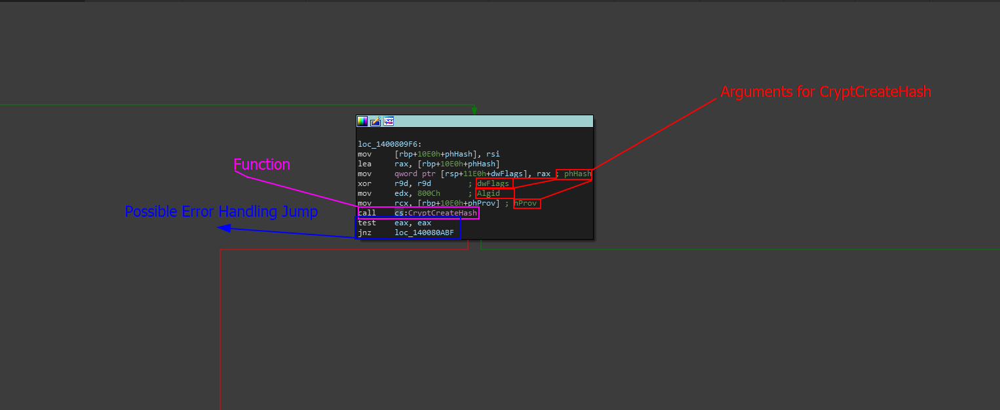

# Hashing Algorithm Investigation

### What is this task?

In order for us to properly modify the contents of the binary integrity system, we need to be able to modify the hash file! But before we do that- we need to know the algorithm that the hashing system is using!

Thankfully, we have access to the hash cause it is on our system- the hash is shown below.

```
6b40106b18f4946dfcda388c99d771fbbac779e7ee3b555e17f608b69a272512
```

## Solving the task

In order to solve the task, we not only need to find the algorithm of the hash that our program is grabbing from this file, but also somewhat verify that this is the algorithm that is being used.

### Step 1 - Analyzing The Hash

The hash itself is a pretty fucking obvious tell as to what it is- to most trained eyes, we can assume this is SHA256. We can check this by going to a online program like [Hash Analyzer](https://www.tunnelsup.com/hash-analyzer/) (or use your own, I use my own hash detection utility) . For the sake of this challenge, using Hash Analyzer gives us SHA256.&#x20;

Now we need to verify this.

### Step 2 - Verifying The Algorithm

To verify the algorithm, all we have to do is go to the same function that was using `CreateHash` literally the only part of the program hashing itself- and analyze the function setup. Lets go back to the same screenshot in [locating-the-binary-integrity-system](locating-the-binary-integrity-system/ "mention").

<figure><figcaption></figcaption></figure>

The Windows API call to `CryptCreateHash` requires a few input arguments. This is the output as specified [here ](https://learn.microsoft.com/en-us/windows/win32/api/wincrypt/nf-wincrypt-cryptcreatehash)in the Microsoft documentation.

```cpp
BOOL CryptCreateHash(
  [in]  HCRYPTPROV hProv,
  [in]  ALG_ID     Algid,
  [in]  HCRYPTKEY  hKey,
  [in]  DWORD      dwFlags,
  [out] HCRYPTHASH *phHash
);
```

The one we are mostly interested in is the `Algid` parameter which stands for Algorithm ID and it is how the function determines what algorithm it is going to be using for hashing data.

The parameter `Algid` is of type `ALG_ID` a custom data type designed for algorithm ID specifications. To find the algorithm we want, all we have to do is take the hexadecimal value and match it to the ones in the [ALG\_ID Type Documentation](https://learn.microsoft.com/en-us/windows/win32/seccrypto/alg-id) by Microsoft!

Our ID is 0x800C which maps to `CALG_SHA_256` which confirms that our hash pulled from the file and compared from the result of this function we are currently in is going to be comparing two seperate SHA256 hashes.

### Step 3 - Answer

The answer to this question or task is that the hashing algorithm used is SHA256 indicated by `800C` hexadecimal being pushed as the `Algid` argument to the `CryptCreateHash` Windows API call.

## Professional Confirmation

Even though we know what hash the program is creating on itself and the hash in the file is also this algorithm- we still have not 100% confirmed this. To confirm this, trace back to where the binary integrity system actually compares the two hashes by tracking the data that is returned throughout the program.

This is how you would confirm this realistically.

