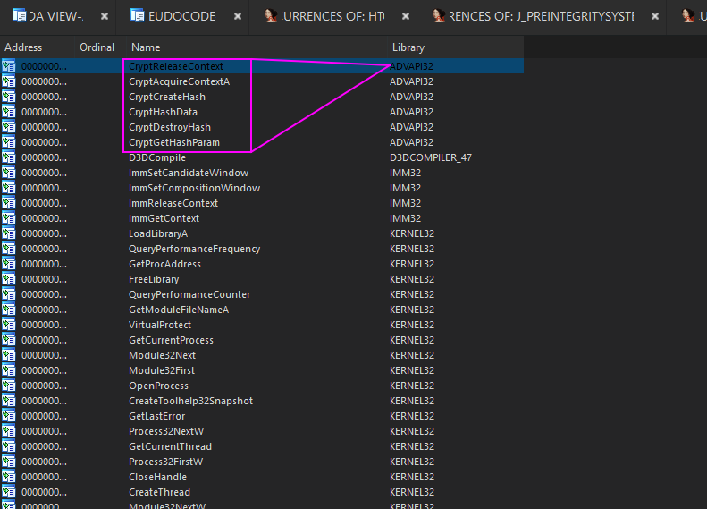
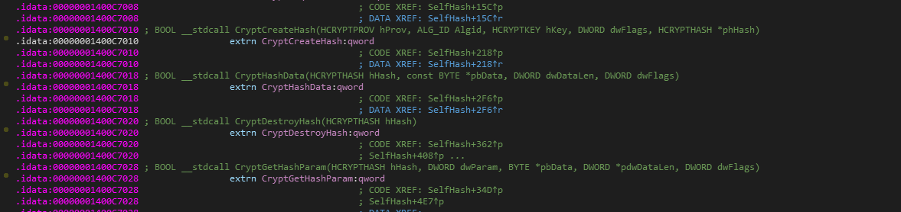
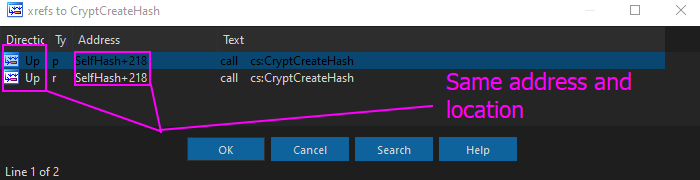
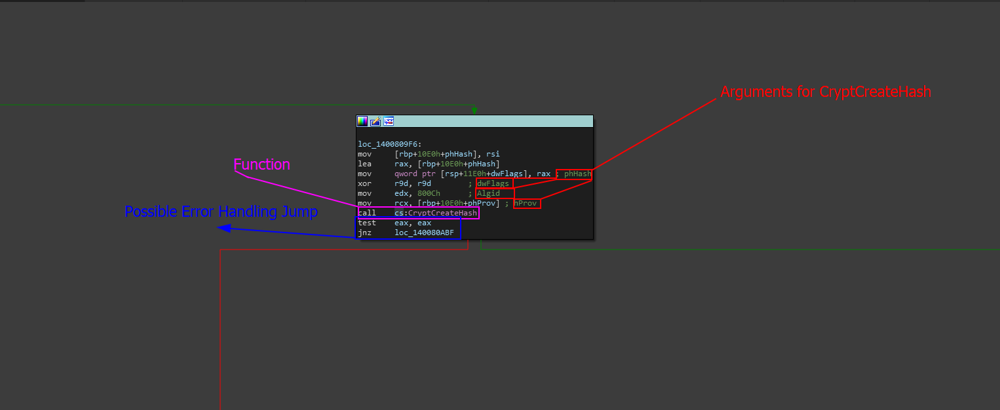
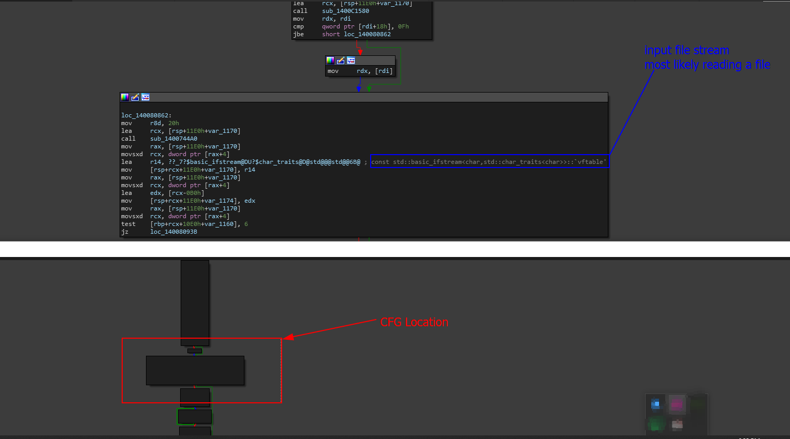
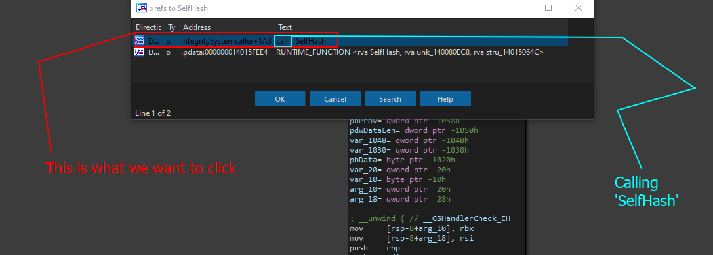
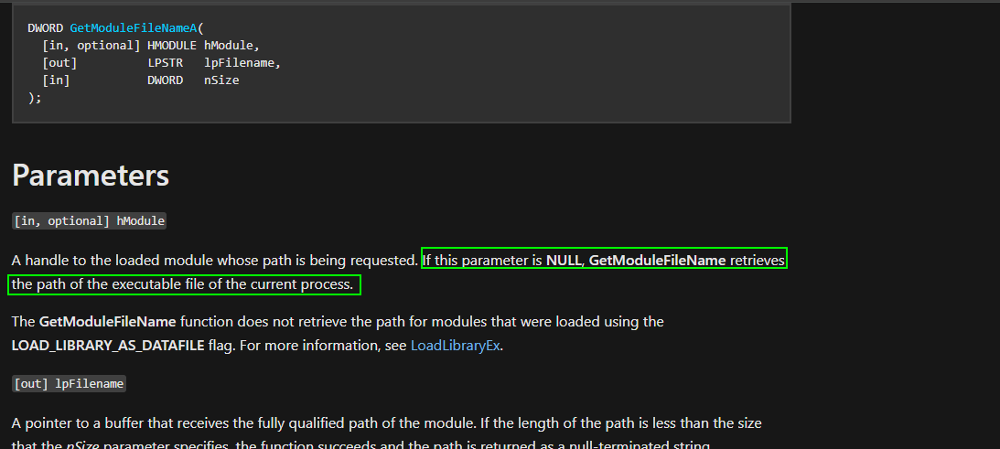

# Locating The Binary Integrity System

Looking for the binary integrity in this level is not too hard, it just takes some hopping around and symbol tracing.

### Finding The Function

Cross-references also known as XREFs are one of the more helpful things when we do not want to be cheap and use string references  to find a function or import call. In order to find the integrity system, especially if we are following the methodologies from [methodology-theory](../tips-for-this-section/methodology-theory/ "mention") then we are going to be first taking a look at the import system to look for anything revolving around hashing.

> **Important Note:** While we are not 10000% sure this is a cryptographic binary integrity system that uses hashes, looking at the import list can give us a good idea of what systems are used and possibly ones tied to our integrity system which we can track down. For example, if we see `CreateHash` in a program, it **most** likely is used for some form of integrity system especially if there is no logical reason it needs to create a hash. Further analysis of the hash during the program will allow us to verify that the use of API calls like `CryptCreateHash` are used for binary integrity.

So go to the import tab in IDA, and immediately you should see this.

<figure><figcaption></figcaption></figure>

As we can see, we have multiple functions here. The one I am **most** interested as a reverse engineer is the one that is creating the hash. Aka: `CryptCreateHash` . This is because this function gives us insight into the hash we are creating and sets everything up giving us also a general location of where data is going to be sent.

So double click on the symbol and you should be brought to this screen.

<figure><figcaption></figcaption></figure>

Now click on the symbol **ONCE** and then press `x` to list all of the cross references. We are brought to this window.

<figure><figcaption><p>XREF window</p></figcaption></figure>

When we click on one of the two we are brought to this new location in the Control Flow Graph (CFG) / IDA View A.

<figure><figcaption></figcaption></figure>

As we can see, we clearly have our function. For now, we are not going to dig into the function, but rather ensure the context is used properly for what we want. Lets look around.

<figure><figcaption></figcaption></figure>

Near the top of the function we notice a call to `std::ifstream`. While we can not fully see any plaintext name (meaning the file is most likely **not** hardcoded **that we can see**) then we can up our certainty of this being a function that 'self hashes' itself to compare to another hash (_just in a theoretical example_)

At the very top of this function lies the name of the subroutine/function, this name is `sub_140080800` but for now, I am going to rename it to `SelfHash` as I feel like that name is currently appropriate for the **little** analysis we did on it (very minute).

With that, lets find some cross references to this function now.

<figure><figcaption><p><mark style="color:red;"><strong>Note: Ignore that I already renamed it, this function was previously 'sub_140081100'</strong></mark></p></figcaption></figure>

We want to double click on the first one since not only is this calling the function `SelfHash` but it is also in the `.text`  segment of the binary which means it is actually executable code. When we do that we are brought to this reference.

<figure><figcaption></figcaption></figure>

**WOAH WOAH WOAH DUDE CHILL- yeah I know, there is a lot here so let me simplify it.**

Before `SelfHash` is called, it seems like there is another function that calls `GetModuleFileName` which is a function import from the Windows API. This function allows you to extract the exact path of a module given its handle on the current process.

If we go to the Microsoft documentation on [GetModuleFileNameA ](https://learn.microsoft.com/en-us/windows/win32/api/libloaderapi/nf-libloaderapi-getmodulefilenamea)we get the following function.

```cpp
DWORD GetModuleFileNameA(
  [in, optional] HMODULE hModule,
  [out]          LPSTR   lpFilename,
  [in]           DWORD   nSize
);
```

This function has one output destination that is required _(such as a buffer to store the filename)_ and one required input which is the size of the destination (usually developers just use `sizeof(buffer)` for this if their output destination is a buffer)

There is one optional argument though. When arguments are optional like this, we can just leave them null with `nullptr` or Null Pointer.

> What does this mean? How will the function get a module filename if there is no handle that is provided?

Thankfully, Microsoft thought of this ahead and actually good for us, Microsoft specifies that if this is not a valid handle, and the input optional value is null, then it will return the `path of the executable file of the current process` as highlighted in the screenshot below.

<figure><figcaption></figcaption></figure>

This means that **this function is in fact self hashing itself because we are passing the result of** `GetModuleHandleA` **which is the current path of the EXE we are running, to the function** `SelfHash` **which we can see as** `rsp+210h+var_1C0` **which is also used and loaded before calling** `SelfHash`.&#x20;

With that in mind, we can say we successfully located the binary integrity function.

