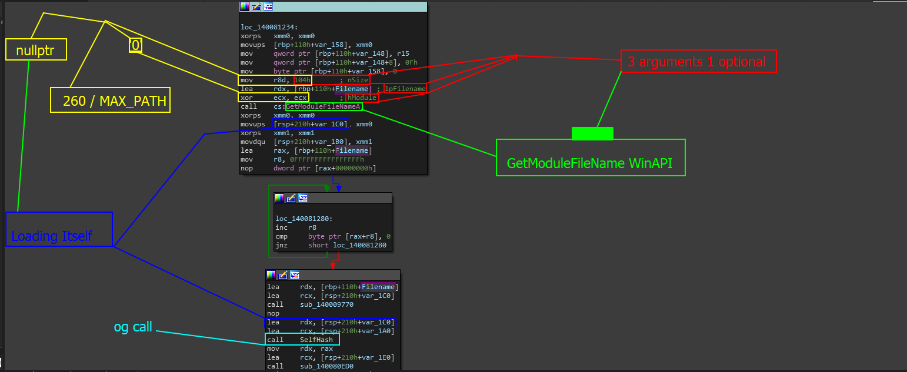

# Locating The Original Caller

## WARNING TO READERS - DEPCRECITATED PAGE

This page has been depreciated as the environment at the time of writing was being actively changed and tested for volatility reasons. Please navigate to [locating-the-thread-management-calls.md](../../locating-the-thread-management-calls.md "mention")as this is the page that covers the revised contents in Level 2.&#x20;


### DEPRECIATED PAGE CONTENT BELOW


Moving on in this level will require that you find the original statement or location in which all threaded routines are added. In this section, we will help you find and locate the bricked routines where all threaded functions are called, including the binary integrity system.

> Why is this required

This is required as we need it to be able to solve [time-based-modification.md](../time-based-modification.md "mention")

### Locating The Function

We can take the previous location we were in which was named `IntegritySystemCaller` shown in the image below from [.](./ "mention")

<figure><figcaption></figcaption></figure>

When we XREF the top of the function which looks like the image below, we get a single reference.

<figure><figcaption></figcaption></figure>

The reference we get is the first one highlighted below.

<figure><figcaption></figcaption></figure>

Tracing into this function gives us the following brick.

<figure><figcaption></figcaption></figure>

The reason this function was called `pre-integritysystemcall` was because of the system command the program executes presumably to fetch the remote hash. When you analyze further up, you come across bricks like this.

<figure><figcaption></figcaption></figure>

Now, lets go deeper down the chain and see where this function finally ends up. Get the XREFs of this current function by clicking on the top of the graph at the subroutine name and press 'x' again.

<figure><figcaption></figcaption></figure>

Hoping into this function brings us to this very interesting control flow and a very interesting brick. Lets check the two shots out.

<figure><figcaption></figcaption></figure>

This local function is interesting. Mainly because we are using `th32ProcessID`  and pushing 5 to it when we never actually used that value- of course, this is a clear sign of something. For now, lets check around and see whats happening in the control flow graph map.

<figure><figcaption></figcaption></figure>

Analyzing this CFG overview, we have a very interesting set of blocks that are all based on conditions. They all seem to be the exact same size with the exact same conditional. So lets look at these for a second.

<figure><figcaption></figcaption></figure>

When we inspect the bodies of these functions, we notice a few things right off the bat.

* **1**: `th32ProcessID` is still actively being used and 0x0F which is 15 in decimal is being moved into it.
* **2**: Similar function setups is something we also notice. Nearly identical structures outside of a change in offset values and variables.
* **3**: Local blocks which tell us that this code might be encapsulated in `{}`&#x20;

So - **What all does this tell us?**

This tells us some interesting things but the most important being that there is a pattern here- and we can see that when we even load the code through the pseudo-code generator. This also tells us that there may be other systems also thrown on a clock or timer?&#x20;

All in all: There are some things here that tell us this **might** be a management system or just a large set of task creation / adding internally. For example, calling the same class function over and over.

```cpp
    System.Add([] {
        // Other function calls
        GuiRender();
        RenderTab();
        Bincall();
        if () { ... }
    }, std::chrono::seconds(15));
```

With that in mind...

> Where do we go next?

Well, there is something interesting. Going back to the other code where our binary integrity system is called, we notice that 5 in decimal or 0x05 in hexadecimal is being pushed along with some other data and information.

```
loc_14008488E:
lea     rax, PreIntegritySystemCall
mov     [rbp+0AE0h+var_AE0], rbx
lea     r9, [rbp+0AE0h+th32ProcessID]
mov     [rbp+0AE0h+var_AD8], rax
lea     rax, [rbp+0AE0h+var_AE0]
mov     qword ptr [rbp+0AE0h+th32ProcessID], 5  <-----\
lea     r8, [rbp+0AE0h+var_AE0]                        |
mov     [rbp+0AE0h+var_AA8], rax                       |_______ time?
cmp     rdx, [rbp+0AE0h+var_1E0]
jz      short loc_1400848D3
```

Maybe we could try to set a timer to see how long it takes for our binary integrity system to update us on a status (_which we know it sends some form of messages based on conditions \[which we could find ways to fault, e.g: deleting the required file once we uncover it to purposely cause an error in the system or terminate network connection to prevent downloads thus uncovering a message and giving us a good time_). If it takes 5 seconds, then we know that this actually may be the wait call.

&#x20;&#x20;
