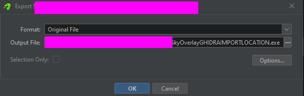

# Time Based Modification

### What is this task

This task is pretty much entirely bypassing the binary integrity system via time based modification. While this does not bypass it, increasing the counter on the cycle routines will give us much more ability to make modifications to the program.&#x20;

The reason we are patching the counter on the functions is because this counter represents the seconds before the first and second cycle of a function.

### How to complete this task

In order to complete this task, we need to modify the timer that goes off every other 5 seconds for the binary integrity system and change it to  make sure the integrity system basically never goes off.

To do this, we can go and trace the location of the binary integrity system which was located in [locating-the-binary-integrity-system](locating-the-binary-integrity-system/ "mention") which is apart of the thread system also located in [locating-the-thread-management-calls.md](../locating-the-thread-management-calls.md "mention") and modify one of the existing counters.

> **Note**: In the file that is shipped as level 2, the binary integrity system is now the first function pushed onto the thread instead of the last as we explored in [locating-the-binary-integrity-system](locating-the-binary-integrity-system/ "mention")so please take note of this and make sure you named offsets. This is important anyway.

## Steps

It is important and worth noting that **I could not use IDA to patch the instruction line that we needed to patch. It often threw up the error 'invalid operand' even when checking and verifying the validity of the instruction. So based on this thread, I can see that IDAs patching engine does not support a wide variety of instructions. To solve this, I used**[ **Binary Ninj**](https://binary.ninja/)[**a**](https://binary.ninja/) **as a fallback and** [**Ghidra** ](https://ghidra-sre.org/)**was my second choice so for this section we will be using Ghidra.**

### **Step 1 - Getting the file offset**

The first step is going to require that we find the file offset of the function we want to modify in IDA. In this case, since we are basically going to the binary integrity system we named in [locating-the-binary-integrity-system](locating-the-binary-integrity-system/ "mention"), we can find the file offset of either that function or the line we want to modify in the local function. To make sure we are all on the right page, below is the function location we are at.

<figure><figcaption></figcaption></figure>

To get the file offset, we need to go into text view and look at the **.text** section offset which we are at. For us, this offset is `0x0000000140081B30` as demonstrated below.

<figure><figcaption></figcaption></figure>

### Step 2 - Using Ghidra to locate the file offset

Simply drag and drop the file into your Ghidra project and load the proper tools to analyze the file. When you do so, you should be brought to the following window.

<figure><figcaption></figcaption></figure>

Inside the Ghidra window, press `G` and this little window will pop up prompting you to input an offset.

<figure><figcaption></figcaption></figure>

Now input the file offset we found in IDA into the prompt and hit enter. To make sure you are on the right page, input the value as `0000000140081B30`

This will bring us to the following line.

<figure><figcaption></figcaption></figure>

Now to edit the line or make a valid patch run the keybind `CTRL+SHIFT+G` and that will allow you to make a input like a regular text editor. When you do that, change `0x5` to a really large value in hexadecimal.

> **IMPORTANT NOTE:** Sometimes, when I need a really high value but I can not directly calculate it in my head- I will pop open Python3 and run `hex` followed by the decimal value and Python will slap down the hexadecimal value of the decimal input. For this instance, something like `hex(99999999)` will work- 99999999 is 0x5f5e0ff in hexadecimal. This means our program will approximately wait 99999999 seconds which is 1666666.65 minutes which is 27777.7775 hours and  that many hours in days is 1157.407395833.  So as you can imagine, this is a pretty good value!&#x20;

When you want to export the file, press `o` on your keyboard and then make sure the format is the original file and the output file is a renamed version of the input file to make sure you are going to have a backup.

<figure><figcaption></figcaption></figure>

### Step 3 - Running The Application

When we re-run the application, you will notice that no window or error pops up telling you what is wrong with the program. This means that the system did fail to run.

## Important Note

When patching data statically, it is important to take into consideration memory alignment and data types matter. This is why we can not push a full max i64 value, because somtimes, the functions we call are not always going to be able to accept the full maxiumum value that integer64 takes because it might not be parsed as integer64 and may be integer16. So make sure you are taking that into consideration when changing values- this goes for byte sizes even.
