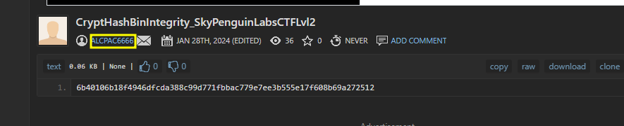

# User account for remote resource

### What is this task?

As we explored in [file-location-of-the-hash.md](../section-1.0-binary-integrity-system/file-location-of-the-hash.md "mention")the URL where the resource was pulled from was a raw pastebin URL. This URL specifically was [https://pastebin.com/raw/nrGJzewj](https://pastebin.com/raw/nrGJzewj) . Now we need to find the user account that owns this paste or if they were a anonymous user.

### Answer

To solve this task, simply remove the raw from the path of the URL and view the account at the top right of your screen of who made the paste.

\`[https://pastebin.com/nrGJzewj](https://pastebin.com/raw/nrGJzewj)\`&#x20;

We see this page

<figure><figcaption></figcaption></figure>

This gives us the user URL \`[https://pastebin.com/u/AlcPac6666](https://pastebin.com/u/AlcPac6666)\` so the user account that hosted it was called `ALCPA6666`
