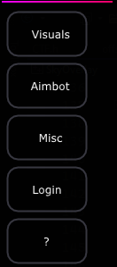
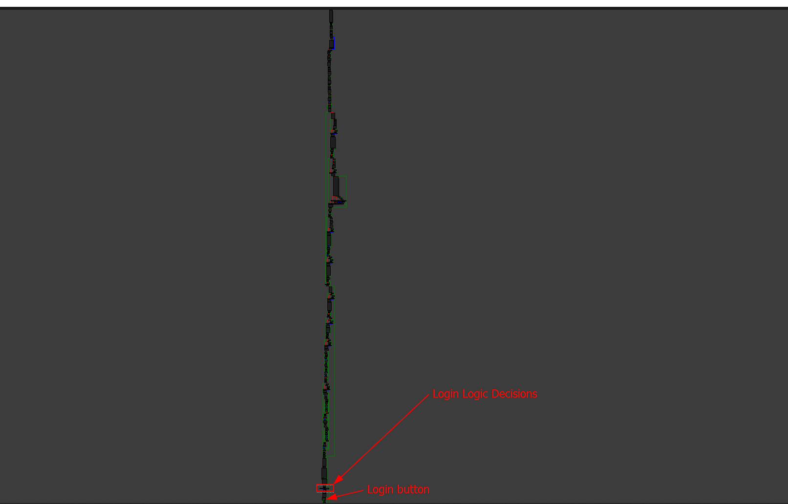
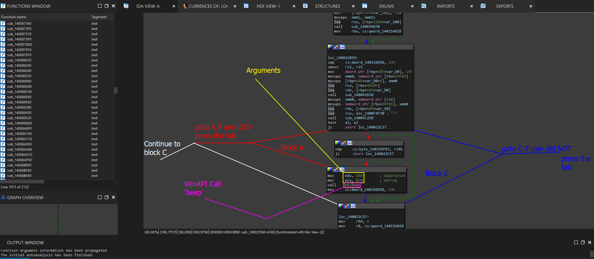
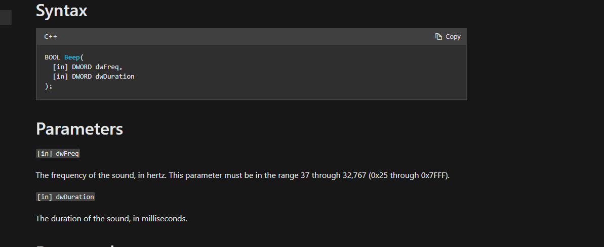

# Finding Functions Via Sound

### What Is This Task?

In the program, we have a simple sound that plays whenever we press specific buttons. If you go through the menu, once unlocked and patched, you notice that the menu buttons beep with a very specific frequency and sound to it- this makes for a fun trivial little goose hunt!

This task is essentially using Windows API calls to trace specific functions based on features or events that happen on the GUI itself. This makes for a much more unique training environment.

### How To Solve This Task

In order to solve this task, we need to be able to find the beeps and for each beep within the menu tab location, then when we find the function, pick apart the arguments and set their timer counts to 0x0 which will tell the beeper to pretty much never run. Or, we can tune the functions frequency to be so minute we do not hear it.

> **IMPORTANT NOTE**: Ideally, we want to set the timer to as low as we can without the program crashing whilst also giving the program just enough time to exit from that function call. So we may want to set it for like 10 miliseconds. Fast enough that we do not hear the sound and that the sound never plays whilst also eliminating the laggy wait time for the tab to actually render. The idea is to showcase how to erase or add features to an application as a reverse engineer.

When we solve this task, we should have successfully changed all beeps in the menu that we know of to not register or make a sound at all.&#x20;

## Steps To Execution

Before we move on, make sure that you download level 2. You can find this level hyperlinked in [level-1-3-download.md](../../../levels/level-1-3-download.md "mention") which stores all levels and their executable links.

When you redownload the CTF and make sure you have everything setup, you can now follow the steps below.

### Step 1 - Sub-info

For those who have not tested the new menu, when you crack the login system for part 2 which is the same login system cracked in level 1 shown in [crippling-logins.md](../../level-1-all-walkthroughs/bypass-entirely-login-system/crippling-logins.md "mention")you will notice that upon pressing new tabs in the menu that things start to be a bit weird.&#x20;

Upon clicking the buttons shown below, they all pause, the program then makes your operating system output a low frequency beep, then it renders all the information on the GUI tab.

&#x20;&#x20;

<figure><figcaption><p>Tabs from the menu</p></figcaption></figure>

### Step 2 - Attack plan!

This is one of the cooler things I wanted to make out of this nifty little CTF. In order to solve this challenge, we will need to bypass the binary integrity systems and also have to trace some API calls again- WOO! :joy:

* **Tracing API calls**: The main way we are going to solve this objective is by tracing API calls from the systemic Windows API. We do not know what functions our application is using, for all we know- it could be a custom implementation or the imports could be masked. So it is **important that we verify the API call we are looking for exists by looking at the import view in IDA and searching for the API call by name**. We can trace the calls, view the arguments being pushed to the stack and modify them accordingly.

In some scenarios, it is **important to note that some people make custom implementations or will mask the import symbols. So its worth noting that this method is very beginner/intermediate practice**.

### Step 3 - Going back to level 1

In level one, specifically the [crippling-logins.md](../../level-1-all-walkthroughs/bypass-entirely-login-system/crippling-logins.md "mention") part, we explored a CFG or Control Flow Graph that looked absolutely FUCKING massive for a program of this size. This CFG is represented again below.

<figure><figcaption></figcaption></figure>

So, while we were able to analyze the login buttons, the logic and the tabs for the login, we only explored a very **minute** portion of the single function. Since we are trying to view `tab-specific` functions is look around areas such as the individual tabs that were rendered. This is why we go back to the login function previously to get back to the same location.

The internal structure of this code would look something like this.

```cpp
void render() {
    // GUI rendering instance setup and initiation
    {
         // Left side of the menu for configuration
         if (Button_Pressed("aimbot"), 0, 0, 000) {
                   // other actions 
                   Configuration::set_current_tab = 0 // main menu / default tab
         }
         if (Button_Pressed("esp"), 1, 1, 111) {
                   // System checks, configuration checks and other systemic actions 
                   // such as a beep to indicate the program has detected the user 
                   // made an action on the GUI and is changing the configuration
                   // obiously a user would not **KNOW** for certain but its a 
                   // viable prediction
                   Configuration::set_curent_tab = 1
         }
    }
    // Right side rendering (render based on buttons)
    {
         if (Configuration::set_current_tab == 1) {
              // Render content for tab 1
         } else if (Configuration::set_current_tab == 0) {
              // Render content for tab 0 or the home page
         }
         // Load cleanup and configuration for rendering
    }
    // Other random stuff here
}
```

But also consider that between the left and the right side rendering is most likely hundreds and hundreds of lines of code to render specific buttons, tabs, tab items, menu bars and so on from there. The reason we can assume this is purely based on the structure of the data at the top and the bottom of the CFG.

We also can logically map this out- it makes sense that we would be rendering the menu tabs first before we render the tab items and sets based on the conditions. Why render the tabs if the user can not see the tabs or change them yet?

Its really all in the way you want to picture it. Ideally, this is what the code can look like and its important that we get this picture for further analysis.

### Step 4: Analyzing Tabs

Since our pseudocode above seems to be indicating that the tabs are at the very top of the function, we can analyze each new tab and its contents to figure out what exactly is happening.  So now that we are in the same area, lets go all the way up until we find a tab block- such as the block for the '?' tab indicated by the string '?'.

We should see something like the screenshot below.

<figure><figcaption></figcaption></figure>

In this image we see a condition on the tab block that states to run the code shown below if the user presses the tab. If the user does NOT press the tab, continue rendering other tabs or running/executing conditional checks.

```
mov     edx, 3B6h       ; dwDuration
mov     ecx, 0C8h       ; dwFreq
call    cs:Beep
mov     cs:dword_140156D58, 13h
```

Thankfully, IDA already points this out for us and sets up the information for the calls based on the symbol caught or located.

### Step 5 - Finalizing

Considering we analyzed the functions enough to understand that tabs are all beeping after and use the exact same API calls, we can easily infer information for objectives [beep-frequency.md](beep-frequency.md "mention"), [beep-creation.md](beep-creation.md "mention"), [exact-time-length-of-beep.md](exact-time-length-of-beep.md "mention"). So if you want the answers for those, just click and you will see the small information and it will be branched from this.

### Step 6 - Answer For This Level

There was no direct answer. But we still need to change the functions and verify our findings. To do this, follow the same steps you used to patch the application, but instead, patch over either the duration arguments or the frequency arguments with new values.

> **IMPORTANT NOTE**: Patching this, we need to make SURE the new data we are pushing is correct. So for instance, we know the frequency of the beep above is `0C8h` or `0x0C8` which is `200` in  milliseconds.

We can verify the content of the important note by going to the [Microsoft documentation for the Beep function](https://learn.microsoft.com/en-us/windows/win32/api/utilapiset/nf-utilapiset-beep) and verify that the arguments are in both hertz and milliseconds.&#x20;


<figure><figcaption></figcaption></figure>

So we need to take our new millisecond conversion, which is going to be like 30 milliseconds or 20 milliseconds and convert it to hexadecimal. In this case, if we push 30, we need to write `0x1E` as the new value being pushed first as that is the first argument to the `Beep` API call.

For theory: (patch)

`mov ecx, 0C8h ; dwFreq` -> `mov ecx, 01Eh ; dwFreq`

## Extra Goodies

The one thing I wanted to insert in here that I thought would be a cool addition or thought is that a program that allows you to automatically configure systemic beeps to find and locate specific parameters. I have only had to do this twice in the real world, but basically the program would take your input for the frequency and length of the beep and would call `Beep()` with these parameters. It would also check to make sure you are not over the max frequency or max time for the beep. Essentially, this can be used to locate the use of `Beep()` where you may need to find it.

> **Example Scenario:** Say this game cheat, each button, each tab created a symbol. We can not just find all the cross references for beep- because by the time we go through 50 different function calls and references, its going to be a mess. The same falls for `GetAsyncKeyState`. So instead, we can build a program to automate a VERY specific beep or just go through a bunch of common frequencies, hold them for 5 seconds and output the parameters (in hex which is what we would see in IDA) before the function is called. Alas: we could easily narrow down the location of the beep based on what we are hearing from our program. This would be useful in a sense where we do not have any strings or clear indicators that we are in the right place we want to be. The only issue is if that every single action makes the same frequency for the same amount of time you are fucked and have to use another method of getting to where you want to go.

[beeper-utility.md](../../level-exploits-scripts/brute-forcing/beeper-utility.md "mention")
