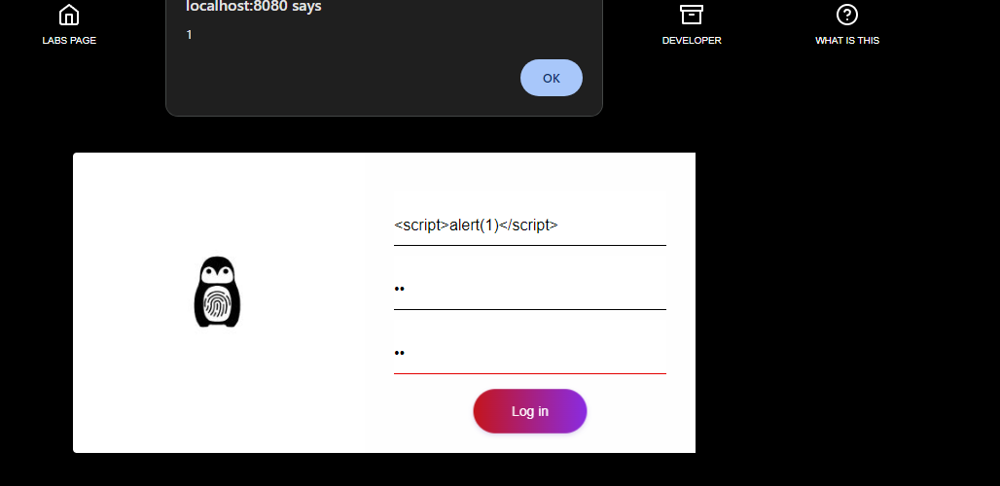

# Answer Page

The answer to this one is a bit obvious, you just need to develop a real payload that will actually trigger the security fault in the application.

> Explanation of finding

The finding was XSS as indicated with no extra sanitization functions used and no other information to indicate limits or barriers + the data was being added together without being stripped or analyzed.&#x20;

**indicated by ->** `document[u(0x138)](adminID + email + password)`&#x20;

> Payload and Proof

In order to trigger this attack- we can just create the most basic XSS payload known to man and execute it in the adminID field.

```javascript
adminID     =    <script>alert(1)</script> // a dumb and basic script kiddie payload
```

<figure><figcaption></figcaption></figure>

