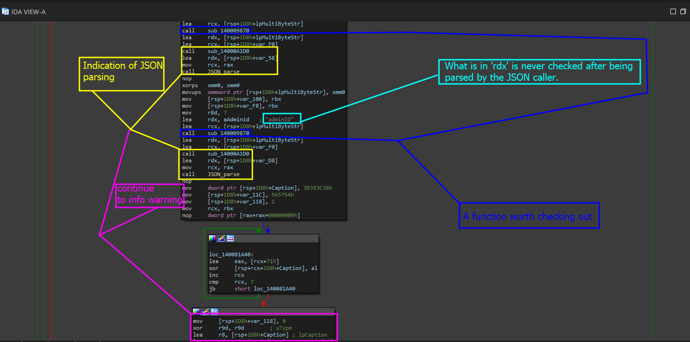

# Security Issue: No Input Checks

Sometimes, its not always about finding ways to exploit a program- other times, it may actually be about finding security issues that can lead to the discovery of other bugs. For example- the one thing that causes a user, heap-based BOF is not checking user input and properly allocating data. In other scenarios where data is dynamic and being thrown to a bunch of other functions, there are chances developers will leave out input checks to sanitize and make sure the input is safe before entering specific dimensions of the program.

### What is this task

With that, this section brings to you the task and objective to explain where input checks should be made and why it is dangerous that the program just&#x20;


Important Note: Remember that the data being pulled from the web server is being decoded as json.&#x20;


### How will we finish this task

In order to finish the task, we need to pinpoint **one** area that should be implementing data sanitization checks. As you can imagine, we are most likely going to be going back to the server that parses the data sent to <mark style="color:red;">api/v2/login</mark> endpoint.

So, lets go back to the top and sit here for a second.

<figure><figcaption></figcaption></figure>

## Finding A Issue

We have already imagined we are going to be targeting the POST request entry- because this is how data can get into the binary application remotely. Ideally, if we can look at the way data is being parsed and the way the application handles data- we might actually be in for a fun check. Lets analyze the portion that parsed the data.

### Retracing Steps and Analyzing

<figure><figcaption></figcaption></figure>

The image above showcases what we already know.

* It is using JSON on the backend
* Does not seem like the data is being checked
* There are still some interesting functions to look into that appear one too many times

So lets analyze these functions.

### Analyzing - sub\_14000A1D0

This one is pretty simple to understand- it just seems like a library based function for parsing or error handling as indicated by the following screenshot.

<figure><figcaption></figcaption></figure>

Even that this was a quick analysis and was not fully deep diving, I suggest that you look a little bit further especially when analyzing the control flow to see if any of it actually matches for checking entire strings or values being parsed for negative symbols.

### Analyzing Further

If you take a second to analyze other surrounding bricks and even try to trace the data through this entire function, you notice that there is no security check- and there should be one right around the area we start calling JSON parser functions to parse the values...we should actually put it before we toss it into the function.

