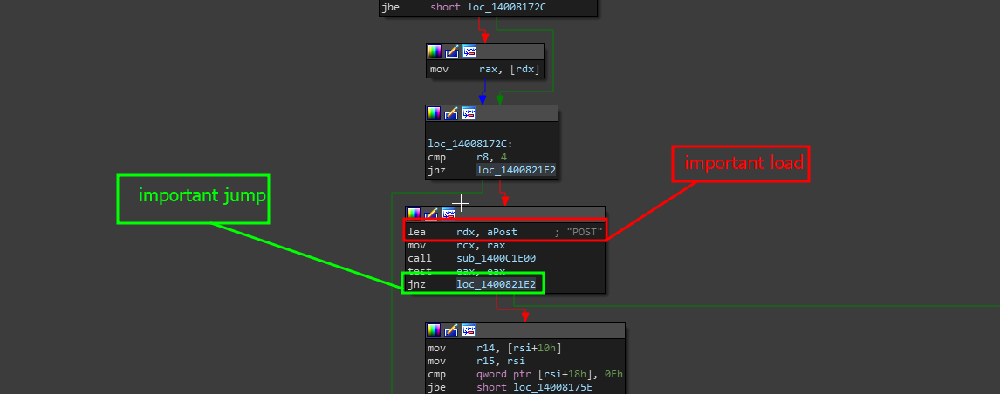
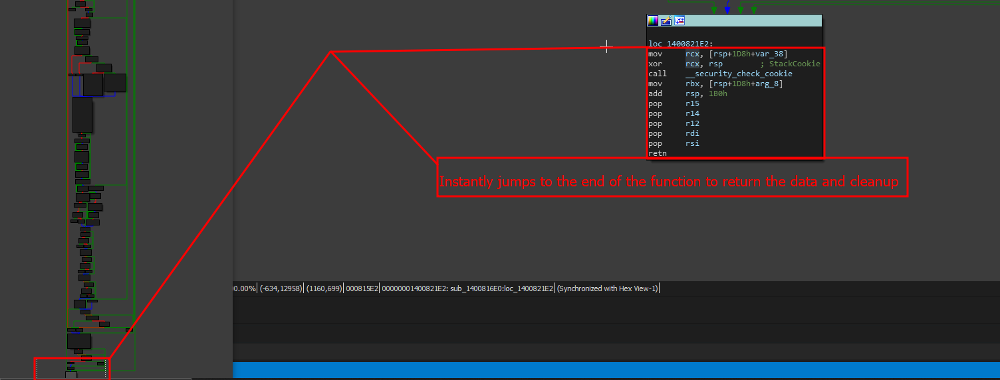
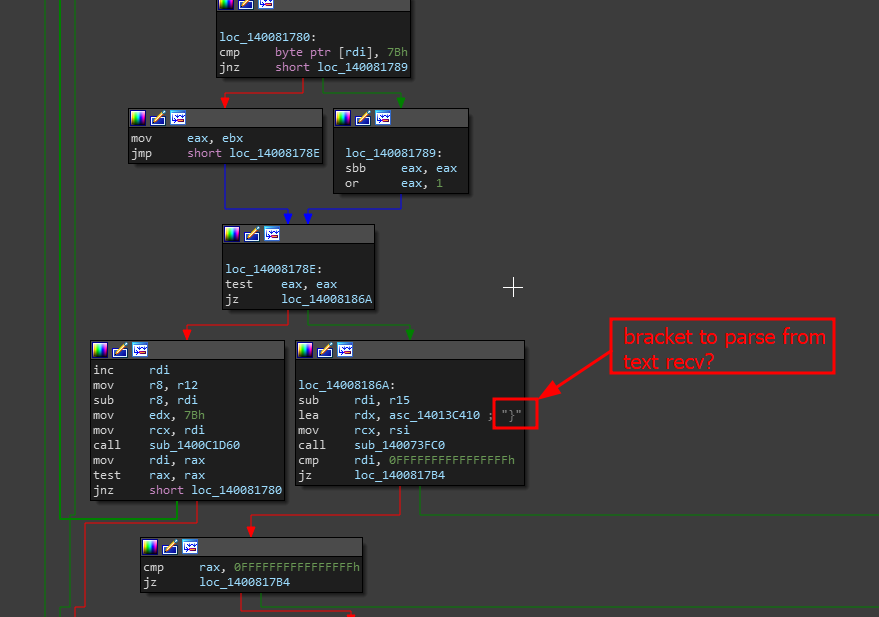
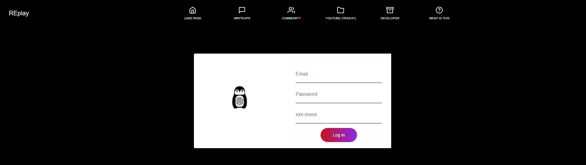
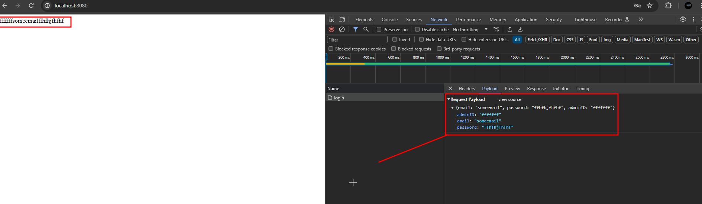
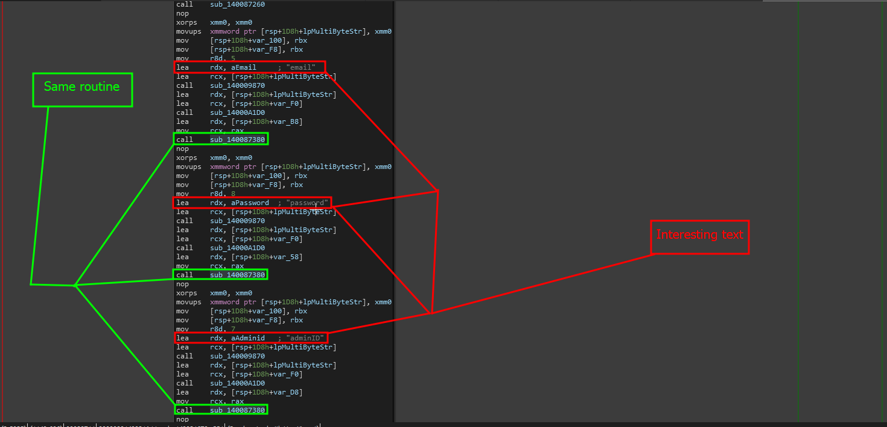
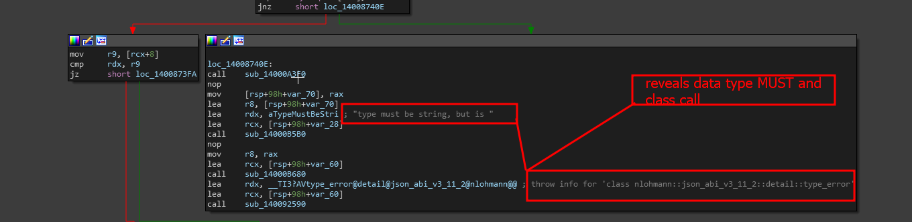
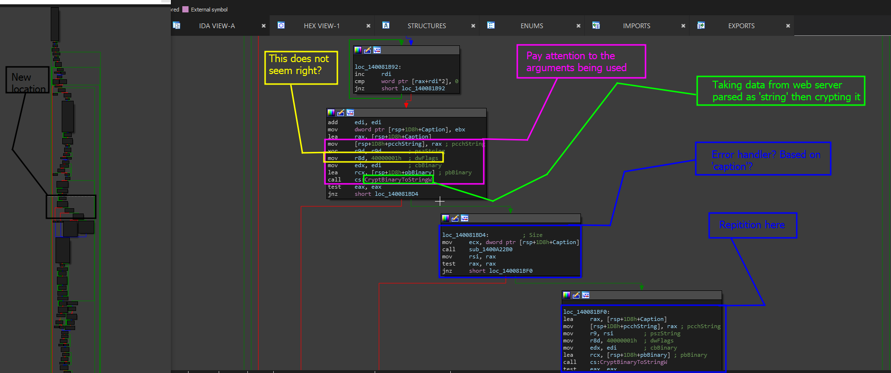
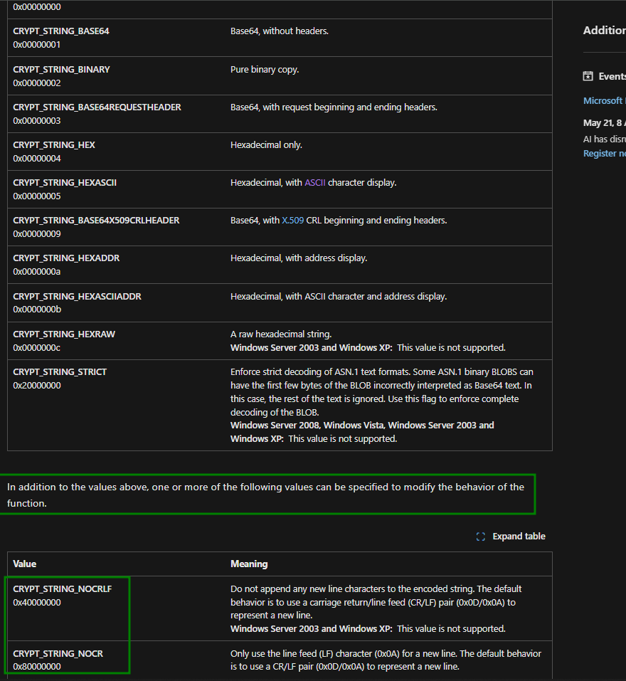

# Analyze - sub\_1400816E0

Leaving off from the previous page ( [analyzing-important-sections.md](../analyzing-important-sections.md "mention") ), we were just starting to analyze the subroutine <mark style="color:purple;">sub\_1400816E0</mark> as named by IDA.

## Analyzing the routine

Analyzing the top half entirely is a difficult task in of itself and requires a lot of analysis. So lets take the most important part (_which is the first and biggest conditional determining the major steps to the function_) and analyze it.

<figure><figcaption></figcaption></figure>

This screenshot demonstrates two important things.

* <mark style="color:red;">**1: The call to the local routine**</mark> -> This is a function or comparison that seems to entirely depend on if the function is going to go nowhere or continue to do something. So we can imagine, both forms are worth exploring (_both conditional routes, sorry_).
* <mark style="color:red;">**2: The POST keyword**</mark> -> This keyword kind of confirms a little bit what we have up top about that local jump. This function may actually be checking if the request method for the API endpoint was a POST request. This is good to keep in mind and document.

### Checking The Local Jump

Lets analyze the local jump by double clicking on `loc_1400821E2` and see where it takes us. The image below showcases the result location.

<figure><figcaption></figcaption></figure>

So it is clear that if this jump is made, the function is cleaned up. So we can now call the local jump to `Local_Suicide` which means the functions just going to kill itself when it jumps to that.

<figure><figcaption></figcaption></figure>

When we analyze just below the POST request condition (_when its true_) we see a small load into a character sequence which is defined by ASCII string constant (_ASC_) seen as `asc_14013C410` which helps us identify the way data may be parsed. To verify this- lets go back a little bit.

### Tracing back our steps&#x20;

Lets actually analyze the request. Follow the steps below to verify how our POST data is being sent to the server socket.

> Step 1 - Open the browser and navigate to the server

Assuming you did everything right and the application is running and you verified the server is up- you should see this.

<figure><figcaption></figcaption></figure>

> Step 2 - Open up `Inspect element` and go to the network tab in chrome dev tools

If you did open up inspect element, send a request to the server and see how it was done and inspect the results. When you send the request you should be able to see the following.

<figure><figcaption></figcaption></figure>

In the results- we have the following

* **Headers**: Helpful for knowing how to craft our own (_if there is anything specific we need_) (knowing how to send)

```json
Request URL: http://localhost:8080/api/v2/login
Request Method: POST
Status Code: 200 OK
Remote Address: 127.0.0.1:8080
Referrer Policy: strict-origin-when-cross-origin
```

Cool so nothing special. Just that we verified the server is looking for HTTP post at this endpoint.

* **Request payload : Helpful for crafting our own later on (knowing what to send)**

```json
{
    "email":"someemail",
    "password":"ffhfhjfhfhf",
    "adminID":"fffffff"
}
```

Alas! We have verified some information here- our program is probably going to be taking the text data by reading the content inside of the brackets and also parsing it (_most likely using libraries like Nlohman JSON or standard text parsing libraries even APIs_)

### Going back

Now that we have actually verified our program is probably parsing data based on what is inside of the brackets, we can move on with analyzing the function to see if we come across anything wild or out in the open.

Eventually, you may notice the same content that is in the screenshot below.

<figure><figcaption></figcaption></figure>

The two reasons this is important to us are as follows:

* 1: The same data operations for loading values and pushing them to a function that happens all in the same exact stage.
* 2: The same functions being called in the same order every time with similar data

These two coordination's call for investigation on subroutine  `sub_140087380`! Lets analyze!

<figure><figcaption></figcaption></figure>

Damn okay! That was actually pretty fast. So as we imagined, or probably guessed- we are in the area or part of the function that decodes the json values from the incomming POST request that was being parsed and checked out prior to this being executed.

## Break - What now?

Since we have gotten far, lets take a break to breathe, analyze our results, then continue forward.

### Noting what we have

Right now, we are understanding that our server works like this

* Step 1 -> Listen for requests
* Step 2 -> Check the path and based on the path execute a function
* Step 3 -> Said function being called checks the request for that path&#x20;
* Step 4 -> If the endpoint is `/api/v2/login` and the request is POST then parse
* Step 5 -> During parse, using <mark style="color:purple;">nlohmann</mark> JSON calls to store and deserialize data properly

So far, that is all we have. Now...

### What do we expect?

Well, since our program is utilizing _AdminIDs_, we can imagine a few things.

* **1: The program is going to take the AdminID and internally verify it** with a encrypted key we do not see or something that is generated (_maybe using a custom seed and algorithm and implementation_)
* **2: The program is going to be executing cryptographic operations on the key** (_e.g: base64 encoding it or even hashing it to compare it to one in an online or local database that the software setup or had shipped_)
* **3:** **We are going to be sorting through weeds.** Because of the way C++ programs work, especially when using the Windows API- you will have to use MANY different data conversion functions which can make it an absolute mess to sort through (due to compiler optimization stuffing it all into one function if need be.) With that, we can expect a gradual amount of noise to sort through.&#x20;

Going through this list is pretty easy- we can choose to eliminate based on the easiest one. In this case, option 2 or possibility 2 is more likely considering it is an AdminID and we might be comparing encoded values or something!&#x20;

> Lateral Movement

In order to move and eliminate this option- we need to search for any use of WinCrypt (_Windows API for encrypted related operations_) which may indicate for a cryptographic operation, analyze that function and the data being pushed to it, then check if its the same data that we are expecting.


For more information on WinCrypt API symbols, go to [this ](https://learn.microsoft.com/en-us/windows/win32/api/wincrypt/)documentation. But also note that anything with Crypt in the name should give you the hint its related to a cryptographic operation.&#x20;


## Resuming - Eliminating The List&#x20;

In order to eliminate this option, we can just analyze the entire function for anything that uses `Crypt` indicating it is an import from the <mark style="color:purple;">WinCrypt</mark> library. From our previous location, we scroll down in the function and we eventually meet the brick of code shown below.

<figure><figcaption></figcaption></figure>

Lets go through this color by color.

* <mark style="background-color:purple;">Magenta</mark>: This is the most crucial and confusing part for us at the same time. Notice how there is multiple interdrawn sections? Well, this section pretty much breaks down into the function call to <mark style="color:purple;">CryptBinaryToStringW</mark>, the function arguments and one argument that sticks out as a large hex value. This value is - '<mark style="color:purple;">0x40000001</mark>'&#x20;
* <mark style="color:green;">Green</mark>: This is just indicating that we were in fact correct on our choice, this choice actually was the one that we needed to look for! As expected, we are taking the data and eventually pushing it to <mark style="color:purple;">CryptBinaryToStringW</mark> which will encode the string.
* <mark style="color:blue;">Blue</mark>: Blue is just pointing out sections of interest- we see one repetition and possibly a error handling function which outputs an error message based on 'caption' being used.
* <mark style="color:yellow;">Yellow</mark>: Ah yes! This is the value that was confusing. Don't worry- lets think this through step by step.

### Analyzing <mark style="color:purple;">CryptBinaryToStringW</mark>

To do this, lets refer to the official Microsoft documentation shown [here](https://learn.microsoft.com/en-us/windows/win32/api/wincrypt/nf-wincrypt-cryptbinarytostringw)- which shows the following syntax of the function.&#x20;

```cpp
BOOL CryptBinaryToStringW(
  [in]            const BYTE *pbBinary,
  [in]            DWORD      cbBinary,
  [in]            DWORD      dwFlags,
  [out, optional] LPWSTR     pszString,
  [in, out]       DWORD      *pcchString
);
```

Inn this function, one of the arguments are pretty important here in identifying **what** is happening to the data. If we look at the '<mark style="color:purple;">dwFlags</mark>' definition in the Microsoft documentation, we get the note below.

> `[in] dwFlags`
>
> Specifies the format of the resulting formatted string. This parameter can be one of the following values.&#x20;

These values are in the screenshot of the tables below.

<figure><figcaption></figcaption></figure>

This means that basically, when specifying flags for the function, they can use the `pipe` or `pipe eq` with other flags like `CRYPT_STRING_NOCRLF` and `CRYPT_STRING_NOCR`. Awesome! So now what? Well, we need to choose the two best values that fits our scenario.

### Assuming our values

In the '**dwFlags**' position was the value - 0x40000001  So we can imagine, that ideally- the value indicates the use of flags `CRYPT_STRING_NOCRLF` which holds `0x40000000` and `CRYPT_STRING_BASE64` with value `0x00000001` &#x20;

To check this we can actually take the two values in a Python terminal and see that the value we get using the following line.

`0x00000001 | 0x4000000`&#x20;

This gives us

```
>>> 0x40000000 | 0x00000001
1073741825
```

But wait- that is not the value we expected... whats going on here?


Recall back to the page that talks about IEEE-754 and how compilers use that. This was a good hint and lead!


If you did not follow the hint above, then basically, due to the way numbers and data works in a computer- we use specific standards to convert and store original values, especially large hexadecimal values and floating point values. In this case, our decimal value needs to be verified by applying a formula known as the IEEE-754 standard with a script like the one below.

```python

import struct

def IEE754_ConvDecToFormula(decimal):
    return hex(struct.unpack('I', struct.pack('I', decimal))[0])


while(True):
    dv = int(input("Enter dec(i)> "))
    print("-\\", dv)
    print(" |")
    print(" |>IEEE-754 representation in hexadecimal:", IEE754_ConvDecToFormula(dv))

"""Example
Enter dec(i)> 1073741825
-\ 1073741825
 |
 |>IEEE-754 representation in hexadecimal: 0x40000001
"""
```

If you followed the code example below, then you would know that this value 0x40000001 is the exact value we were looking for. So by now, we understand that our key is actually being base64 encoded and will be checked.

## The issue with Windows APIs

Many people, especially when setting up buffers on the Windows API, believe that the _WinAPI_ was designed enough to build-in safeguarding mechanisms into the API calls themselves. However, as saddened as you may be to hear, this is not always true.

In many cases, compiling functions like `CryptBinaryToStringW` with standard buffers can easily be susceptible to BOFs and I have seen it soooo many times before in the past. Mainly because, even if the compiler sees a buffer overrun, and warns you- developers might turn these warnings off as it is not a super high security issue to the compiler.&#x20;

Alas: analyzing functions like `CryptBinaryToStringW` can be extremely important especially when auditing for mistakes with buffers.

### To continue on, you should...

Before we continue on, and you read some of the other pages- it may be important to stop now and analyze all functions that could be heap-based since we are looking for a heap BOF. This includes `free()` calls as we will be using this information later.

If you are having problems with this, see the linked page below.


[analyzing-free](../../../../../../../replay-extras/replay-isolated-training/examples/use-after-free-1/analyzing-free/)


and


[tracing-malloc.md](../../../../../../../replay-extras/reverse-engineering-other-theory-s/tracing-externs/tracing-malloc.md)


Once done- go to the next page linked below to analyze where the vulnerability is happening.

> Analyzing this API call and setup further

