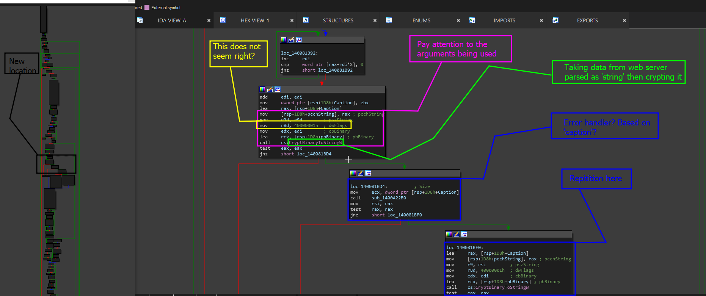
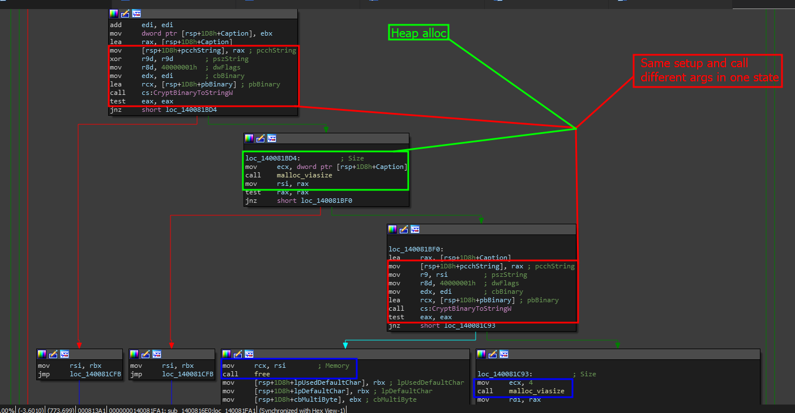

# Locating The BOF

The buffer overflow is close! We just need to do a tiny bit more digging and get to the finding. Lets go back to our steps to make sure we are in the same place.

## From where we left off...

If you were following this writeup closely, you would be in the same area shown below in the screenshot.

<figure><figcaption></figcaption></figure>

In this screenshot, if you have a database where `free` and `malloc` have been analyzed and scanned or renamed, you should see this.

<figure><figcaption></figcaption></figure>

### Why is there two of the same calls?

Well, sometimes, developers may use the API to gather or store specific information such as a sizing element used for proper allocation. Check the code line out below that this resembles.

```cpp
    DWORD dwsize = wcslen(input) * sizeof(wchar_t);
    DWORD dwFlags = CRYPT_STRING_BASE64 | CRYPT_STRING_NOCRLF;
    DWORD dwLength = 0;

    if (!CryptBinaryToStringW((BYTE*)input, dwsize, dwFlags, NULL, &dwLength)) {
        return NULL;
    }
```

In this code, note that the 4th positional argument is of type NULL. This means that `pszString` is not going to be there- finally concluding that this function is not going to be storing the result but rather the size of the result in dwLength. The use case of `pszString` is shown below.

> `[out, optional] pszString`
>
> A pointer to a buffer that receives the converted string. <mark style="color:red;">**To calculate the number of characters that must be allocated to hold the returned string, set this parameter to NULL**</mark>. The function will place the required number of characters, including the terminating NULL character, in the value pointed to by _pcchString_.

Ah awesome! So- we can expect the next call to be holding the buffer.

Lets analyze that brick

## Moving Forward- Analyzing The Area

In the second call to `CryptBinaryToStringW`, we notice that this value is different for `pszString` as the original call used `xor r9d, r9d` as a way to produce `0` which is what `NULL` expands to. Meaning this first call was in fact used for sizing as defined by the highlighted text above.

&#x20;&#x20;

<figure><figcaption></figcaption></figure>

IN this image, we also pay attention to the fact that the resulting size is also being pushed to the secondary call. But lets focus in on the allocation.

### Analyzing Bad Allocation

In the allocation brick, the local function, we see the following code.

```cpp
loc_140081BD4:          ; Size
mov     ecx, dword ptr [rsp+1D8h+Caption]
call    malloc_viasize
mov     rsi, rax
test    rax, rax
jnz     short loc_140081BF0
```

This is interesting to us- to anyone who is a developer, you would know that there should be something else here as USUALLY you are not supposed to be just putting the size but also multiplying it by the size of the data type of the data being pushed. So ideally, the assembly call should be this

```cpp
mov     ecx, dword ptr [rsp+1D8h+Caption]
mov     eax, 2
mul     rcx                                ; Note this operator that was not there before
cmovo   rax, r15        
mov     rcx, rax
call    malloc_viasize
```

This is the correct malloc call as in source code- this looks like: `malloc(buf_sz * sizeof(this.type))` and if you do not know what that means, for example of our above situation-

```cpp
malloc(dwLength * sizeof(wchar_t))
```

Now that we can see the issue, we have been able to successfully find the vulnerability area.&#x20;


[answer-page.md](answer-page.md)


