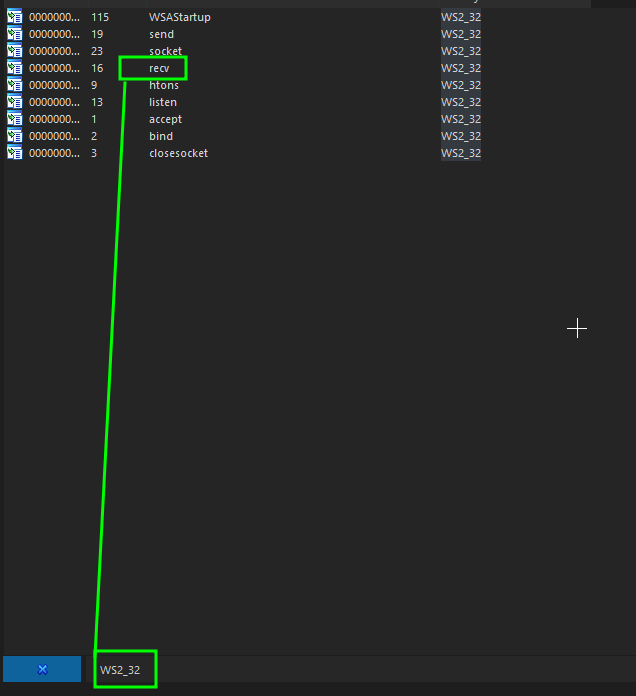
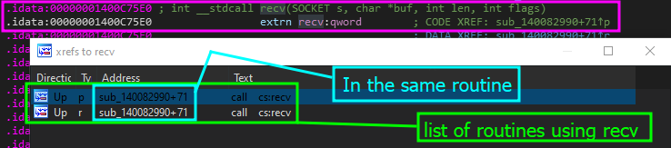
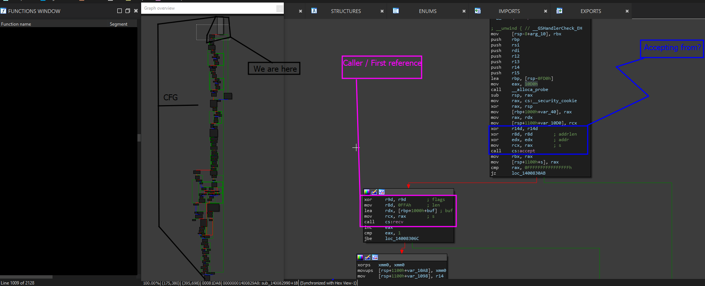
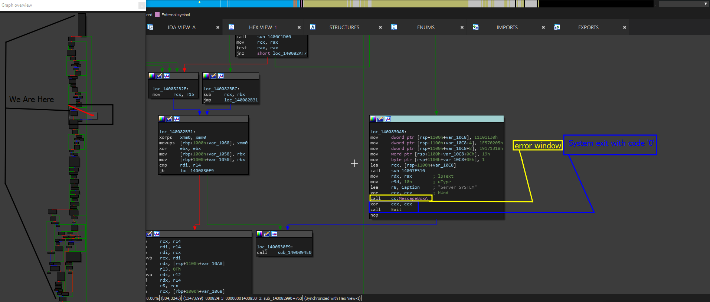
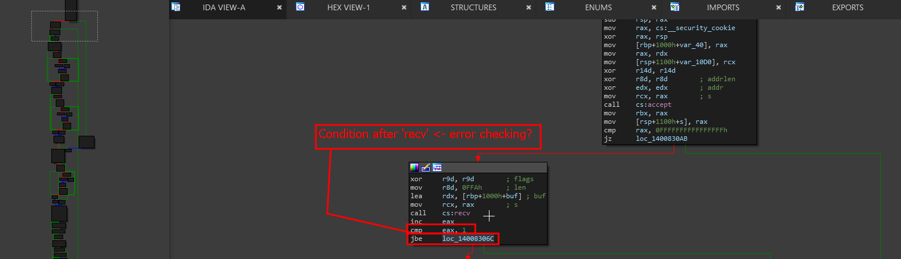
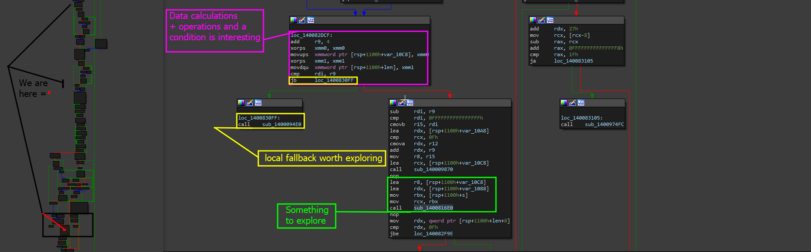
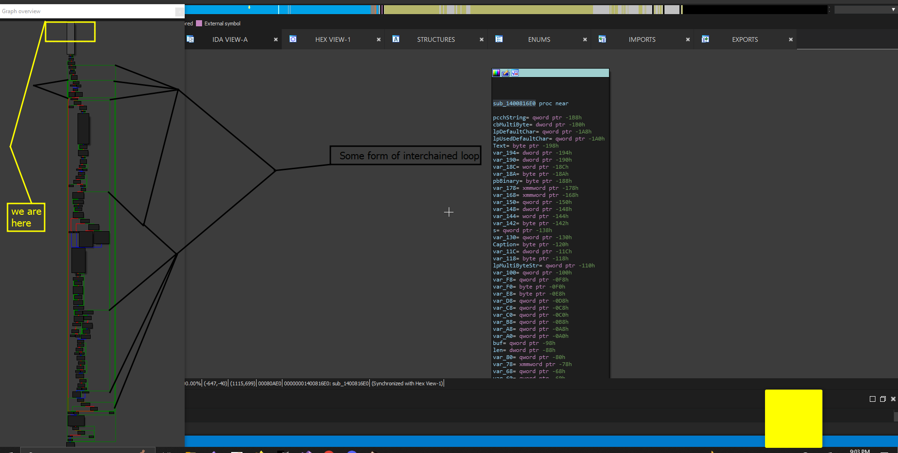

# Analyzing Important Sections

In order to find the BOF, we need to be located around the server routines data handling function. Considering the way most servers are designed (which is usually a customized router that executes a handling function based on the page being requested) we can create a list of all the functions that are receiving data from the client. This will ensure that we capture all the functions that can be manipulated via remote input


It is important to note that this is one of the best ways to look at it! We have a server, sure, the server is not capturing our raw input and it may be changing it. But even better considering that we can find ways to interact with the server and API without actually using the web panel- instead, just analyze an example request and find out the parameters we used to send it to the server from the client and then BOOM! We can mimick our own.\
\
This also will mimic a TON of IoT scenarios- many IoT devices (_Apple TV included_) will utilize web and remote based server APIs for user input. While these go through a sanitization stage through the web application, the server itself might not do this. Exploring this functionality by sending malicious payloads or inputs to the raw endpoint might result in discovering a huge flaw in the device that can be leveraged to full compromise or even something as small as data exfiltration. &#x20;


Below are the steps for finding this flaw.

## First step - Analyzing, Gathering, Eliminating

Before we go into trying to find the vulnerability, we need to analyze the application and gather a list of functions that use the `recv` call on the binary. We then need to filter through each call and eliminate a list of functions that are useful to us.

To do this follow the steps below.

### Analyze to check if `recv` is used

This is simple, just go through the import symbol table and try to find any calls to `recv`&#x20;


Note that as we have discussed already, if this does not show up, analyze where recv is imported from, view its code structure and try to find similarities.\
\
Many people will modify these functions to make them safer or less detectable


So drop REplay's executable file into IDA and lets search for any use of `recv`.

<figure><figcaption></figcaption></figure>

Now that we know this exists, lets get all cross references and find every possible use of this function.

### Creating a list of routines using \`<mark style="color:purple;">recv</mark>\`

To do this, click on the symbol and you should be brought to the `.idata` section of the binary holding the extern symbol- then click on the symbol and press '<mark style="color:purple;">x</mark>' to get cross references and you should see this.

<figure><figcaption></figcaption></figure>

### Analyze the list

There is not much to analyze, in the end, we are analyzing all of one function which we can see as both subroutines are the same ID with `sub_140082990+71`. This means that the server might only support one way or entry for data remotely.

Lets hop in this routine.

### Second Step - Analyzing The Routine

When we first click on the routine, we are brought to this section on the CFG (Control Flow Graph)

<figure><figcaption></figcaption></figure>

As you can see when you view the image- we see now only the first reference being called, but we also see a '_<mark style="color:purple;">accept</mark>_' call which may be accepting internal connections or responses from the client.

Upon looking further into the function itself, about where the black line is goin in the <mark style="color:orange;">CFG</mark> to label the diagram '<mark style="color:orange;">CFG</mark>' we find a function for <mark style="color:blue;">MessageBoxA</mark>. Take a look below!


Note that this is going to be full dissection of the function, we are going to explore, document, and rename functions.\
\
In the screenshot below, I renamed a function call 'Exit' that was originally `sub_14009ABFC`.The way I know it was exit was not only the data being pushed to it `xor eax, eax = 0` but also the fact that analyzing the routine and seeing where it jumped led to the Windows API value `uExitCode` being used to exit the process and terminate other modules. This is standard analysis practice.


<figure><figcaption></figcaption></figure>

As the window showcases, we spot a possible error location- of course, we do not know the data as it seems to be obfuscated. Eventually, with dynamic analysis this will reveal itself!

By this point, we need to note what exactly we are looking for.

* **Ignoring locals:** Local functions are good for us especially if we want to make sure if we are in a loop, or if we are analyzing flow to a crypto routine and more. But for us, we only need to see where our data is going- If you kept the database to IDA as you walked through this, you would know that this is only the routine data handler which is parsing requests. So we want to find actual subroutines our data is being passed to which may lead us to handling specific data from those endpoints.

Now, lets take a closer look.

> Analyzing Recv

it was massively noted in Microsofts documentation [<mark style="color:purple;">here</mark>](https://learn.microsoft.com/en-us/windows/win32/api/winsock/nf-winsock-recv), that the recv function actually copies data to a input buffer of a pre-defined length. Check it out below.

* **Function use code**&#x20;

```cpp
    char recvbuf[DEFAULT_BUFLEN];
    int recvbuflen = DEFAULT_BUFLEN;
    iResult = recv(ConnectSocket, recvbuf, recvbuflen, 0);
    
    if ( iResult > 0 )
            printf("Bytes received: %d\n", iResult);
    else if ( iResult == 0 )
            printf("Connection closed\n");
    else
            printf("recv failed: %d\n", WSAGetLastError());
            
    
```

* Structure of the function

```cpp
int recv(
  [in]  SOCKET s,            <- input parameter
  [out] char   *buf,         <- data from recv is going where (to 'this') destination
  [in]  int    len,          <- input parameter length of buffer for proper copy
  [in]  int    flags         <- input parameter optional for flag definitions
);
```

This case tells us a few things. Defined below are the most important to our situation.

* **1 (Syntax and structure of **<mark style="color:purple;">**recv**</mark>**)**: That the input we are looking to trace is the buffer pushed to <mark style="color:purple;">recv</mark> prior to being called. So since this is the second argument in the function, we need to follow the second argument or at least pay attention to where the data is being used.
* **2 (Function demo code above):** The code that Microsoft gave us as an example of the function is  also going to be checking  for specific inputs. Here, we can expect some conditionals after <mark style="color:purple;">recv</mark> is used to check the status of 0 to see if the connection was closed, and can also check to see if error flags such as _<mark style="color:purple;">SOCKET\_ERROR</mark>_ (_expands to -1 in C++ WinAPI_) flags are  used which can help us identify the area/stage we are in.

<figure><figcaption></figcaption></figure>

As you can see here, we have two important lines of code.

```cpp
inc     eax                ; increment by 1
cmp     eax, 1             ; see if eax is 1 (compare right value to the value in the left register)
jbe     loc_14008306C      ; Jump if Below or Equal instruction will jump to loc_14008306C if the resulting comparison is below or equal to the set value

```

Analyzing the local call is also important- upon analyzing this we see the following.

```
loc_14008306C:          ; s
mov     rcx, rbx
call    cs:closesocket
```

Okay cool! So we have just found out that this local function is responsible for fallback cleanup if `recv` failes. So re can rename this `local_cleanup_recv_fallback` which is pretty memorable.

Moving forward, I found this brick of code at the end of the function. The reason this was of interest to me is primarily due to the fact that its fallbacks and logic was encrypted unlike everything else in the CFG which was just a lull space entry '`" "`' in source code, or was sending data as raw HTTP responses which we can use later. The screenshot below demonstrates this.

<figure><figcaption></figcaption></figure>

We have multiple things to pinpoint here

* <mark style="color:purple;">Pink Part:</mark> The reason I highlighted this was because it showcases the obfuscated data most likely being deobfuscated for comparison. This chunk of data is important because this is a very common pattern in compile-time encryption libraries like XorStr or SkCrypt and various other encryption systems. Mainly because these instructions deal with larger sets of data calculations.
* <mark style="color:yellow;">Yellow part:</mark> The yellow part resembles some form of call which might be to the fallback function if a path is not found or selected. Maybe what was encrypted here was the original server path that we explored in [endpoints-for-login.md](../../../endpoints-for-login.md "mention")dynamically. (_Remember that we see the same pattern of symbols for string encryption routines + we see that this string only appears dynamically??? This has to be the condition that handles it!_)
* <mark style="color:green;">Green Part:</mark> The green part is even more interesting because if the conidition will also execute this block which is the continuation of the function. We see a massive amount of data being pushed before we call a few different subroutines so I figured it was best to analyze this section as well.

Lets analyze the fallback.

> Analyzing the local fallback - <mark style="color:purple;">sub\_1400094E0</mark>

This function is interesting, because when we click on it it traces to an error message being loaded which is shown in the assembly brick below.

```cpp
sub_1400094E0 proc near
sub     rsp, 28h
lea     rcx, aInvalidStringP ; "invalid string position"
call    sub_14008E454
```

This indicates that the code we were calling above most likely was a bunch of loops for finding specific string values, as indicated with "_invalid string position_" which is an error that only occurs in string related operations that requires an index of a string (_such as indexing a string literal, finding a value from a specific index, indexing by character, and more_)&#x20;

So this is good- it means that some of our code is going to be an error handling portion and we might have just identified that.

> Analyzing the FOI (Function of Interest) - <mark style="color:purple;">sub\_1400816E0</mark>

When we click on the routine- it seems like we get chained into a similarly sized brick of code. Check out the image below showcasing this.

<figure><figcaption></figcaption></figure>

Because this function is so big, and we have a lot to look at- I made another page for this.


