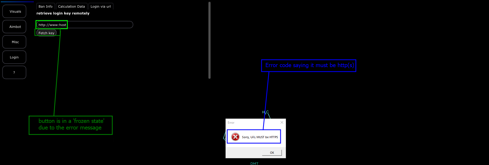

# S1: Input analysis

For this section, we are going to be analyzing some of the inputs. The one we have yet to discover is actually a feature the developer added in there which was downloading your license key remotely. This feature was designed to make users easily grab their keys from existing web sites like pastebin that may also require authentication.

## Getting too used to inputs UwU

In this section, we will analyze and come up with some usable solution as to what is happening in the application that is causing an error we come across. The steps are organized below!

### How to get here

To get to this feature, login to the cheat or crack it either one works- and then go to the tab on the left that has `?` as a icon and then go to the top and click on `Login via url` and you should be brought to this.&#x20;

&#x20;

<figure><figcaption></figcaption></figure>

### Exploring the feature

To explore the feature- we can test some inputs. Assuming that this is a remote fetcher in a way that it says it is, we can throw in some URL at first. Typically, I like checking for errors or mistakes in the URL- so basically test a series of input that can cause unexpected behavior or errors to show up. Check the list below.&#x20;

* `http://www:host` : If the program is not just checking for http we will see an error pop up. If the program is validating host formats and value formats properly and trying to parse this- it will throw an error because of '_`www:host`_' and we should see that or at least see a crash.
* `12345` : If we get an error with the previous test, lets toss some numbers in to see the result of the program.&#x20;
* `A` : This random input will let us know if the program might just crash or if the program will actually tell you the value MUST be a URL.&#x20;

This is a very small list, but for this small example and what we are looking for- I expect that it will at least give us information. If our situation fails, then we need to make a new list. But for now, lets go ahead and get it through\

> Result of - `http://www:host`

<figure><figcaption></figcaption></figure>

This is great! We now know that our string must contain HTTPS instead of HTTP. Lets explore the others and see what we get.

> Result of - `12345`&#x20;

<figure><figcaption></figcaption></figure>

Well this is a weird result- why do we still get an error? The error should be that the host is not parsable or that the value needs to be greater than the length of _n_. Lets see what "A' gets us.

> Result of - `A`&#x20;

<figure><figcaption></figcaption></figure>

So we get the same issue every time?

### Analyzing the result

So we get an application that seems to have gone the old route. Where instead of actually picking apart each value of the string, its only checking for a specific value. Lets run the payload '_a\_\_\_https_' to prove this.

<figure><figcaption></figcaption></figure>

Awesome! We got the program to not error out and continue execution.


If you need help learning how to navigate the GUI, then I have provided a section in [gui-things](../../../../../../replay-extras/gui-things/ "mention")called [navigate](../../../../../../replay-extras/gui-things/how-to/navigate/ "mention") which teaches you how to navigate, setup, run, etc for REplay's GUI


This means that we have found some form of flaw that is worth analyzing. Our program ONLY checks if HTTPs is there- so lets see if we can try a legit URL like `https://www.google.com`.

When we do this, we get a message box that tells us is it going to fetch the value when we stop the message box. When we do stop it, the program freezes and crashes and we get a screen that looks like the one below.

<figure><figcaption></figcaption></figure>

This is pretty good because we have a solid base and a reason to explore.

### Our base for the target:

For the base of the target, we are going to have the following.

* Program only crashes when it finds '**https**' in a text value and is a valid URL or target&#x20;
* Program runs a console in the background with the output of curl (_which you can see pop up before the crash_)

These are two important points for us to build off of.


Note that if you hit enter super fast and just spam your way through it, the program does not have a crash due to how fast the calls are happening and what you do by skipping the output of the console and command execution step.\
\
Ideally, we do not expect users to do this so it still becomes a flaw.


Well, lets dig deep into this function and see what we are in for!&#x20;

