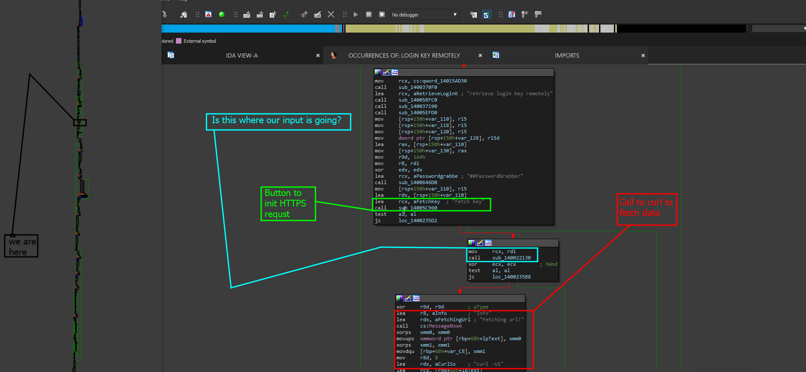
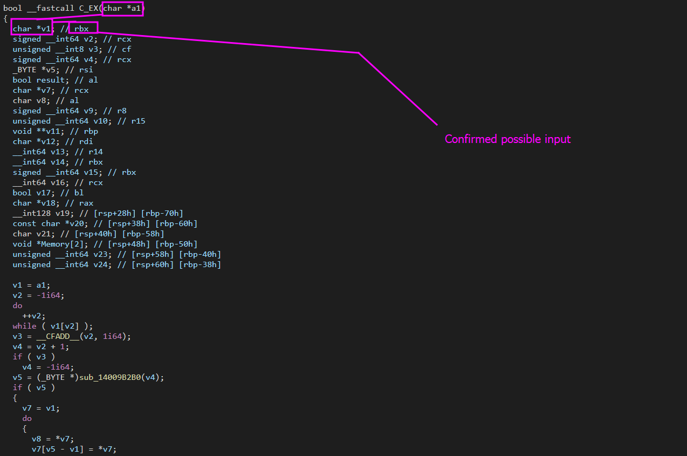

# S2: Func Analysis

As mentioned in previous sections, we expect you to know how to locate this function. I personally located it with the phrase "Login via url" which is the tabs name. This led me to the following location.

<figure><figcaption></figcaption></figure>

## Analyzing The Function Location

This part of the function was definitely interesting. So we can go ahead and actually knock these out based on their color codes.

* <mark style="background-color:orange;">Black</mark>: This just means that we are in that specific location in the graph of that one function. Not sure if I mentioned that or not a while back.
* <mark style="color:green;">Green</mark>: Green is highlighted because it defines the buttons state labeled as "fetch key". If we pressed it, the code is parsed and its fetched. If the state is not active, it just continues rendering other data for that frame.
* <mark style="color:red;">Red</mark>: Red defines the block where the code is told to take the URL ( [vuln-rce](../../vuln-rce/ "mention") ) and format it into the curl command (_little did they know that is dangerous as a whole_). This is highlighted as it is important for defining the boundaries between where we want to step.


Note that when hunting like this, we want to make sure we minimize the circle as much as possible and eliminate issues in the program. For us, we need to narrow it down between the final stage of execution before the button is released and unfrozen (_which in this case is where the curl command is executed_) and the very top from when the condition that the button was pressed is true.


* <mark style="color:blue;">Blue</mark>: Blue is where I believe that our data is being sent. To get a better view point of this, we can analyze the pseudocode of this area and see exactly what '<mark style="color:red;">rcx</mark>' represents. Maybe it is a global configuration or something.

### Pseudocode Analysis

In order to understand what RCX plays in the function role. We need to click on the subroutine we suspect our input data to be going to and generate a pseudocode chart to analyze. When you click on the function, for right now I have chosen to rename it `C_EX` which is just a way of saying example but outside of that you should see the same structure.

<figure><figcaption></figcaption></figure>

As you can see, just by looking at the analysis we see thatg rbx is actually used as a character input here and represents the new variable `*v1` which is pretty cool! This means that we were actually able to verify, a larger amount that this is in fact where our data is going. Lets analyze more of the function and see what you come up with!

### Analyzing top to bottom


[top-to-bottom-analysis.md](top-to-bottom-analysis.md)


