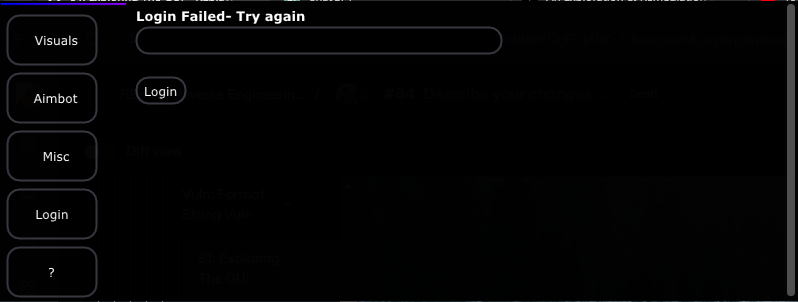

# S1: Exploring The GUI

Remember this amazing screen? The real login system?

<figure><figcaption></figcaption></figure>

Yeah, we are going back to this login.

## Exploring The Login page

Lets go to checking the inputs in this login page of the GUI.

### Checking inputs

The first way to find format string bugs, especially ones rendered on GUIs, is going to be taking these inputs and injecting large sets of formatting characters into the input such as the line below.

`%x %x %x %x`&#x20;

The idea of this is that when the rendering function is called, the format will actually print the result of that format specifier. For us, since we are using `%x`, it will print whatever value happens to be on the stack or in the register that would have been interpreted as the argument for `%x`. We can use many other formatting specifiers, but for now, we just need to use a basic identification one for this flaw.

### Analyzing Results

When you press enter on the GUI, you instantly get a value that will actually be random- this is the value on the stack or register which may have been the argument to that rendering call. Sadly, I can not post results for this because at the time of writing, I did not want to change the GUI to ALWAYS hold the text rendering there and was not going to go through a mess to capture the screenshot. Regardless, you should be able to a random hex value if this worked 4 times.

