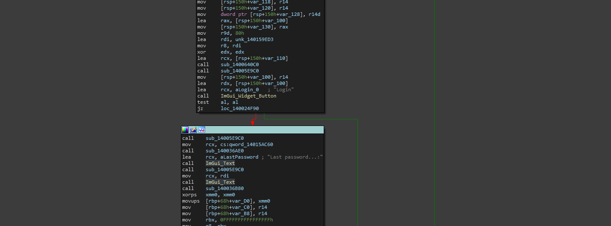

# S2: Exploring The Input

Now we need to actually explore the program statically and see where this is happening. If you have been following most of these writeups, then you would remember the common exploration of the login system in [crippling-logins.md](../../../../../level-1-all-walkthroughs/bypass-entirely-login-system/crippling-logins.md "mention") which showcased the login input and the way data was being thrown into the text functions.

Note that we also identified the text functions throughout some of the writeups, but I will leave you with a note below.


Sometimes, using [replay-isolated-training](../../../../../../replay-extras/replay-isolated-training/ "mention") techniques can help you understand the way text based functions are supposed to be. In many scenarios, GUI rendering functions may also be proprietary- so it is important that you ensure your understanding of **how** data needs to be moved around and manipulated before its rendered onto the GUI.\
\
In this case, I built a very basic GUI using ImGui, then spent some time looking at the source code, then dissecting the function call _(since it was not an import, there was no label or import symbol to trace or look at, instead- an unknown subroutine)_&#x20;


## Analyzing the login

To make sure we are all on the same path, I am looking at the portion of the GUI that resembles the rendered login tab which contains the login button and text to indicate that there was a password being used. This section looks like this

<figure><figcaption></figcaption></figure>

### Analyzing the code section

If you paid attention to the way data was looking, you would understand that the issue happened between the phrase `Last password...:` being outputted and the final string of text outputting the status of the value. So we can take the following code block into analysis.

```
call    sub_14005E9C0
mov     rcx, cs:qword_14015AC60
call    sub_140036AE0
lea     rcx, aLastPassword ; "Last password...:"        ;| Load text phrase
call    ImGui_Text                                      ;|
call    sub_14005E9C0                                   ;\call text, pop font?
mov     rcx, rdi                                        ;| load value from value
call    ImGui_Text                                      ;\call text, no format specification
```

See the pattern? So now we have correctly identified not only the location of the issue, but also the reason its happening.

