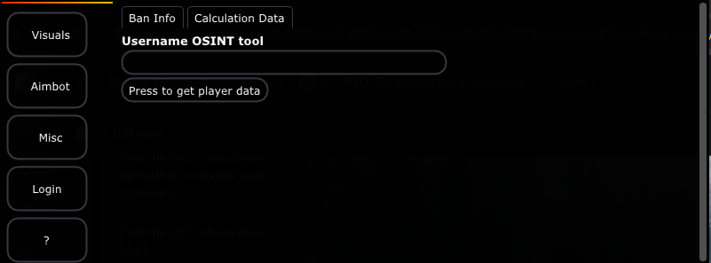
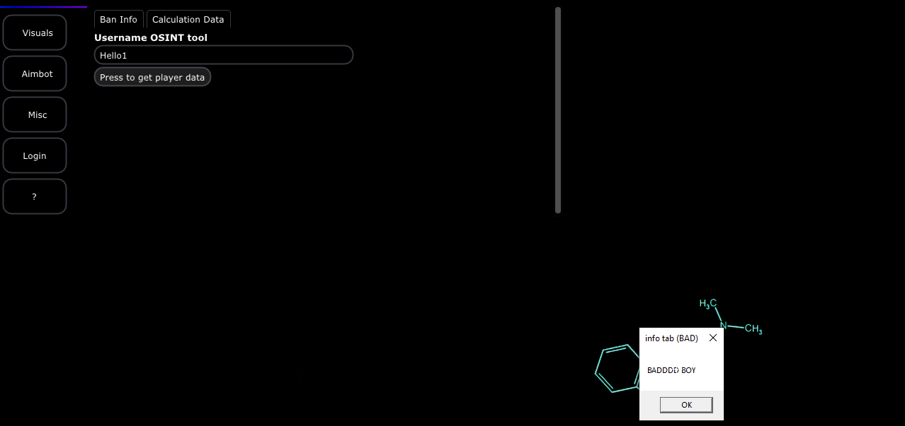
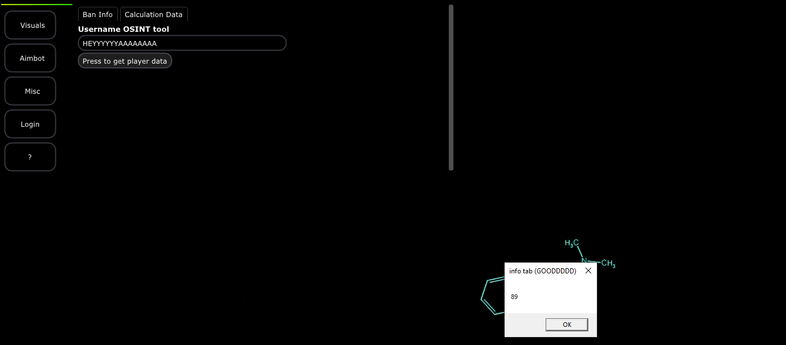

# S1: Input Analysis

Locating the input is something that we are going to need to go back to the GUI for. So lets open the application and if you have no already, you can either use the password you found from the page ' [find-the-integer-based-key-used-to-compare-the-input-license-in-the-gui..md](../../../../../../level-1-all-walkthroughs/find-the-integer-based-key-used-to-compare-the-input-license-in-the-gui..md "mention")' or you can go back to cracking the login of the menu as we did in this page ' [crippling-logins.md](../../../../../../level-1-all-walkthroughs/bypass-entirely-login-system/crippling-logins.md "mention")'&#x20;

## Disecting The GUI

Once you have the GUI opened on your Desktop. Click on the button that has the '?' icon on it. Then click on the tab name 'Calculation data' and following should show up.

<figure><figcaption></figcaption></figure>

### Checking input

Now, lets play around with this input, look for errors and spam a few things. One thing I am going to do is run the following payloads.

* Hello1
* Hello^\&#%^\*^&\*$%^\*#@$%^\*
* HEYYYYYYAAAAAAAA
* <<<<<<<<<<<<<<<<<<<<<<<<<<<<<<<<<<<<<<<<<<<<<<<<<<<<<<<<<<<<<<<<<<<<

Lets check the results.

> [Hello 1 and Hello^\&#%^\*^&\*$%^\*#@$%^\*](#user-content-fn-1)[^1]

<figure><figcaption></figcaption></figure>

> HEYYYYYYAAAAAAAA

<figure><figcaption></figcaption></figure>

This is a very different response. We got some random number- its certainly not the length of our character? So something happened- maybe this is telling us the calculation was good?

> <<<<<<<<<<<<<<<<<<<<<<<<<<<<<<<<<<<<<<<<<<<<<<<<<<<<<<<<<<<<<<<<<<<<

This actually got stopped- because it seems like the buffer only allows up to 38 characters.&#x20;


A good thing to mention with GUIs is that most inputs have some form of mechanism to prevent the user from typing anything else into the buffer to prevent buffer overflows or any issues that can occur.\
\
This is with most graphical libraries too as they provide standard utilities to prevent major vulnerabilities that are quick to make when it comes to GUIs. &#x20;


### Analyzing results

Okay this function is definitely something we want to look at. Not only did one of our responses indicate or spit out some random value and that some check was "good" but it also told us that it does not allow more than 38 characters to be entered. This is really good into!

### Where to go from here?

Well, we can do two things.&#x20;

* 1: We can just go straight to IDA and start exploring-
* 2: We can go back to the payload and see what triggered it by some process of elimination?

Both of these will work- but 2 might be a better choice because we want to analyze as deep as we can- not wide!


Analyzing wide and deep are two completely different things. Similar to fuzzing wide and fuzzing deep in a API, this can be split into the two groups.\
\
Analyzing Wide: Analyzing wide is in simple terms: the analysis of a broad range of features or aspects of the system such as APIs, imported calls, surface functions and more. Its helpful when you are just getting used to the environment and learning how to maneuver around it.\
\
Analyzing Deep: Analyzing deep is what we are going to be doing in this entire section. Instead of focusing on a large set of areas such as analyzing the thread routines and how it works with the binary integrity system and so on from there, we will be focusing entirely on one singular function. This function will be the local function in which the program is taking our input.


Lets explore a tiny bit more.

[^1]: These both had the same results. An image showing a small pop up box named "info tab (BAD)" and a caption "BADDDDD BOY" is all what happens when the input does not work for some reason.

