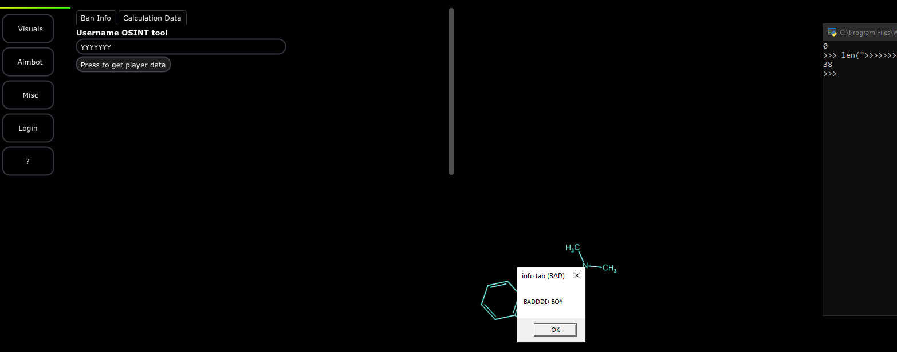
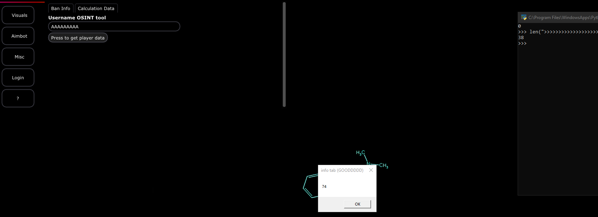

# Dissecting

In order to get more information on what is influencing the input, we can separate the working payload into parts like this.

* <mark style="color:purple;">H</mark> (_appears once_)
* <mark style="color:purple;">E</mark> (_appears once_)
* <mark style="color:purple;">YYYYYY</mark> (_appears six times_)&#x20;
* <mark style="color:purple;">AAAAAAAA</mark> (_appears eight times_)

### Considering the influence

Now that we have our data picked out, we can layout a possibilities list of everything that is influencing our results.

* <mark style="color:red;">**The length of the payload:**</mark> To test this, we can basically create another payload all one character but keep it the same length as the payload before.&#x20;
* <mark style="color:red;">**Sequence of characters:**</mark> Sequence of characters means that it is looking for the string to contain a specific sequence such as <mark style="color:purple;">`YYYYYY`</mark>. The way we can test for this is to just push in specific sequences specifically two of different lengths. We can check for <mark style="color:purple;">`YYYYYY`</mark> <mark style="color:purple;"></mark><mark style="color:purple;">and</mark> <mark style="color:purple;"></mark><mark style="color:purple;">`AAAAAAAA`</mark> .
* <mark style="color:red;">**Ordered Sequence of Characters:**</mark> Maybe its the specific order of the sequence of characters. So remove H and E and then run the payload again.
* <mark style="color:red;">**Specific character contains:**</mark> This means that the program is checking for a specific character. To do this, run all 4 characters through the program alone and separate and see what the program does.

_Wow, those are a lot of possibilities!_

Yeah, that is kind of why, sometimes, reverse engineering the function to get a better idea first can become helpful. The reason I chose to ignore it was to make this portion of the CTF a little bit more unique :joy:.

### Analyzing results.

Lets test the influence list and see what we come up with first.

> Ordered Sequence Of Characters

The ordered sequence of characters was interesting, because the amount that pattern exists clearly does not matter, we can just pipe these two.

<figure><figcaption></figcaption></figure>

Okay so first portion, bad result&#x20;

<figure><figcaption></figcaption></figure>

Interesting, when we slapped this pattern in here, it seemed like the program decided to say yes that was right somehow. _So we can cross out the following_.

* Ordered Sequence of Characters
* The length of the payload _(this is a different length and still worked)_
* Sequence of characters (the only possible right answer right now)

As mention in the list, this is **the only possible one right now**&#x20;


A lot of times- as a researcher, accepting one conclusion is not always going to be helpful. You can NOT just skip other questions because you found one good outcome.\
\
You need to exaughst everything to make sure not only you found what you confirmed, but you are also not leaving out a massive part of the system.\
\
As security researchers, it is also our responsibility to go deep into a system and try our best to find those flaws and holes- this involves exploring every inch if possible. \
\
\-- optional read (below) \
\
This is because when we answer questions like this with a feasible conclusion, that is only the temporary truth, it is the conclusion that all evidence currently points to. Temporary means that another answer to a separate question can possibly change the temporary conclusion making it fluid. We actually see this in science all the time!\
\
For example: we thought many years back Einstein's 'modification of general relativity to allow a universe that is not expanding' was great! But it was a temporary truth for the time being, until later on, we realized that newer tests and experiments revealed that this truth has an error in it, so that original truth does not exist and is off the board.&#x20;


Lets see the results for the last question.

> <mark style="color:red;">**Specific character contains <- the proof**</mark>

For this, we are going to feed the following.

* _H_
* _A_
* _E_
* _Y_

if you feed these yourself, you notice that the character 'A' is the only one to trigger this statement. Cool! That means that our actual current notice is that its result triggers on A.&#x20;

One theory we can also form is that maybe this is taking a character and converting it to its ASCII representation. But, since its <mark style="color:blue;">character->ascii not character || integer</mark> (_unless you tested that and it worked_) then there is no way to influence this without testing combinations that can be mapped. Even then, notice how the result of the calculation is also a different number and does not seem to include the actual ascii value.

### What do we do now?

Well now we can go to the next step and actually analyze the input.


When we hop into the next section, I will not show you how to get to the input function. This should be obvious at this level to you and should also click if you have been walking through this entire CTF instead of just skipping steps.


