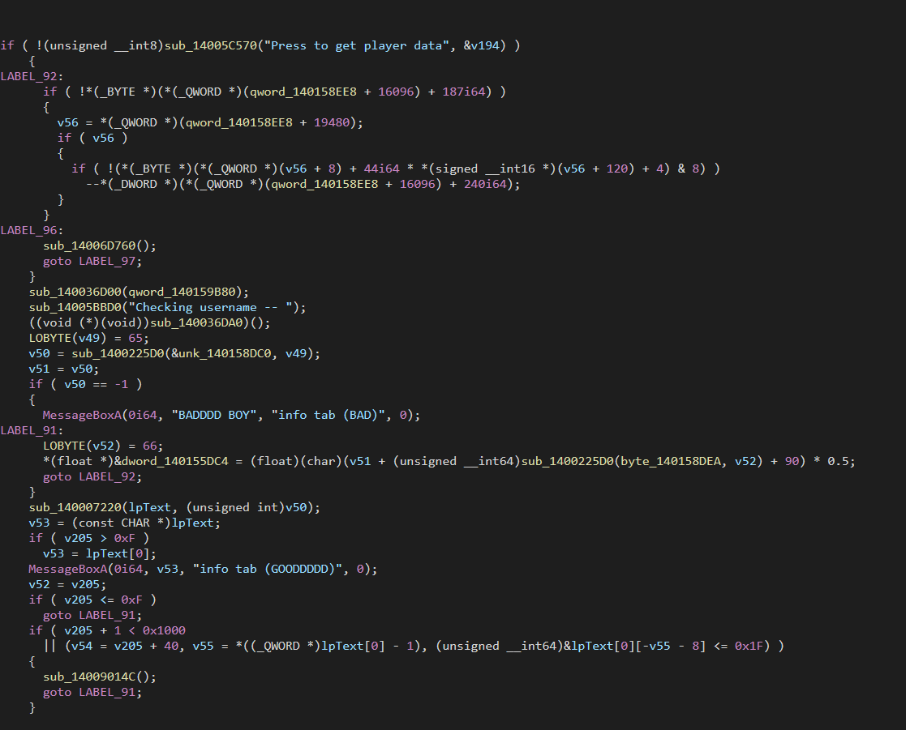

# S2: Func Analysis

As explained in the previous step, [s1-input-analysis](../s1-input-analysis/ "mention"), I assume you already know how to get to the function input using methods that are quite simple (designed like that for ease of access to the routine). With that, you should be in the same area.

<figure><figcaption></figcaption></figure>

## Analyzing the routine

This routine and actually entire area is kinda funky to read. So we are going to go and translate this to Pseudocode. If you are not used to this, despite us doing this once- simply follow the steps below.

* Go to `View` in the top bar of the window
* Open Subviews>Generate Pseudocode&#x20;

or you can use F5.


Sometimes, IDA can give you issues about section read permissions and the format of data. For now, ignore that as it does not cause much of an issue for us.


### Finding a range&#x20;

For us to go deeper into this function, we need to be able to hardcore focus on one area. And for us, that is the location of where the condition gets executed if a previous condition gets executed.

> Ring any bells? No?

If it did not ring any bells, basically, we are looking for the condition where if I press a button, the code gets executed.


Think of GUIs as one giant while true loop. Code is constantly executing and the only way to prevent widgets from messing up and executing when they are not supposed to- is to make them into conditions. Basically, if the button was pressed, then boom the code is executed. If we did not have a condition to check if the button was pressed or not, the second the button renders, the code would be executed and cause entire rendering issues and even crashes!


For that, we are going to be analyzing the pseudocode shown below.

<figure><figcaption></figcaption></figure>


In IDA, pseudocode can become a pain to work with! So, if you really want to focus on the code itself and analyze it, right click on the pseudocode dump and then click on the button that lets you generate an HTML document as said 'generate HTML'. This will produce a syntax highlighted HTML file.&#x20;


If you want to copy and paste it, then here is the pseudocode so you can break it down yourself. Personally, I always use an editor inside of a code note to do the documentation as you will see later.

```cpp


```

Now that we have our range, we need to analyze that range, and dig deeper! Lets go down the rabbit hole Allice!&#x20;
