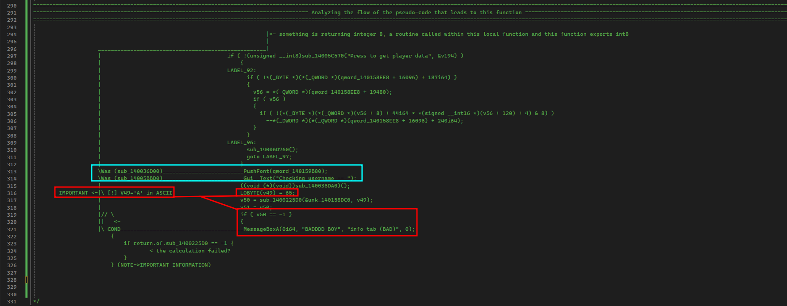

# Pseudocode Analysis

The next thing we need to do to narrow down our scope is analyze bits and pieces of the code. For us, I have screenshotted my example breakdown of this code. This breakdown will be explained a bit better in brief, but the screenshot is there to show you how I personally note and break down information.

<figure><figcaption></figcaption></figure>

This was a much more cut version from the one below because shortly during analysis, the focus becomes very clear on where we need it to be.&#x20;

### The general breakdown

This function pretty much checks if a user presses the button, if they do, it goes onto taking the information, pushing fonts, printing the information, taking fonts off the stack (_popping fonts_) then will take the information we gave it into the input, push it to a function with an extra argument that converts to <mark style="color:red;">'A'</mark> in ASCII and then checks if the result from that function is `-1` in the case that fails.

Coincidence? I think not haha!

### The main problem area

The main area that we need to go deeper into is this one right here.

```cpp
    LOBYTE(v49) = 65;
    v50 = sub_1400225D0(&unk_140158DC0, v49);
    v51 = v50;
    if ( v50 == -1 ) {
      MessageBoxA(0i64, "BADDDD BOY", "info tab (BAD)", 0);
    }
```

Okay so lets rename these variables and fix the code up a bit with some documentation.

```cpp
    char char_to_search_for = 65; // Is a character because its used to be 'A' in ASCII
    res = sub_1400225D0(&unk_140158DC0, char_to_search_for); // Converts to 'A' as a integer->char
    use_later_res = res; // Result of the operation  
    if ( res == -1 ) { 
      MessageBoxA(nullptr, "BADDDD BOY", "info tab (BAD)", nullptr); // nullptr because '0'
    }
```

Now that we have it documented, the road path becomes clear as to what we need to explore. The reason our program triggers the condition is because of the result of the data. Considering what we have so far- it gives us more of a further reason to focus on the area. So lets dig deep into routine [Broken link](broken-reference "mention").

