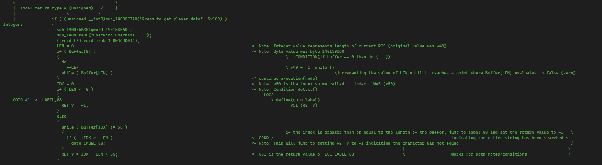

# Pseudocode Analysis

The next thing we need to do to narrow down our scope is analyze bits and pieces of the code. For us, I have screenshotted my example breakdown of this code. This breakdown will be explained a bit better in brief, but the screenshot is there to show you how I personally note and break down information.

<figure><figcaption>
After my modification and analysis
</figcaption></figure>

This was a much more cut version from the one below because shortly during analysis, the focus becomes very clear on where we need it to be.&#x20;

### The general breakdown

This function pretty much checks if a user presses the button, if they do, it goes onto taking the information, pushing fonts, printing the information, taking fonts off the stack (_popping fonts_) then will take the information we gave it into the input, push it to a function with an extra argument that converts to <mark style="color:red;">'A'</mark> in ASCII and then checks if the result from that function is `-1` in the case that fails.

Coincidence? I think not haha!

### Explaining my conversions

So for the sake of this section, I will be explaining my major points of importance and conversions to help at least get to the understanding.

* <mark style="color:blue;">`byte_140158DC0->Buffer`</mark>: When you hover over this value in IDA, it gives you `char39` which indicates that this is our input <mark style="color:blue;">buffer</mark>. Not only is it used in this function and checked and passed to the function, but the buffer size is the limit of characters we have.&#x20;
* <mark style="color:blue;">`v49->LEN`</mark>: This basically means that the what was <mark style="color:red;">v49</mark> and is now <mark style="color:blue;">LEN</mark> which is the length of the string stored in the <mark style="color:blue;">buffer</mark>. I assumed this based on the way it was being used with the Buffer variable. This is the length because it iterates over the <mark style="color:blue;">buffer</mark> and adds to <mark style="color:blue;">LEN</mark> until it finishes.&#x20;
* <mark style="color:blue;">`v50->I`</mark>: Also known as <mark style="color:purple;">idx</mark> or simply index (_even though I used 'i'_), this was known as the index as it is used in the while line -> `while ( Buffer[I] != 65 )` is comparing what is in the input buffer to the value '<mark style="color:red;">65</mark>' and we can see '<mark style="color:red;">i</mark>' increase over time throughout the goto loops.
* <mark style="color:blue;">`v51->Result`</mark>: This was an interesting bit. Basically, the only way I really could tell it was the actual result being returned was due to the use of assigning `-1` as a return value and of course the most notable combination of the ordinal value of 'A' with our index influencing the input and etc.


[exploring-iof](exploring-iof/)

