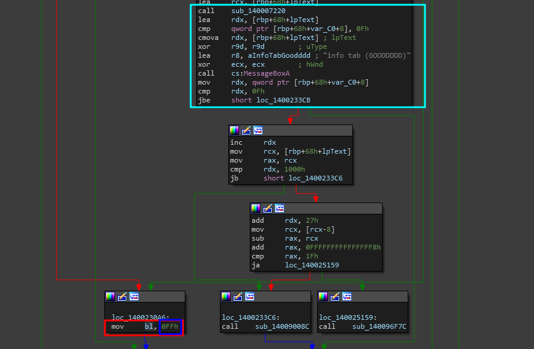
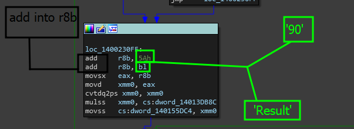
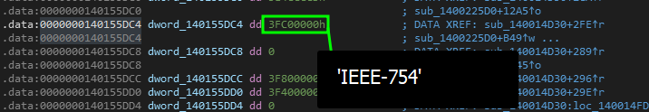
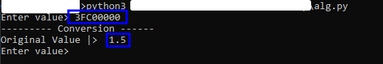
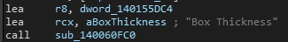
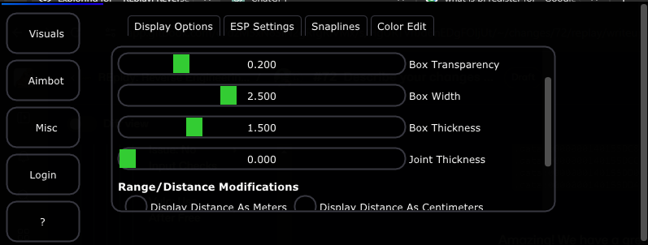

# Exploring IoF

In the last portion of the writeup, we essentially were able to go through the pseudocode and analyze what was happening with our information that we were giving the program. Now that we understand it, we can see where the actual return is.

## Analyzing The Result

The <mark style="color:blue;">`Result`</mark> variable told us that the function either returned <mark style="color:blue;">`-1`</mark> saying that the calculation failed and the character '<mark style="color:orange;">A</mark>' was not in the buffer or returned the result of <mark style="color:red;">`(Idx + len_of_buffer + 65)`</mark> which is basically taking the index of the character that was found, adding it to the length of the buffer + 65 which is the ordinal value of '<mark style="color:orange;">A</mark>'.

This is super important for us- so lets figure out exactly what this data influences.&#x20;


Integer overflows can happen in many forms- but if we can not get it to crash, or can not find a way to use it maliciously, then we have no proof that the finding is actually dangerous despite being a finding. So we need to be able to verify that the result of the function is actually negative (**e.g**: adding the data to a specific value or setting in the menu)


### Analyzing The Return Value

In the pseudo-code we analyzed, there was code telling us what the end result of that calculation was. Great, so lets find the return type of the value.

In order to do this, go to the top of the function which shows all the values as shown below.

```cpp
__int64 __fastcall sub_1400225D0(char a1)
{
  __int64 v1; // rax
  __int64 v2; // rdx
  __int64 v3; // rbx
  __int64 v4; // rcx
  __int64 v5; // rdx
  __int64 v6; // rcx
  __int64 v7; // rax
  __int64 v8; // rsi
  float v9; // xmm11_4
  float v10; // xmm8_4
  float v11; // xmm1_4
  signed int v12; // edi
  float v13; // xmm9_4
  float v14; // xmm8_4
  unsigned int v15; // xmm1_4
  int v16; // xmm0_4
  __int128 v17; // xmm0
  unsigned __int64 v18; // rax
  __int64 v19; // rbx
  __int64 v20; // rdi
  __int128 *v21; // rsi
  __int128 *v22; // rbx
  __int64 v23; // rdi
  __int128 *v24; // rbx
  __int64 v25; // rdi
  __int128 *v26; // rbx
  __int64 v27; // rdi
  __int128 *v28; // rbx
  __int64 v29; // rbx
  signed __int64 v30; // rdx
  __int64 v31; // rcx
  __int64 v32; // r9
  __int64 v33; // r8
  signed int v34; // eax
  __int64 v35; // rax
  float v36; // xmm1_4
  __int64 v37; // rax
  signed __int64 v38; // rcx
  __int64 v39; // rbx
  __int64 v40; // rdx
  __int64 v41; // r8
  float v42; // xmm1_4
  float *v43; // rcx
  _QWORD *v44; // rbx
  _QWORD *v45; // rcx
  __int64 v46; // r8
  __int64 v47; // rax
  __int64 v48; // rdx
  int len; // ecx
  int I; // edx
  char Result; // bl
```

notice how `char Result` is going to be stored in the `bl` register? This means that when we are looking for the '<mark style="color:purple;">integer</mark>' to overflow, we are really looking for a register holding that specific value. In this case, we want to make sure the `bl` register is correct. For our context: `Result` is stored in the least significant byte of a larger register, which is `bl`. This indicates that `Result` is likely treated as an 8-bit value (_integer8_).


Note that compiler optimizations may result in 'char' replacing 'int8\_t' which is the real data type of the value on the backend. This optimization happens because, a char or character is expected to be at least 8 bits wide (1 byte wide), and to be able to represent either all integers within[ -127 and 127 inclusive](https://stackoverflow.com/questions/17744226/int8-t-vs-char-which-is-the-best-one) (if signed) or between 0 and 255 (if unsigned)


This is the value we want to pay attention to in our assembly view. So lets go back to that and see if we can figure out where '`bl`' goes to.&#x20;

<figure><figcaption></figcaption></figure>

In this screenshot, we are placed a little bit at the end of the conditionals checking the result where data is also being pushed into <mark style="color:blue;">bl</mark>.&#x20;

<figure><figcaption></figcaption></figure>

A few lines under and we see an addition operation pretty much taking the original result and adding <mark style="color:red;">'0x5A</mark>' to it which is <mark style="color:red;">90</mark> in decimal until finally moving a few bits of data around and pushing the result (_xmm0_) into `cs:dword_140155DC4` This is interesting- we might be able to obtain a tiny bit more info.

<figure><figcaption></figcaption></figure>

Amazing! We have a great value here- but we do not know what it is. However, if you remember correctly, we built a converter for this.


[ieee-745-formula-implementation.md](../../../../../../../../level-exploits-scripts/algorithmic-implementations/ieee-745-formula-implementation.md)


Using that same tool and taking that value into the program, the end result '`1.5`'&#x20;

<figure><figcaption></figcaption></figure>

Now, since we know the value is <mark style="color:red;">1.5</mark>, lets see what this and get the cross reference. When we cross reference the byte variable we get the following code.

<figure><figcaption></figcaption></figure>

> Why is this interesting to us?

This is interesting because we are moving the value into the "<mark style="color:red;">Box Thickness</mark>" slider float value for the ESP option in the menu. As you can see, the value <mark style="color:red;">'1.5'</mark> is the default value for the thickness of the ESP box around the character.

<figure><figcaption></figcaption></figure>

LITT! We were able to verify that this is where the result goes.

### What does this mean?

Well, this basically means that we can expect our integer overflow to effect the box thickness variable in the menu or application. Ideally,&#x20;

### Lets build a payload


[payload.md](payload.md)

