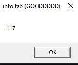
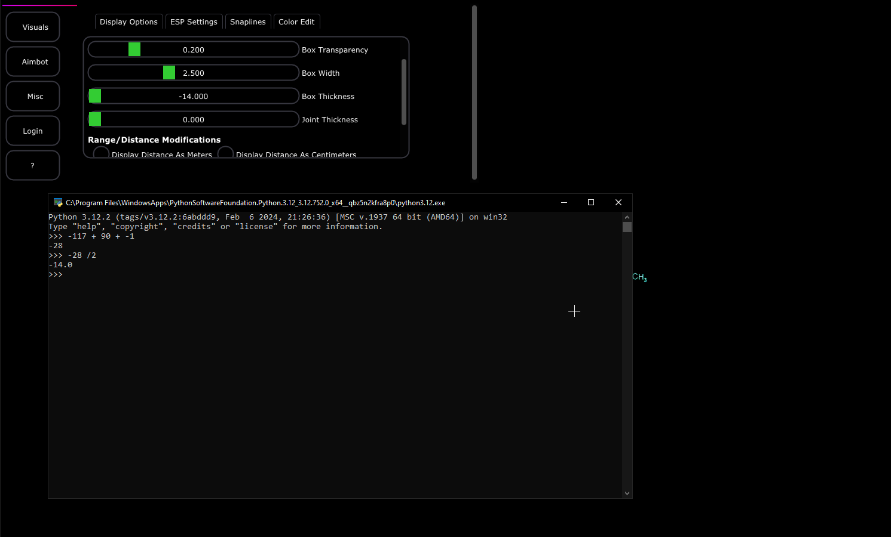
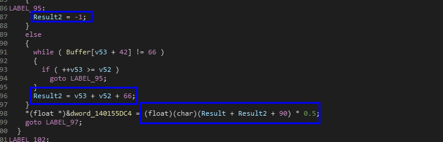

# Payload

In order to verify our findings, we need to build a payload. This is quite simple if we revert back to the original calculation.

### Analyzing the contents of result

The original result of the payload was as follows just to recap one last time.

```
RET_V = IDX + LEN + 65
```

This is basically saying&#x20;

* The index of 'A'
* Plus the length of the string
* Plus the ordinal of 'A' which is 65

Our buffer states that the max characters we can use is 39 characters. Since this value boils down to an integer8 data type. We have a max and minimum range of +127 and -126. Anything above or below this range is going to cause a fault in the default value of the 'Box Width' configuration variable.

### Creating the payload

Creating the payload is fairly easy.

&#x20;Considering this value is int8, we need to use a string longer than 64 characters, but we can not do that because the buffer only allows us to use a 39 character buffer.

So we need basically

* amount of chars -> 38&#x20;
* Position the 'A' character one index before the 38th value (making 37) to trigger the conditional
* then sending that line as a single string triggering the conditional at position 37 with a string of length 38 and a character integer value of '65'

So our resulting payload following these instructions is `____________________________________A_`

for a smaller explanation

```

					 "_____________________________________A_"
					  \                |                   |   
					  |_            ___|                  /
					   |__ '-' * 37| char 'A' at POS 36   | 
```

<figure><figcaption></figcaption></figure>

With the entering of this, we get the value of -117 which should not be the value. When we go to the ESP tab, we get the following result in the ESP box configuration.


in this screenshot I also calculate how the result got to where the result was based on the analysis we did previously.


<figure><figcaption></figcaption></figure>

Basically you take the original value and result we got which was -117 and then add the 90 as the operation was doing and of course using <mark style="color:red;">-1</mark> because the character the other use of that function was searching (_if you went back and did enough analysis_) was '<mark style="color:green;">B</mark>' which was not contained.&#x20;

For context:&#x20;

<figure><figcaption></figcaption></figure>

