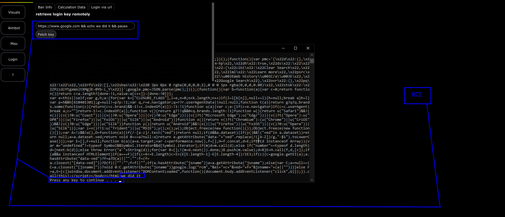

# Answer Page

### Flaw&#x20;

The flaw discovered in this function was Remote Code Execution (RCE) by injecting commands into the input of the remote login / key function in the cheat.

### How to prevent this

Since we are pulling from a remote location- we want to make sure we do not use curl for this and instead just utilize standard HTTP libraries that can eliminate many cases where RCE happens. Its not totally preventable, but it is definitely possible.&#x20;

### Proof of Concept&#x20;

> Screenshot

<figure><figcaption></figcaption></figure>

> Code + Explanation

```cpp

      MessageBoxA(0i64, "Fetching url!", "Info", 0);
      *lpText = 0i64;
      _mm_storeu_si128(&v209, 0i64);
      sub_140009870(lpText, "curl -sS", 8ui64);
      sub_1400093C0(lpText, " ", 1i64);
      v57 = -1i64;
      do
        ++v57;
      while ( *(&unk_140159DD0 + v57) );
      sub_1400093C0(lpText, &unk_140159DD0, v57);
      sub_1400093C0(lpText, " && echo your key is && pause", 29i64);
      v58 = lpText;
      if ( *(&v209 + 1) > 0xFui64 )
        v58 = lpText[0];
      system(v58);
```

This code basically takes <mark style="color:red;">unk\_140159DD0</mark> which is the user input and does not sanitize nor check it. It then adds it to the command that is executed on the machine by concatinating the two values.

