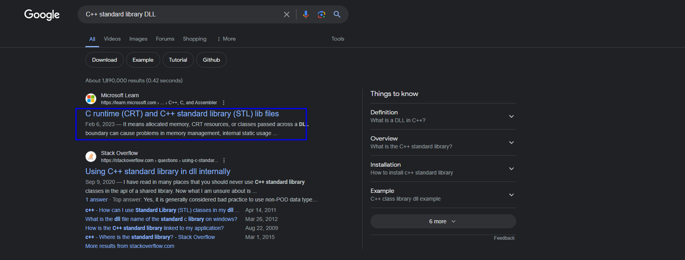
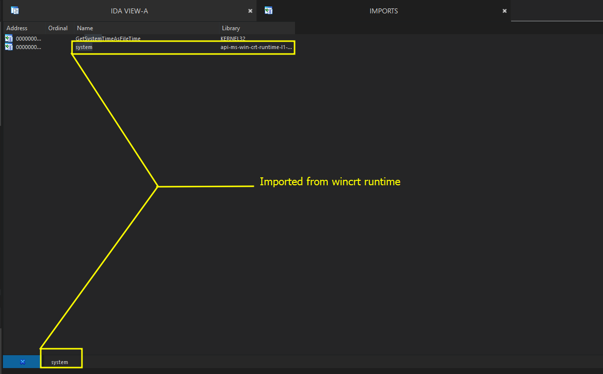
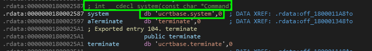
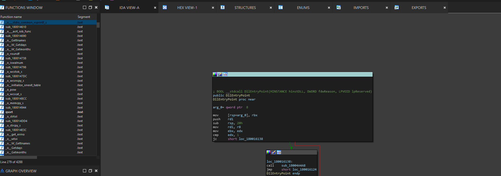
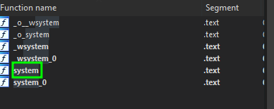
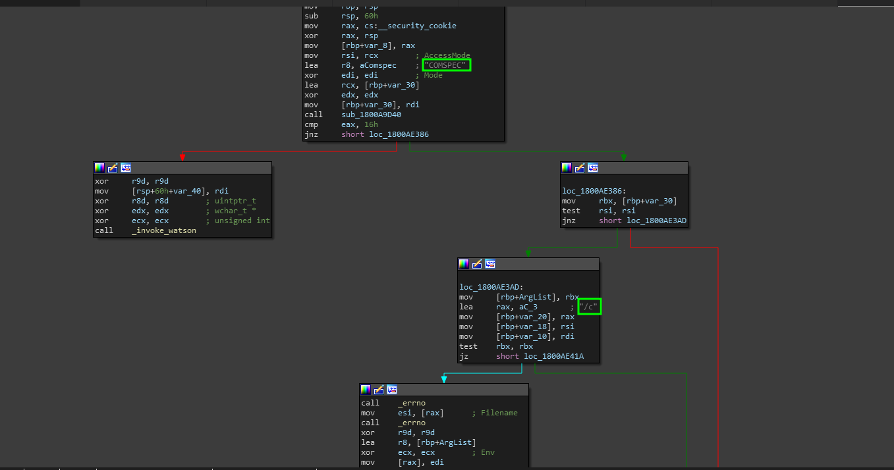
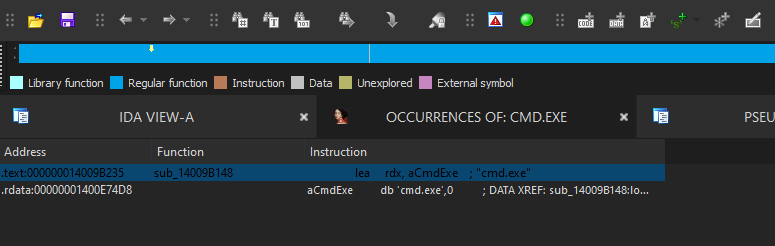

# Finding system

In order to find the `system` call which is how RCE can happen (_outside of other more advanced examples_), we can find and analyze the backend source code to `system` within the DLL it is usually imported from.


Note that the reason we have to manually find its source file (e.g: the DLL it is imported from) is because in IDA, there is not a direct way to view the source code of dynamically imported symbols. \


So, we need to manually go digging by trying to find the origins of the `system` call using specific methods


## Locating <mark style="color:purple;">systems</mark> Origins

In order to locate the origin of a symbol or imported name that might not be known is through multiple methods which are described in the sections below.

### Google

If you are looking for a standard C/C++ call or really any standard call, there is a good chance you can google it followed by "_source DLL_" and then you can find the name. Since our function is a standard C++ function we can see what the default runtime library is for C++ for Windows10.

<figure><figcaption></figcaption></figure>

As you can see, Google shows a link from the Microsoft documentation that makes the term "CRT" (_C Runtime Library_) and there are a few libraries like that which exist on your system.&#x20;

If you click on the link and investigate more you come up with this which can help you analyze which DLLs we might need to analyze first.

> DLL List - [https://learn.microsoft.com/en-us/cpp/c-runtime-library/crt-library-features?view=msvc-170](https://learn.microsoft.com/en-us/cpp/c-runtime-library/crt-library-features?view=msvc-170)

When scrolling on this list, we see that a _UCRT_ or [<mark style="color:purple;">Universal C Runtime</mark>](https://www.google.com/search?q=what+does+UCRT+stand+for\&oq=what+does+UCRT+stand+for\&gs\_lcrp=EgZjaHJvbWUyBggAEEUYOTIJCAEQABgNGIAEMgkIAhAAGA0YgAQyCQgDEAAYDRiABDIJCAQQABgNGIAEMgkIBRAAGA0YgAQyCQgGEAAYDRiABDIJCAcQABgNGIAEMgkICBAAGA0YgAQyCQgJEAAYDRiABNIBCDU3NjdqMGo5qAIIsAIB\&sourceid=chrome\&ie=UTF-8) which is dynamically imported on programs that use the standard C libraries as C++ does. With that, we can go ahead and analyze the DLL. But before we do that, lets go over some other methods.

### Analyzing Import Tables

In your target program is not actually showing that it is importing system through the import table, than maybe you can create your own program like the one below that uses system and see if the program has it in the import table when we check IDA!

```cpp
#include <iostream>

int main() {
    std::cout << "Hello world! Entering command..." << std::endl;
    system("dir");
} 
```

> Tossing it into IDA and seeing the import table

When you throw the program into IDA and check the imports, make sure to filter for the phrase "system".

<figure><figcaption></figcaption></figure>

Our DLL seems different- the full name is `api-ms-win-crt-runtime-l1-1-0` so now all we have to do is see where system is in the DLL.&#x20;

> Dragging `api-ms-win-crt-runtime-l1-1-0` into IDA and analyzing

Since this is a DLL, instead of importing it will be exporting symbols. So instead, this time we have to load the DLL into the program and go to the export tab and search for the functions.

<figure><figcaption></figcaption></figure>

When you see that <mark style="color:purple;">system</mark> was a valid export entry in the _dll_ we loaded and double click on it, you are brought to this section.

This section shows us directly that the <mark style="color:purple;">system</mark> call is called as "<mark style="color:red;">ucrtbase.system</mark>" which means that the actual origin is in _**UCRTBASE.dll**_&#x20;

> Analyzing ucertbase.dll

When we toss the DLL into IDA, we see something that we actually did not see in other DLLs. We actually see real code. This means that we have reached the source DLL for the functions we are going to be reading.

Thankfully, because of the way exporting is done in DLLs, we can easily search for the function name `system` in the function panel.


<figure><figcaption><p>Entry point of the DLL</p></figcaption></figure>

Now lets search for the function `system` and look at what shows up.

<figure><figcaption></figcaption></figure>

As you can see, there are many parts of the function that show up- but be surprised to hear that despite it being highlighted- this call is actually just going to locate us to a blank piece of code. Instead, we want to go to `system_O` or the functions `base`.

> Why do we look for this?

Well, we look for this because Microsoft likes adding their own unique portions to these calls. So the actual system call is not the original source code of the function, its tweaked and modified to jump to the changed version.

This is done for numerous reasons such as performance and ease of use and so on from there. So lets analyze that pseudocode brick. But before I do that, just to make sure you are on the right track, the screenshot below shows the beginning to middle of the <mark style="color:red;">CFG</mark> from the <mark style="color:red;">system\_O</mark> call analysis and disassembly.

&#x20;

<figure><figcaption></figcaption></figure>

> Psuedo-code

The code below is the pseudo-code generated representation of `system_O`&#x20;

```cpp
 int __cdecl system_0(const char *Command)
{
  const wchar_t *v1; // rcx
  unsigned __int64 v2; // rsi
  intptr_t v3; // rdi
  __int64 v4; // rdx
  char **v5; // rbx
  char **v7; // [rsp+30h] [rbp-30h]
  char **ArgList; // [rsp+38h] [rbp-28h]
  const char *v9; // [rsp+40h] [rbp-20h]
  unsigned __int64 v10; // [rsp+48h] [rbp-18h]
  __int64 v11; // [rsp+50h] [rbp-10h]

  v2 = (unsigned __int64)v1;
  v3 = 0LL;
  v7 = 0LL;
  if ( (unsigned int)((__int64 (__fastcall *)(_QWORD, _QWORD, char ***, const char *))sub_1800A9D40)(
                       0LL,
                       0LL,
                       &v7,
                       "COMSPEC") == 22 )
    invoke_watson(0LL, (const wchar_t *)v2, 0LL, 0, 0LL);
  v5 = v7;
  if ( v2 )
  {
    ArgList = v7;ex
    v9 = "/c";
    v10 = v2;
    v11 = 0LL;
    if ( v7 )
    {
      v2 = (unsigned int)*errno();
      *errno() = 0;
      v3 = spawnve_0(0, (const char *)v2, (const char *const *)ArgList, 0LL);
      if ( (_DWORD)v3 != -1 )
      {
        *errno() = v2;
        goto LABEL_14;
      }
      if ( *errno() != 2 && *errno() != 13 )
      {
        v3 = 0xFFFFFFFFLL;
        goto LABEL_14;
      }
      *errno() = v2;
    }
    ArgList = (char **)"cmd.exe";
    v3 = (unsigned int)spawnvpe_0(v3, (const char *)v2, (const char *const *)"cmd.exe", 0LL);
    goto LABEL_14;
  }
  if ( v7 )
    LOBYTE(v3) = access_s(0LL, 0) == 0;
LABEL_14:
  free_base(v3, v2, v4, v5);
  return v3;
}
```

Notice that the key highlights are.

* <mark style="color:red;">cmd.exe</mark>
* _/c_
* "[<mark style="color:purple;">COMPSEC</mark>](https://en.wikipedia.org/wiki/COMSPEC)"
* `ArgList`&#x20;

This seems to be obvious for what we need to search for.&#x20;

### Finding System Based On Knowledge

Since we now know what it takes to identify the `system` call, we can go into REplay and we can find that function based on the direct print we have of the functions backend code.


remember again: the reason it may not be named in REplay is due to compiler optimization and project settings which call for statically linking the functions code due to how much its used.


If we go back to IDA for REplay and search for the string - `cmd.exe` we should see it pop up.

<figure><figcaption><p>sub_14009B148 is our culprit </p></figcaption></figure>

As we can see with the results, we can analyze the subroutine.

