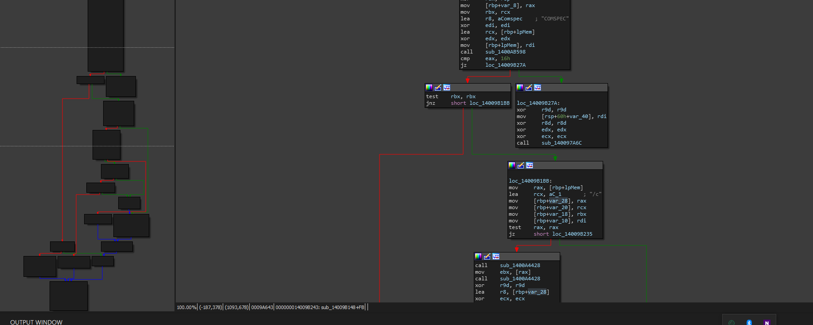

# sub\_14009B148

The contents of this routine in pseudocode are as follows.

```cpp
__int64 __fastcall sub_14009B148(__int64 a1)
{
  __int64 v1; // rbx
  unsigned int v2; // edi
  void *v3; // rcx
  int v4; // ebx
  int v5; // ebx
  LPVOID lpMem; // [rsp+30h] [rbp-30h]
  const char *v8; // [rsp+38h] [rbp-28h]
  const char *v9; // [rsp+40h] [rbp-20h]
  __int64 v10; // [rsp+48h] [rbp-18h]
  __int64 v11; // [rsp+50h] [rbp-10h]

  v1 = a1;
  v2 = 0;
  lpMem = 0i64;
  if ( sub_1400AB598(&lpMem, 0i64, "COMSPEC") == 22 )
  {
    sub_140097A6C(0i64, 0i64, 0i64, 0i64, 0i64);
    JUMPOUT(*&byte_14009B28E);
  }
  if ( v1 )
  {
    v8 = lpMem;
    v9 = "/c";
    v10 = v1;
    v11 = 0i64;
    if ( lpMem )
    {
      v5 = *sub_1400A4428();
      *sub_1400A4428() = 0;
      v2 = sub_1400ABCF8(0i64, v8, &v8, 0i64);
      if ( v2 != -1 )
      {
        *sub_1400A4428() = v5;
LABEL_13:
        v3 = lpMem;
        goto LABEL_14;
      }
      if ( *sub_1400A4428() != 2 && *sub_1400A4428() != 13 )
      {
        sub_1400A9C30(lpMem);
        return -1;
      }
      *sub_1400A4428() = v5;
    }
    v8 = "cmd.exe";
    v2 = sub_1400AC05C(0i64, "cmd.exe", &v8, 0i64);
    goto LABEL_13;
  }
  v3 = lpMem;
  if ( !lpMem )
  {
LABEL_14:
    sub_1400A9C30(v3);
    return v2;
  }
  v4 = sub_1400AC110(lpMem, 0i64);
  sub_1400A9C30(lpMem);
  LOBYTE(v2) = v4 == 0;
  return v2;
}
```

NOTE the important patterns

* cmd.exe
* COMSEC
* /c

> Analyzing logic flow

Lets now analyze the logic flow of the function.

<figure><figcaption></figcaption></figure>

While this control flow of this is not the exact same, this is mainly due to compiler optimization and organization of the information. But in general, notice the function setup and the way data is being moved. This is a perfect match!

## Conclusion

To conclude this set of pages, we know this is the system call based on the analysis of the routines and the tracing methods we used to confirm its locations and names. Now we can start hunting.


MAKE SURE TO RENAME THIS FUNCTION TO `system`


