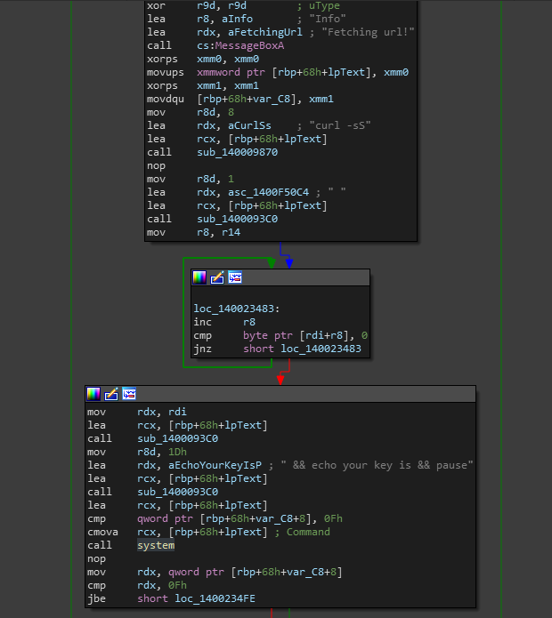
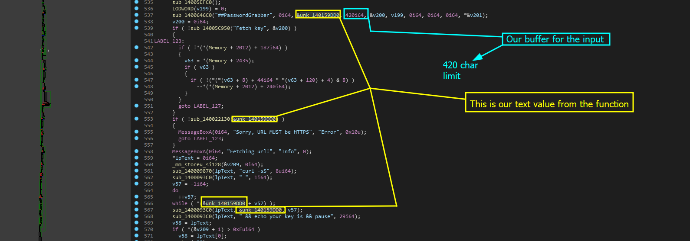

# S1: Analyze the input area

If we look for cross references to the system function call then we end up coming across one reference that looks like this location on the graph. Coincidentally this is the same input function for the functionality we were analyzing in [vuln-double-free](../vuln-double-free/ "mention")

<figure><figcaption><p><br></p></figcaption></figure>

Lets see if we can pseudo-code this.

## Pseudo-code analysis

```cpp
     if ( !sub_140022130(&unk_140159DD0) )
      {
        MessageBoxA(0i64, "Sorry, URL MUST be HTTPS", "Error", 0x10u);
        goto LABEL_123;
      }
      MessageBoxA(0i64, "Fetching url!", "Info", 0);
      *lpText = 0i64;
      _mm_storeu_si128(&v209, 0i64);
      sub_140009870(lpText, "curl -sS", 8ui64);
      sub_1400093C0(lpText, " ", 1i64);
      v57 = -1i64;
      do
        ++v57;
      while ( *(&unk_140159DD0 + v57) );
      sub_1400093C0(lpText, &unk_140159DD0, v57);
      sub_1400093C0(lpText, " && echo your key is && pause", 29i64);
      v58 = lpText;
      if ( *(&v209 + 1) > 0xFui64 )
        v58 = lpText[0];
      system(v58);
      if ( *(&v209 + 1) <= 0xFui64 )
      {
LABEL_112:
        _mm_storeu_si128(&v209, _mm_load_si128(&xmmword_14013EF10));
        LOBYTE(lpText[0]) = 0;
        goto LABEL_123;
      }
      v59 = lpText[0];
      if ( (*(&v209 + 1) + 1i64) < 0x1000
        || (v60 = *(&v209 + 1) + 40i64, v59 = *(lpText[0] - 1), (lpText[0] - v59 - 8) <= 0x1F) )
      {
        j_j_free(v59);
        goto LABEL_112;
      }
```

Directly in this code, we see that the commands are `curl -sS` and `&& echo your key is && pause` indicating that the program has pulled the key after curl. This is flawed for a few reasons.

### Flaws&#x20;

* Input is never checked
* Input is never validated&#x20;
* Output is never checked
* Invalid formatting and weird output message&#x20;

### In order to get command execution we must...

According to the logic of the input check. The input MUST contain a https URL and it must contain something that curl can reach without an issue. This is to make sure that curl does not return an invalid status code and terminate the command process.

* P**roof of logic check for HTTPS**

```cpp
    if ( !sub_140022130(&unk_140159DD0) )
      {
        MessageBoxA(0i64, "Sorry, URL MUST be HTTPS", "Error", 0x10u);
        goto LABEL_123;
      }
      // continue...
```

### Where is the input data?

In order to verify our input actually influences the code, we need to trace the value of `unk_140159DD0` and see where it goes. This is currently unknown to IDA, so lets see if we can figure it out ourselves.


To follow variables like 'unk\_140159DD0' in pseudocode just click on the variable name once and IDA will highlight a trail you can follow of where it was used via lightly highlighting the variable and data name.


When you follow this, a little bit further in the dump you get the following.

<figure><figcaption></figcaption></figure>

As you can see, this is clearly the input data we are using. Now, we need to see where this is being pushed.

### Where is the input in the command?

To analyze this, look at the code below.

```cpp
      sub_140009870(lpText, "curl -sS", 8ui64);                  // first part
      sub_1400093C0(lpText, " ", 1i64);                          // spacing 
      v57 = -1i64;                                               // decl idx
      do                                                         // <- itter {
        ++v57;                                                   //       inc + 1
      while ( *(&unk_140159DD0 + v57) );                         //    } input + inc
      sub_1400093C0(lpText, &unk_140159DD0, v57);                // add input to cmd
      sub_1400093C0(lpText, " && echo your key is && pause", 29i64); // finish cmd
```

This is pretty much how our data is being placed.

* 1            -> The first thing we start out with is "curl -sS" which is then followed by a random space talked about in two.
* 2           -> The second thing is the whitespace there to prevent issues with the command execution of curl. Spacing is important in commands
* 3           -> The third thing is that we are actively passing our input without checking it and passing it right into the command. This will be the `host` argument to the curl command.
* 4           -> The last command is being passed where after the user input is placed into the function, `&&` is pushed to make sure the extra commands the program wants to execute, execute properly.

## Analyzing EXEC

