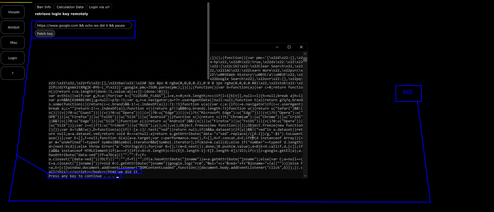

# S3: Crafting The Payload

Now that we have a general structure of the command, we can finally move onto the payload.

## Building Payloads

Sometimes, we have to do a tiny bit of command and value + input tweaking to ensure that we can build the right payload. In this case, we need to understand the synthesis of the command string itself. Ideally, the string we analyzed before is shown below without code.

```cpp
"curl -sS" + " " + User_Input + " && echo your key is && pause" -> push(system())  
```

So basically, because our user input is not sanitized we can create a simple payload.

### The payload&#x20;

When we go to create the payload, we also want to keep in mind that this code and proof will not work unless our payload includes https and is a host the client can reach and is a valid host. Not only do we have to bypass the check with this, but we also have to prevent curl from terminating the process with a standard exit code.

> Our specific payload

For this section, I developed the following plaintext payload. The reason we have to formulate it this way is also due to the placement and construction process of the command and final output.

`https://www.google.com && echo we did it && pause`

### Proof of Working Payload

<figure><figcaption></figcaption></figure>
