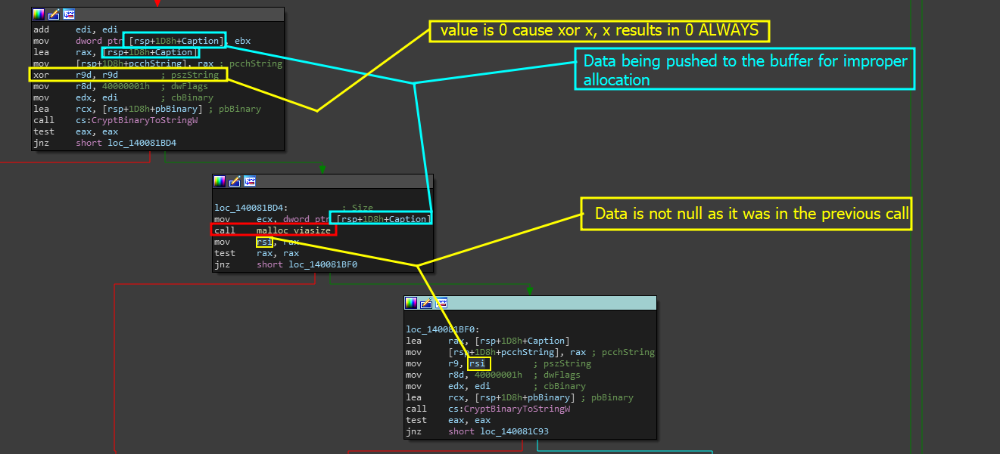

# Vuln: Use After Free


UAF, Use After Free, is further talked about in [uaf-use-after-free](../../information-module/binary-auditing-further-reading/uaf-use-after-free/ "mention")


In many scenarios, buffer overflows are pretty easy to catch and even basic input checks are not always going to be leading to issues at that moment in time- so, if we can not find a buffer overflow- what is the next stage? Well, we can search for use after free vulnerabilities!

### What is this task

This task requires that we find a valid UAF _(Use After Free)_ vulnerability in the program, state why its an issue, and also explain how we can fix it and why we should not be using memory after it has been deinitialized.&#x20;

## Pre game thinking - Logic

UAFs are actually super easy once we get to the root of finding all occurrences of modifications or general `free` calls. If you need help with this, please view the page linked below to learn about manually tracing `free` inside of Windows applications.&#x20;


[tracing-free.md](../../../../../../replay-extras/reverse-engineering-other-theory-s/tracing-externs/tracing-free.md)


### What are we looking for

If we have the calls laid out and we can easily search for all references, basically we are looking first for the use of '<mark style="color:purple;">free</mark>' where '<mark style="color:purple;">heap\_malloc</mark>' was used. From there, we want to look for the value _freed_ that was pushed into '<mark style="color:purple;">free</mark>' then figure out if that same data is used right after.

### How do we get there?

Well, we can go back to the server function that we analyzed which handled the HTTP POST request to <mark style="color:red;">/api/v2/login</mark> on the local server. The reason we go back to this, is because we saw malloc being used many different times and plus that area seems to be perfect for a plethora of vulnerabilities including the BOF we found and missing security checks for data input.

So lets check out the original area shown in the image below.

<figure><figcaption></figcaption></figure>

If we are in this area, lets pay attention to the way data was allocated. What value was pushed to the malloc call?

## Analyzing the function for flaws

Lets check the following screenshot out which is the same exact area, a little bit further down, but still same area with the UAF vulnerability in plain sight.

<figure><figcaption></figcaption></figure>

Through this screenshot, we can track the way RSI is being used and if we analyze where RSI is being freed- we can easily find our answer.

### Analyzing the free block

The block below includes the code that goes to freeing up memory and then calling a Windows API function.

```cpp
mov     rcx, rsi        ; Memory
call    free
mov     [rsp+1D8h+lpUsedDefaultChar], rbx ; lpUsedDefaultChar
mov     [rsp+1D8h+lpDefaultChar], rbx ; lpDefaultChar
mov     [rsp+1D8h+cbMultiByte], ebx ; cbMultiByte
mov     [rsp+1D8h+pcchString], rbx ; lpMultiByteStr
mov     r9d, 0FFFFFFFFh ; cchWideChar
mov     r8, rsi         ; lpWideCharStr
xor     edx, edx        ; dwFlags
xor     ecx, ecx        ; CodePage
call    cs:WideCharToMultiByte
```

Here, this code presents a Use After Free vulnerability because the register <mark style="color:purple;">rsi</mark> is being pushed to <mark style="color:orange;">rcx</mark> as an argument to the free function call. A few instructions later, and we use rsi as an argument to calling the WinAPI call to <mark style="color:purple;">WideCharToMultiByte</mark>. Because there is no other use or initialization of <mark style="color:purple;">rsi</mark>, <mark style="color:purple;">rsi</mark> becomes a value that is uninitialized memory used.&#x20;
